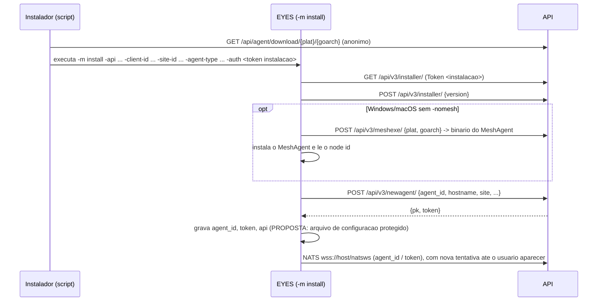

# Contrato de fio do agente EYES

Especificacao autoritativa do protocolo que o agente **EYES** (novo, escrito do zero) precisa falar com o servidor Cybereyes **como ele existe hoje**.

- **Fonte unica**: este repositorio (`backend/src`, `backend/tests`, `docs/api`, `docs/adrs`, `infra/`, `frontend/src`). Nada aqui vem do codigo do Tactical RMM, do `rmmagent`, do `rmmagentwincare` ou do `trmm-shared`.
- **Regra de leitura**: tudo o que nao tem marca e comportamento do servidor, com `arquivo:linha` para conferir. O que o servidor nao define aparece como **nao determinado pelo servidor**, seguido de uma **PROPOSTA** para o EYES.
- Caminhos curtos usados nas referencias:
  - `Api/` = `backend/src/Cybereyes.Api/`
  - `Core/` = `backend/src/Cybereyes.Core/`
  - `Tests/` = `backend/tests/Cybereyes.Api.Tests/`
  - `front/` = `frontend/src/`
- Convencao de tipos: `str`, `int`, `float`, `bool`, `nil`, `[T]` (lista), `{...}` (mapa/objeto). "Inteiro" no JSON quer dizer numero sem parte fracionaria.
- **Base**: commit `e7cc9dd` (HEAD de `main`). Todos os `arquivo:linha` se referem a esse commit.

> **Alteracoes em andamento fora desta base.** Quando esta especificacao foi escrita, o working tree tinha mudancas nao commitadas, aparentemente a adaptacao do servidor ao EYES. Elas afetam as secoes 2.4, 2.5 e 6.2 e o item 1 da secao 9:
>
> - `Api/Rmm/AgentSettings.cs`:
>   - arquivos `eyes-v{versao}-{plat}-{arch}`;
>   - binarios embutidos na imagem;
>   - `Version` lida de `VERSION`, padrao `3.0.0`.
> - `Api/Rmm/InstallScripts.cs`: comando `eyes install --api ... --nomesh`; o EYES cria o servico e instala o MeshAgent em todos os sistemas.
> - `Api/Rmm/InstallerEndpoints.cs`:
>   - download sem redirecionamento padrao;
>   - 404 em string JSON.
> - `Api/Rmm/AgentProtocolEndpoints.cs`: `meshreinstall` respeita `plat`.
> - `docker-compose.yml`, `Dockerfile`, `MeshTests.cs`: ajustes correspondentes.
>
> As rotas `/api/v3`, o NATS e os comandos (secoes 1, 3, 4, 5 e 7) **nao foram tocados** por essas mudancas. Quando elas forem commitadas, revise as secoes 2.4 e 2.5 contra o codigo novo.

## Sumario

1. [Transporte](#1-transporte)
   1. [Identidade e segredos](#11-identidade-e-segredos)
   2. [NATS](#12-nats)
   3. [msgpack](#13-msgpack)
   4. [REST](#14-rest)
2. [Instalacao e registro](#2-instalacao-e-registro)
3. [Trafego periodico agente -> servidor](#3-trafego-periodico-agente---servidor)
   1. [Configuracao (`config`)](#31-configuracao-get-apiv3agent_idconfig)
   2. [Check-ins por NATS](#32-check-ins-por-nats)
   3. [Inventario WMI / hardware](#33-inventario-agent-wmi)
   4. [REST periodico simples](#34-rest-periodico-simples)
   5. [Checks](#35-checks)
   6. [Tarefas automatizadas](#36-tarefas-automatizadas)
   7. [Windows Update](#37-windows-update)
   8. [Chocolatey](#38-chocolatey)
   9. [Historico de comando/script (`histresult`)](#39-histresult)
   10. [Logs de sistema](#310-logs-de-sistema)
   11. [SNMP (agente coletor)](#311-snmp-agente-coletor)
   12. [Token do app de bandeja](#312-token-do-app-de-bandeja)
4. [Comandos servidor -> agente (NATS)](#4-comandos-servidor---agente-nats)
5. [App de bandeja (IPC local)](#5-app-de-bandeja-ipc-local)
6. [Status, versoes e dependencias de versao](#6-status-versoes-e-dependencias-de-versao)
7. [Cybereyes Care: catalogo, execucao e Health Check](#7-cybereyes-care-catalogo-execucao-e-health-check)
8. [Ambiguidades e PROPOSTAs](#8-ambiguidades-e-propostas)
9. [Bugs e inconsistencias do servidor](#9-bugs-e-inconsistencias-do-servidor)
10. [Checklist de conformidade](#10-checklist-de-conformidade)

---

## 1. Transporte

### 1.1 Identidade e segredos

| Item | Quem gera | Formato exigido pelo servidor | Uso |
|---|---|---|---|
| `agent_id` | agente, no registro | `str` nao vazio, ate 200 caracteres (`Api/Rmm/AgentProtocolEndpoints.cs:82`); unico (`:91`) | assunto NATS, usuario NATS, URLs REST, chave `agent_id` nos check-ins |
| token do agente | servidor, no `newagent` | 40 hex minusculos (20 bytes aleatorios, `Core/Rmm/AgentSecrets.cs:8`) | REST `Authorization: Token <t>`; senha NATS |
| token de instalacao | servidor (console) | 64 hex minusculos (`Core/Rmm/AgentSecrets.cs:10`), com validade | REST nas rotas de instalacao |
| `pk` | servidor | `int` (id do agente no banco) | resposta do `newagent`; o agente nao precisa usar em rota nenhuma |

- O servidor guarda so hashes: SHA-256 hex do token para o REST (`AgentSecrets.cs:12`) e bcrypt (fator 10) para o arquivo de usuarios do NATS (`AgentSecrets.cs:14`).
- O `agent_id` vira um **token de assunto NATS** e um **segmento de URL**. O servidor separa assuntos por `.` (`Api/Rmm/Maintenance/CareEndpoints.cs:39-40`) e assina `*` (um token so, `Api/Rmm/Nats/NatsBackgroundServices.cs:63`).
  - Portanto o `agent_id` **nao pode** conter `.`, `*`, `>`, espaco, `/` nem caracteres de controle, embora o servidor nao valide isso.
  - **PROPOSTA**: 40 letras ASCII `[A-Za-z]` aleatorias, geradas uma vez e persistidas. Os testes usam 40 letras minusculas (`Tests/AgentTests.cs:264`).
- O `agent_id` da URL e ignorado em todas as rotas `/api/v3`: o agente e identificado so pelo token (`docs/api/fase1-agente.md:19`; os handlers leem a claim `AgentPk`, por exemplo `Api/Rmm/AgentProtocolEndpoints.cs:219-220`).

### 1.2 NATS

#### Conexao
- **URL**: `wss://<host>/natsws` (porta 443).
  - O Nginx encaminha `location /natsws` para `nats:9235` com upgrade de WebSocket (`infra/docker/nginx/templates/default.conf.template:103-110`).
  - O NATS escuta WebSocket na 9235 sem TLS interno, com `compression: true` (`infra/docker/nats/nats.conf`).
  - A porta 4222 nao e publicada no host (`docs/runbooks/instalacao.md:21`).
- **Timeouts do proxy**: `proxy_read_timeout`/`proxy_send_timeout` de 330 s. A conexao precisa ter trafego (PING do cliente NATS) em menos de 330 s, senao o Nginx derruba.
- **Credenciais**: `user = <agent_id>`, `password = <token do agente>` em texto puro; o NATS confere contra o bcrypt (`Api/Rmm/Nats/NatsAuthWriter.cs:58-68`, `docs/api/fase1-agente.md:49`).
- **Propagacao do usuario**: o arquivo de usuarios e regravado pelo servidor ao registrar ou excluir agente, na partida e a cada 5 min (`NatsBackgroundServices.cs:11-40`). O conteiner recarrega com `SIGHUP` em ate ~2 s apos a mudanca (`infra/docker/nats/run.sh`).
  - Logo depois do `newagent` a autenticacao NATS pode falhar por alguns segundos: o agente precisa tentar de novo. Os testes repetem por ate 30 s (`Tests/AgentTests.cs:283-305`).
- **Tamanho maximo de mensagem**: `max_payload: 67108864` (64 MiB, `nats.conf`).
- Certificado: o agente deve validar TLS. O script Linux tem `--insecure`, que repassa `-insecure` ao binario (`Api/Rmm/InstallScripts.cs:85,125`). Ver 2.4.
- **PROPOSTA**: derivar a URL do NATS da URL da API passada em `-api`: `https` vira `wss`, `http` vira `ws`, mesmo host e porta, caminho `/natsws`. O servidor nao entrega a URL do NATS em rota nenhuma (**nao determinado pelo servidor**).

#### Permissoes do usuario do agente (`NatsAuthWriter.cs:67`)
```
publish:   allow [ "<agent_id>", "<agent_id>.cmdoutput.>", "<agent_id>.terminal.>" ]
subscribe: allow [ "<agent_id>" ]
allow_responses: { expires: "1435m" }   (Nats:ResponseExpiration, Api/Rmm/Nats/NatsSettings.cs:11)
```
Consequencias para o EYES:
1. O agente **so pode assinar `<agent_id>`**. Ele nao pode assinar `_INBOX.>`, entao **nao pode fazer request/reply como cliente**: toda chamada do agente ao servidor que espera resposta e REST.
2. As respostas aos comandos vao para o `reply` da mensagem recebida, liberado por `allow_responses`. Sem `max` explicito, o NATS libera **uma resposta por requisicao**, dentro de 1435 min.
3. O agente publica check-ins no proprio assunto `<agent_id>` e tambem assina esse assunto, entao **recebe de volta as proprias publicacoes** (eco do NATS). Mensagens sem `func` devem ser ignoradas.
   - **PROPOSTA**: conectar com `echo: false` (opcao `no_echo` do cliente) e, mesmo assim, ignorar mensagens sem `func`.

#### Assuntos

| Direcao | Assunto | Conteudo | Quem trata |
|---|---|---|---|
| agente -> servidor | `<agent_id>` com `reply = "agent-<tipo>"` | check-in msgpack (secao 3.2) | `CheckinConsumer`, fila `cybereyes-api` (`NatsBackgroundServices.cs:63-77`) |
| servidor -> agente | `<agent_id>` | comando msgpack `{func,...}`, como request (com `reply`) ou publish (sem `reply`) | agente |
| agente -> servidor | `_INBOX...` (o `reply` recebido) | resposta msgpack ao comando | `AgentRpc.RequestAsync` (`Api/Rmm/Nats/AgentRpc.cs:17-36`) |
| agente -> servidor | `<agent_id>.cmdoutput.<run_id>` | evento do Cybereyes Care (string JSON em msgpack) | `CareEventConsumer`, fila `cybereyes-api` (`CareEndpoints.cs:36-50`) |
| agente -> servidor | `<agent_id>.terminal.<session_id>` | quadro de terminal (secao 4.6) | `TerminalSessions.PumpAsync`, assinatura comum na replica da sessao (`Api/Rmm/Actions/TerminalSessions.cs:98`) |

- O `reply` dos check-ins **nao e um inbox**: e um rotulo literal que o servidor le em `msg.ReplyTo` e exige comecar com `agent-` (`NatsBackgroundServices.cs:66`). O servidor nunca publica nesse "assunto".
- **Grupos de fila**: o servidor usa a fila `cybereyes-api` em `*` e `*.cmdoutput.*`. Cada mensagem e tratada por uma replica so. O agente nao usa grupos de fila.
- **Requisicao versus publicacao**: o servidor usa `RequestAsync` (espera resposta com timeout) ou `PublishAsync` (dispara e esquece) (`AgentRpc.cs:17-38`). A regra para o EYES:
  - se a mensagem recebida tem `reply` nao vazio, responda **exatamente uma vez**;
  - se nao tem, nao responda.
  - Alguns `func` chegam das duas formas (por exemplo `rebootnow`).
- **Timeout**: sem resposta no prazo, ou sem assinante (`NatsNoRespondersException`), o console recebe 504 `AGENT_TIMEOUT` (`AgentRpc.cs:28-35`, `Api/Infrastructure/Problems.cs:47-48`).

### 1.3 msgpack

Implementacao do servidor: MessagePack-CSharp com `ContractlessStandardResolver` e `MessagePackSecurity.UntrustedData` (`Api/Rmm/Nats/MsgPack.cs:10-11`).

**Servidor -> agente** (`MsgPack.Serialize`, `MsgPack.cs:13`). O servidor sempre envia um mapa com chaves `str`. Os valores seguem o tipo .NET:

| Tipo .NET usado | Codificacao msgpack | Observacao para o decodificador do EYES |
|---|---|---|
| `string` | `str` (fixstr/str8/16/32) | |
| `int`/`long` | menor inteiro que cabe (positive fixint, uint8, int16...) | aceitar qualquer familia de inteiro |
| `bool` | `true`/`false` | |
| `null` | `nil` | |
| `List<string>` | array de `str` | |
| `Dictionary<string,string>` (o `payload`) | mapa `str -> str` | |

**Regra do `payload`**: quando existe, `payload` e um mapa cujos valores sao **sempre `str`** (`docs/api/fase1-agente.md:71`, `docs/api/fase7-agente.md:279`). Exemplos:
- numeros vao como texto: `"days": "7"`, `"cols": "80"`, `"page": "1"`;
- listas vao como texto delimitado: `tasks` separado por virgula;
- objetos vao como texto JSON: `params`, `target`.

Os demais campos ficam **no nivel de cima** e tem tipo nativo (`timeout` int, `run_as_user` bool, `id` int, `script_args` array...).

**Agente -> servidor** (`MsgPack.Deserialize`/`Normalize`, `MsgPack.cs:15-47`):
- **mapa** vira dicionario com chaves texto. Chave nao `str` e convertida com `ToString`; use sempre `str`.
- **array** vira lista.
- **`bin`** vira `str` por decodificacao **UTF-8** (`MsgPack.cs:44`). Para o servidor, `str` e `bin` sao equivalentes como texto. A unica excecao sao os quadros de terminal (4.6), que leem bytes crus antes da normalizacao.
- **inteiros e floats** sao lidos por `GetNumber` (qualquer inteiro ou float vira `double`, `MsgPack.cs:26-34`). `str` com numero **nao** e aceito como numero.
- **`bool`**: `GetBool` so aceita `true` literal (`MsgPack.cs:23-24`); qualquer outra coisa vale `false`.
- **`nil`**: ausente.
- **`GetString`** devolve `null` se o valor nao for `str`/`bin` (`MsgPack.cs:20-21`). Um numero enviado onde o servidor espera texto vira vazio.
- **ext** (timestamp e outros): nao suportado pelo contrato. **Nao envie.**
- **NaN e Infinity**: proibidos em `disks`, `services`, `wmi` e na resposta de `softwarelist`. Esses valores passam por `System.Text.Json` (`MsgPack.cs:36`), que lanca excecao com NaN, e a mensagem inteira e descartada (`NatsBackgroundServices.cs:74-77`).
- **Resposta vazia** (payload de zero bytes): comportamento **nao determinado pelo servidor**. **PROPOSTA**: sempre responder com um valor msgpack valido.

### 1.4 REST

- **Base**: a URL publica do servidor (`App:PublicUrl`, ou esquema e host da requisicao; `Api/Rmm/InstallerEndpoints.cs:52-53`), por exemplo `https://rmm.exemplo.com`. As rotas do agente ficam em `/api/v3/...` e uma em `/api/v4/...`.
- **Autenticacao**: o seletor escolhe o esquema pelos cabecalhos, nesta ordem (`Api/Infrastructure/AuthSetup.cs:81-94`):
  1. cabecalho `X-API-KEY` presente: chave de API (`Api/Infrastructure/ApiKeyAuthenticationHandler.cs:19`). **O agente nunca envia `X-API-KEY`**: ele tem prioridade sobre o `Token`.
  2. `Authorization: Tray <token>`, ou `/hubs/tray?access_token=`: app de bandeja (`Api/Tickets/Tray.cs:36-38`).
  3. `Authorization: Token <token>`: agente **ou** instalacao (`Api/Rmm/AgentTokenAuthenticationHandler.cs:24-63`).
     - O prefixo `Token` nao diferencia maiusculas.
     - O cabecalho precisa ter exatamente duas partes separadas por espaco.
     - O servidor tenta primeiro o token de agente e depois o de instalacao nao expirado.
- **Politicas**:
  - `Policies.Agent` exige a claim do agente (`AuthSetup.cs:110`).
  - `Policies.Installer` aceita token de instalacao **ou** chave de API com `agents.install` (`AuthSetup.cs:112-115`).
  - Token invalido: 401.
  - Token valido, mas do tipo errado (por exemplo token de instalacao numa rota de agente): 403.
  - O corpo dessas respostas nao e contratual.
- **Content-Type**: `application/json; charset=utf-8` nos corpos JSON.
- **Leitura do corpo pelo servidor**: as rotas do agente recebem `JsonElement` cru e usam `TryGetProperty`, que **diferencia maiusculas**. As chaves precisam ser **exatamente** as documentadas, quase todas em `snake_case`.
  - Chave com tipo errado costuma ser ignorada.
  - Ha casos que derrubam a requisicao com 500 (secao 9).
- **Respostas** (`Api/Rmm/AgentProtocolEndpoints.cs:15-21,59`):
  - sucesso: a string JSON `"ok"` (com aspas no corpo), HTTP 200;
  - erro de negocio: HTTP 400 com o corpo sendo uma string JSON (`"Invalid data"`, `"Agent already exists..."`);
  - excecoes: `checkrunner` 404 devolve o objeto `{"detail":"Not found."}`, e `taskrunner` GET 400 devolve `""` (secao 9).
- **Casing das respostas**: os dicionarios saem com as chaves literais (`snake_case`). Objetos anonimos passam pela politica camelCase padrao, que nao altera nomes que ja comecam com minuscula (`check_interval`, `expires_at`, `task_actions`).
- **Barra final**: todas as rotas do agente estao declaradas **com** barra final (`/api/v3/installer/`). **PROPOSTA**: o EYES usa sempre a barra final, como na declaracao. O roteamento do ASP.NET Core costuma tolerar a falta da barra, mas isso nao e contrato.
- **Datas**:
  - o servidor emite ISO 8601 com deslocamento (`2026-10-05T12:00:00+00:00`);
  - o servidor aceita qualquer texto que `DateTimeOffset.TryParse` entenda e, sem fuso, assume UTC (`Api/Logs/LogIngest.cs:96`).
  - **PROPOSTA**: o EYES envia RFC 3339 em UTC com `Z`.
- **Limites**:
  - corpo ate 30 MB no Nginx (`default.conf.template`, `client_max_body_size 30M`);
  - lote de logs ate 2 MB e 1000 entradas (`LogIngest.cs:16-17`);
  - SNMP ate 1000 itens por lote (`Api/Snmp/SnmpEndpoints.cs:80-96`).

---

## 2. Instalacao e registro

### 2.1 Fluxo


- A ordem `installer` GET, `installer` POST, `meshexe`, `newagent` e **PROPOSTA**: o servidor nao impoe ordem, so exige o token de instalacao em cada uma.
- `client-id` nao e enviado ao servidor em rota nenhuma: o `newagent` so recebe `site`. O servidor tira o cliente do site.

### 2.2 Rotas de instalacao (`Policies.Installer`)

Declaradas em `Api/Rmm/AgentProtocolEndpoints.cs:25-30`.

| Metodo e rota | Corpo | Resposta |
|---|---|---|
| `GET /api/v3/installer/` | | 200 `"ok"`; 401 com token invalido ou expirado |
| `POST /api/v3/installer/` | `{ "version": str }` | 200 `"ok"`; 400 `"Invalid data"` sem `version` `str`; 400 `"Old installer detected (version X ). Latest version is Y Please generate a new installer from the RMM"` quando `version < Agent:LatestVersion` (`:61-74`) |
| `POST /api/v3/meshexe/` | `{ "plat": str, "goarch": str }` (str ou numero aceito) | 200 binario `application/octet-stream` (nome `meshagent`); 400 string JSON (`"Unable to connect to mesh to get group id information"`, `"Arch not supported"`, `"Unable to download mesh agent: HTTP n"`) (`Api/Rmm/Mesh/MeshServices.cs:165-184`) |
| `POST /api/v3/newagent/` | ver abaixo | 200 `{ "pk": int, "token": str(40 hex) }`; 400 string JSON |

Regras do `POST /api/v3/installer/`:
- A comparacao usa `System.Version`. Se `version` ou `LatestVersion` nao forem parseaveis, **passa** (`:69`).
- O EYES precisa enviar uma versao **maior ou igual** a `Agent:LatestVersion`. O padrao e `2.11.0` (`Api/Rmm/AgentSettings.cs:8`; compose `AGENT_VERSION`, `infra/docker/docker-compose.yml:115`).

Corpo do `newagent` (`AgentProtocolEndpoints.cs:76-128`). Os campos texto podem chegar como `str` ou numero, que vira texto (`:222-230`):

| Chave | Tipo | Obrigatorio | Regra |
|---|---|---|---|
| `agent_id` | str | sim | nao vazio, ate 200 caracteres; duplicado da 400 `"Agent already exists. Remove old agent first if trying to re-install"` |
| `hostname` | str | sim | truncado em 255 |
| `site` | int ou str numerica | sim | id do site; inexistente da 400 `"Site not found"` |
| `monitoring_type` | str | nao | `server` ou `workstation`; outro valor vira `server` |
| `description` | str | nao | truncado em 255 |
| `mesh_node_id` | str | nao | node id do MeshAgent em **hexadecimal**, truncado em 255; o servidor converte com `Convert.FromHexString` para `node//` + base64 com `@` e `$` (`Api/Rmm/Mesh/MeshCentral.cs:70-71`); enviar `""` sem MeshAgent |
| `goarch` | str | nao | `amd64`, `386`, `arm64` ou `arm`; truncado em 32 |
| `plat` | str | **na pratica sim** | `windows`, `linux` ou `darwin`; **ausente vira `windows`** (`:107`) |

Erros: `"Invalid data"` com `agent_id` ou `hostname` vazios, ou com `site` nao numerico.

Efeitos do registro:
- o agente nasce `online`, com `last_seen` agora;
- o servidor pede a regravacao do arquivo de usuarios do NATS (`:123`);
- a resposta e `{"pk":123,"token":"<40 hex>"}`. O token **so existe nessa resposta**.

### 2.3 Token de instalacao e implantacoes

Duas origens de token de instalacao, ambas SHA-256 em `installer_tokens`:

- **Instalador avulso**: `POST /api/agents/installer` (console) com `{ siteId, agentType: auto|server|workstation, plat, goarch?, expiresHours 1..720 }` (`Api/Rmm/InstallerEndpoints.cs:14-19,55-81`). A resposta `{ command, expiresAt, plat }` traz o comando pronto com o token.
- **Implantacao**: `POST /api/deployments` com `{ siteId, agentType, goarch?, expiresAt }` (`InstallerEndpoints.cs:95-129`).
  - O token fica cifrado (Data Protection) e e servido sem autenticacao em `GET /api/deploy/{uid}/{linux|darwin|windows}` enquanto `ExpiresAt` nao passar (`:145-165`).
  - Excluir a implantacao apaga o token (`:139`).
  - Comandos gerados (`:187-192`):
    - Linux: `curl -fsSL '<url>/api/deploy/<uid>/linux' | sudo bash`
    - macOS: `curl -fsSL '<url>/api/deploy/<uid>/darwin' | sudo bash`
    - Windows: `irm '<url>/api/deploy/<uid>/windows' | iex`
- Chaves de API com `agents.install` tambem passam na politica de instalacao (`AuthSetup.cs:112-115`), mas os scripts sempre usam token de instalacao.
- Tokens vencidos ha mais de 1 dia sao apagados de hora em hora (`Api/Rmm/Monitoring/Schedulers.cs:236`).

### 2.4 Linha de comando que o binario do EYES precisa aceitar hoje

O servidor gera estes comandos e o EYES tem que aceita-los **sem mudar o servidor**.

**Linux**: `GET /api/install/linux.sh` (anonimo, sem segredo) ou `/api/deploy/{uid}/linux` (com segredo embutido) (`Api/Rmm/InstallScripts.cs:17-30,59-179`).
- Comando gerado: `curl -fsSL '<api>/api/install/linux.sh' | sudo bash -s -- --client-id N --site-id N --auth TOKEN [--agent-type server|workstation]` (`:32-42`).
- Opcoes do proprio script: `--api`, `--client-id`, `--site-id`, `--auth`, `--agent-type auto|server|workstation`, `--insecure`, `--nomesh` (`:78-89`).
- Arquitetura por `uname -m`: `x86_64`/`amd64` vira `amd64`; `aarch64`/`arm64` vira `arm64`; `armv6l`/`armv7l` vira `arm`; `i386`/`i686` vira `386` (`:95-101`).
- Com `auto`, o script detecta interface grafica: com ela vira `workstation`, sem ela `server` (`:104-121`).
- MeshAgent: instalado **pelo script** em `/opt/tacticalmesh`, salvo `--nomesh` ou MeshCentral desligado (`:131-145`).
- Binario: baixado de `<api>/api/agent/download/linux/<ARCH>` para **`/opt/tacticalagent/tacticalagent`** e marcado `0755` (`:71-72,147-151`). O script tambem cria `/opt/tacticalagent/bin`.
- Registro: o script executa
  ```
  /opt/tacticalagent/tacticalagent -m install -api "<API_URL>" -client-id "<N>" -site-id "<N>" -agent-type "<server|workstation>" -auth "<TOKEN>" -nomesh [-insecure]
  ```
  (`:154-155`). Flags com **um hifen**; `-nomesh` sempre presente; `-insecure` so com `--insecure`.
- Servico: o **script** grava `/etc/systemd/system/tacticalagent.service` com `ExecStart=/opt/tacticalagent/tacticalagent -m svc`, `User=root`, `Restart=always`, `RestartSec=5s`, `KillMode=process`, e faz `systemctl enable --now` (`:157-178`).
  - O EYES precisa rodar em primeiro plano com **`-m svc`**, sem se desanexar (`Type=simple`).
  - Antes de baixar, o script faz `systemctl stop tacticalagent.service`, quando a unit ja existe (`:127-129`).
- **PROPOSTA** para o `-m install` no Linux: registrar e gravar a configuracao sem criar nem iniciar servico, porque o script cuida disso logo depois. Se o EYES tambem instalar a unit, ela precisa ter o mesmo nome e o mesmo conteudo.

**macOS** (`InstallScripts.cs:44-45`): comando gerado no console e servido em `/api/deploy/{uid}/darwin`, sempre com `arm64` na implantacao (`InstallerEndpoints.cs:161`):
```
curl -fsSL -o /tmp/cybereyes-agent '<api>/api/agent/download/darwin/<goarch>' && chmod +x /tmp/cybereyes-agent && sudo /tmp/cybereyes-agent -m install -api <api> -client-id <N> -site-id <N> -agent-type <server|workstation> -auth <TOKEN>[ -nomesh]
```
- O binario baixado e o **proprio agente**, executado a partir de `/tmp`.
- O `-m install` do macOS precisa:
  - copiar-se para um local definitivo;
  - instalar o servico (launchd);
  - instalar o MeshAgent pelo `meshexe` quando `-nomesh` nao vier.
  - Caminhos e rotulo **nao determinados pelo servidor**.
- `-nomesh` aparece quando o MeshCentral esta desligado no servidor.
- `agent-type auto` vira `workstation` (`InstallScripts.cs:57`).

**Windows** (`InstallScripts.cs:47-55`), PowerShell:
```
$setup = Join-Path $env:TEMP 'cybereyes-agent-setup.exe'
Invoke-WebRequest -UseBasicParsing -Uri '<api>/api/agent/download/windows/<goarch>' -OutFile $setup
Start-Process -FilePath $setup -ArgumentList '/VERYSILENT', '/SUPPRESSMSGBOXES' -Wait
Start-Sleep -Seconds 5
& (Join-Path $env:ProgramFiles 'TacticalAgent\tacticalrmm.exe') -m install --api <api> --client-id <N> --site-id <N> --agent-type <server|workstation> --auth <TOKEN>[ -nomesh]
Remove-Item $setup -Force
```
- O arquivo servido para Windows **e um instalador** que aceita `/VERYSILENT` e `/SUPPRESSMSGBOXES` (padrao Inno Setup, `docs/adrs/ADR-010-fase1-agente.md:20`). Ele instala o executavel em **`%ProgramFiles%\TacticalAgent\tacticalrmm.exe`**.
- O executavel recebe flags com **dois hifens** (`--api`, `--client-id`, `--site-id`, `--agent-type`, `--auth`) e `-nomesh` com **um**. O parser do EYES precisa aceitar as duas formas para todas as flags (o pacote `flag` do Go ja aceita).
- O `-m install` no Windows precisa registrar o servico do Windows e, sem `-nomesh`, instalar o MeshAgent via `meshexe`. Nome do servico **nao determinado pelo servidor**.

**Resumo das flags**:

| Flag | Valor | Linux | macOS | Windows |
|---|---|---|---|---|
| `-m` / `--m` | `install`, `svc` | sim | `install` | `install` |
| `-api` / `--api` | URL base | sim | sim | sim |
| `-client-id` / `--client-id` | int | sim | sim | sim |
| `-site-id` / `--site-id` | int | sim | sim | sim |
| `-agent-type` / `--agent-type` | `server` ou `workstation` | sim | sim | sim |
| `-auth` / `--auth` | token de instalacao (64 hex) | sim | sim | sim |
| `-nomesh` | booleano | sempre | as vezes | as vezes |
| `-insecure` | booleano (aceitar TLS invalido) | as vezes | nao | nao |

### 2.5 Download do binario

`GET /api/agent/download/{plat}/{goarch}`, anonimo (`InstallerEndpoints.cs:47,167-185`):
- `plat` em `linux|windows|darwin` e `goarch` em `amd64|386|arm64|arm`; outro valor da 404.
- Nome do arquivo: `AgentSettings.FileName`, ou seja `tacticalagent-v{LatestVersion}-{plat}-{goarch}`, com `.exe` so em `windows` (`AgentSettings.cs:16-17`). Exemplo: `tacticalagent-v2.11.0-linux-amd64`.
- Busca primeiro em `Agent:BinariesPath`, que no compose e `/agents`, montado de `infra/docker/agents` (`docker-compose.yml:114,124`).
- Sem o arquivo local, responde 302 para `{DownloadBaseUrl}/v{LatestVersion}/{arquivo}`. O padrao e `https://github.com/PauloACruz/rmmagentwincare/releases/download` (`AgentSettings.cs:14`).
- Para distribuir o EYES:
  - publique os binarios com **esse nome exato** em `infra/docker/agents/`, ou troque `Agent__DownloadBaseUrl`;
  - ajuste `AGENT_VERSION`.
  - `LatestVersion` e ao mesmo tempo a versao distribuida **e** a minima aceita no registro (secao 9).
- O servidor **nao tem comando de autoatualizacao do agente**: nenhum `func` de update. A atualizacao do EYES fica **nao determinada pelo servidor**. **PROPOSTA**: reinstalar por cima, ou criar comando proprio em versao futura do servidor.

---

## 3. Trafego periodico agente -> servidor

### 3.1 Configuracao: `GET /api/v3/{agent_id}/config/`

Resposta (`AgentProtocolEndpoints.cs:130-153`). Cada intervalo e sorteado **a cada chamada** dentro da faixa, em segundos:

| Chave | Tipo | Faixa | Significado (o que o EYES faz a cada intervalo) |
|---|---|---|---|
| `checkin_hello` | int | 30 a 60 | NATS `agent-hello` (secao 3.2) |
| `checkin_agentinfo` | int | 200 a 400 | NATS `agent-agentinfo` |
| `checkin_winsvc` | int | 2400 a 3000 | NATS `agent-winsvc` (so Windows; **PROPOSTA**: nao enviar nos outros sistemas) |
| `checkin_pubip` | int | 300 a 500 | NATS `agent-publicip` |
| `checkin_disks` | int | 1000 a 2000 | NATS `agent-disks` |
| `checkin_sw` | int | 2800 a 3500 | REST `POST /api/v3/software/` |
| `checkin_wmi` | int | 3000 a 4000 | NATS `agent-wmi` |
| `checkin_syncmesh` | int | 800 a 1200 | REST `POST /api/v3/syncmesh/` |
| `limit_data` | bool | `false` | sem efeito no servidor |
| `install_nushell`, `install_deno`, `nushell_enable_config` | bool | `false` | sem efeito |
| `install_nushell_version`, `install_nushell_url`, `install_deno_version`, `install_deno_url`, `deno_default_permissions` | str | `""` | sem efeito |

A ligacao de cada chave a uma acao vem da documentacao da fase 1 (`docs/api/fase1-agente.md:44`) e dos nomes; o servidor nao a impoe.

**PROPOSTA**:
- buscar o `config` na partida e a cada ~1 h;
- enviar `agent-hello`, `agent-agentinfo`, `agent-disks`, `agent-publicip` e `agent-wmi` uma vez logo apos conectar ao NATS;
- depois seguir os intervalos.

### 3.2 Check-ins por NATS

Formato comum: publicar no assunto `<agent_id>` com `reply = "<tipo>"`. O corpo e um mapa msgpack que **precisa** ter `agent_id` (`str`) igual ao assunto; se nao tiver, a mensagem e descartada (`NatsBackgroundServices.cs:90-94`). Nenhuma resposta e enviada.

| `reply` | Chaves lidas (tipo) | Efeito no servidor | Ref. |
|---|---|---|---|
| `agent-hello` | `agent_id` str, `version` str | `last_seen = agora`, `version` (ausente vira `"0.1.0"`); status `online` com aviso ao console e resolucao do alerta de disponibilidade | `:102-114` |
| `agent-publicip` | `public_ip` str | grava o IP publico (ausente vira `null`) | `:116-119` |
| `agent-agentinfo` | `hostname` str, `operating_system` str, `plat` str, `total_ram` num, `boot_time` num, `needs_reboot` bool, `logged_in_username` str, `goarch` str | ver detalhes abaixo | `:121-143` |
| `agent-disks` | `disks` [mapa] | guarda o JSON literal da lista | `:145-148` |
| `agent-winsvc` | `services` [mapa] | guarda o JSON literal | `:150-153` |
| `agent-wmi` | `wmi` mapa | guarda o JSON literal; lido pelo inventario (3.3) | `:155-158` |

Detalhes do `agent-agentinfo`, gravado sempre por completo (campo ausente sobrescreve com o padrao):
- `hostname`: ausente vira o `agent_id`.
- `plat`: **ausente vira `windows`**. Valores: `windows`, `linux`, `darwin`.
- `total_ram`: em **GB** (`float`), arredondado para cima (teste: `16.0` vira 16, `Tests/AgentTests.cs:358,379`).
- `boot_time`: segundos Unix (`float` ou `int`); o console exibe com `FromUnixTimeSeconds` (`Api/Rmm/AgentEndpoints.cs:81`).
- `needs_reboot`: so `true` liga.
- `logged_in_username`: usuario da sessao interativa, ou **`"None"`** sem usuario. Quando diferente de vazio e de `"None"`, o servidor tambem grava `last_logged_in_user`.
  - **PROPOSTA** de formato: Windows `DOMINIO\usuario` ou `usuario`; Unix `usuario`. O servidor tira `DOMINIO\` e `@dominio` ao comparar (`Api/Inventory/AssetEndpoints.cs:241-260`).
- `operating_system`: texto livre exibido no console e nos relatorios (exemplo do teste: `"Ubuntu 24.04"`).

**Itens de `disks`**. O servidor so guarda; o console le estes campos (`front/features/agents/agentData.ts:3-50`) e os testes usam os mesmos (`Tests/AgentTests.cs:363`):

| Chave | Tipo | Uso |
|---|---|---|
| `device` | str | nome do volume (`C:`, `/dev/sda1`); tambem vira sugestao de disco nos checks (`front/features/agents/monitoring/ChecksTab.tsx:34`) |
| `fstype` | str | |
| `total`, `used`, `free` | str legivel (`"100 GB"`) | exibidos como texto (numero e aceito e mostrado cru) |
| `percent` | num 0..100 | percentual usado (barra de uso) |

**Itens de `services`**, so Windows. O console le estes campos (`agentData.ts:52-61`):
- `name`, `display_name`, `status`, `start_type`, `username`, `description` (todos str).
- **PROPOSTA**: incluir tambem `pid` int, `binpath` str e `autodelay` bool, com os mesmos valores do comando `winservices` (4.3).

### 3.3 Inventario (`agent-wmi`)

O servidor le `wmi` em `Api/Inventory/Hardware.cs:18-56`. Quem usa:
- a ficha do ativo (`AssetEndpoints.cs:173`);
- a sincronizacao de fabricante, modelo e serie (`Api/Inventory/AssetSync.cs:25,256-271`);
- a descoberta de IPs por rede (`Api/Inventory/DocsEndpoints.cs:192-197`).

A estrutura depende do `plat` gravado pelo `agent-agentinfo`.

**Windows** (`plat == "windows"`). `wmi` e um mapa de **secoes**. Cada secao pode ser objeto, lista de objetos ou lista de listas de objetos; o servidor achata qualquer aninhamento (`Hardware.cs:90-112`). Chaves de propriedade em **PascalCase**, como no WMI:

| Secao | Classe WMI equivalente | Propriedades lidas | Uso |
|---|---|---|---|
| `comp_sys` | Win32_ComputerSystem | `Manufacturer`, `Model` (str) | fabricante e modelo (primeiro valor nao vazio) |
| `comp_sys_prod` | Win32_ComputerSystemProduct | `Vendor`, `Name`, `IdentifyingNumber` (str) | alternativa para fabricante, modelo e serie |
| `bios` | Win32_BIOS | `SerialNumber` (str) | numero de serie (preferido) |
| `cpu` | Win32_Processor | `Name` (str) | lista de CPUs (sem repetir) |
| `graphics` | Win32_VideoController | `Caption` (str) | lista de GPUs |
| `disk` | Win32_DiskDrive | `Caption` ou `Model` (str), `Size` (num ou str numerica, bytes) | `"<Caption> <N> GB"` com GB decimal |
| `network_config` | Win32_NetworkAdapterConfiguration | `IPEnabled` (bool), `IPAddress` ([str]) | IPs locais dos adaptadores com `IPEnabled == true` |

- Series descartadas, sem diferenciar maiusculas: `to be filled by o.e.m.`, `default string`, `system serial number`, `0`, `none`, `n/a`, `unknown`, `not specified` (`Hardware.cs:16,58-62`).
- O nome das secoes e as classes equivalentes sao inferencia pelos nomes; o servidor so conhece as chaves.
- **PROPOSTA**: o EYES envia cada secao como lista de objetos.

**Linux e macOS** (`plat != "windows"`). `wmi` e um mapa plano (`Hardware.cs:51-55`):

| Chave | Tipo | Uso |
|---|---|---|
| `make_model` | str | fabricante e modelo; palavras `unknown` removidas |
| `serialnumber` | str | numero de serie (`serial_number` tambem aceito); mesma lista de descarte |
| `cpus` | [str] | |
| `gpus` | [str] | |
| `disks` | [str] | ja formatado (`"Samsung SSD 500 GB"`) |
| `local_ips` | [str] | aceita `"10.0.0.5/24"`: o servidor corta o prefixo (`Api/Inventory/NetUtil.cs:192-202`) |

Notas:
- Sem `make_model` (ou com ele so com `unknown`), o ativo fica sem fabricante e modelo.
- No Linux, o servidor fica com a serie do produto quando ela vem: `/sys/class/dmi/id/product_serial` e citado em `docs/api/fase7-agente.md:345` e no ADR-016.
- RAM e sistema da ficha nao vem do `wmi`: vem de `total_ram` e `operating_system` do `agent-agentinfo`.

### 3.4 REST periodico simples

Todas as rotas usam `Authorization: Token <token do agente>` e respondem `"ok"`, salvo indicacao.

| Metodo e rota | Corpo | Efeito | Ref. |
|---|---|---|---|
| `POST /api/v3/checkin/` | qualquer (ignorado) | Windows: publica `installchoco` se `choco_installed` for falso e **sempre** publica `getwinupdates`; outros sistemas: nada | `Api/Rmm/Monitoring/MonitoringProtocol.cs:247-260` |
| `POST /api/v3/syncmesh/` | `{ "nodeid": str(hex) }` | grava `mesh_node_id` (truncado em 255; ausente apaga) | `AgentProtocolEndpoints.cs:155-161` |
| `POST /api/v3/choco/` | `{ "installed": bool }` | grava `choco_installed` | `:163-169` |
| `POST /api/v3/software/` | `{ "software": [item] }` | substitui o inventario de software (JSON cru); 400 `"Invalid data"` sem a lista | `:171-191` |
| `GET /api/v3/{agent_id}/checkinterval/` | | `{ "agent": int(pk), "check_interval": int }` | `MonitoringProtocol.cs:96-103` |

**`checkin`**: o servidor nao define intervalo. Cada chamada em Windows dispara uma varredura de atualizacoes. **PROPOSTA**: chamar na partida e a cada 6 h (`docs/api/fase3-monitoramento.md` nao fixa valor).

**Item de `software`**. O console le **apenas campos `str`**; numero vira vazio (`Api/Rmm/Monitoring/AlertsPatchesEndpoints.cs:398-412`):

| Chave | Tipo |
|---|---|
| `name` | str |
| `version` | str |
| `publisher` | str |
| `install_date` | str (**PROPOSTA**: `AAAA-MM-DD` ou o texto do sistema) |
| `size` | str (**PROPOSTA**: legivel, por exemplo `"12.3 MB"`) |
| `source` | str (**PROPOSTA**: `msi`, `registry`, `dpkg`, `rpm`, `brew`, `app`...) |
| `location` | str |
| `uninstall` | str (comando de desinstalacao) |

### 3.5 Checks

#### Busca

| Rota | Conteudo |
|---|---|
| `GET /api/v3/{agent_id}/checkrunner/` | **so os checks vencidos** (`MonitoringProtocol.cs:21-94`, com `all=false`) |
| `GET /api/v3/{agent_id}/runchecks/` | **todos** os checks atribuidos (`all=true`); usado depois do comando `runchecks` |

Regras da selecao:
- Valem os checks do agente mais os das politicas efetivas: agente, site, cliente e global, conforme o tipo e o bloqueio de heranca (`Api/Rmm/Monitoring/MonitoringServices.cs:42-83`).
- Agentes nao Windows nunca recebem `winsvc` nem `eventlog` (`MonitoringProtocol.cs:17,26-27`).
- Vencido quer dizer sem `last_run`, ou `last_run` mais antigo que `run_interval`. Com `run_interval` 0, vale o `check_interval` do agente (padrao 120 s) (`:30-36`).

Resposta:
```json
{ "agent": 12, "check_interval": 137, "checks": [ <check>, ... ] }
```
- `agent`: pk do agente.
- `check_interval`: segundos ate a proxima busca. E o menor `run_interval` (piso de 15 s) entre os checks com `0 < run_interval < intervalo do agente`, ou o intervalo do agente, **mais** 1 a 60 s aleatorios (`:92-93`).
- **PROPOSTA de laco**: `GET checkrunner`, executar os checks recebidos, enviar cada resultado, dormir `check_interval`, repetir.

**Objeto `check`** (`MonitoringProtocol.cs:57-89`). Todas as chaves sempre presentes:

| Chave | Tipo | Significado |
|---|---|---|
| `id` | int | id do check; volta no resultado |
| `agent` | int ou **nil** | `AgentId` do proprio check: **nil quando o check vem de politica** (nao e o pk do agente) |
| `check_type` | str | `diskspace`, `cpuload`, `memory`, `ping`, `script`, `winsvc`, `eventlog` (`Core/Rmm/Monitoring.cs:3-15`) |
| `run_interval` | int | segundos; 0 = intervalo do agente |
| `alert_severity` | str | `info`, `warning`, `error` |
| `error_threshold`, `warning_threshold` | int 0..99 | `diskspace`: **% livre minimo**; `cpuload`/`memory`: **% de uso maximo**; 0 = desligado. Avaliados **no servidor** |
| `disk` | str ou nil | `diskspace`: `"C:"` ou `"/"` |
| `ip` | str ou nil | `ping`: host ou IP |
| `script` | mapa ou nil | `script`: `{ code: str, shell: str, run_as_user: bool, env_vars: [str], script_hash: "" }` (`:46-56`) |
| `script_args` | [str] | argumentos do check `script`, variaveis ja resolvidas |
| `env_vars` | [str] | `NOME=valor` do check |
| `info_return_codes`, `warning_return_codes`, `success_return_codes` | [int] | avaliados no servidor |
| `timeout` | int | segundos; padrao 60 |
| `svc_name` | str ou nil | `winsvc`: nome curto do servico |
| `pass_if_start_pending` | bool | `winsvc` |
| `pass_if_svc_not_exist` | bool | `winsvc` |
| `restart_if_stopped` | bool | `winsvc`: o agente tenta iniciar o servico parado |
| `log_name` | str ou nil | `eventlog`: `Application`, `System` ou `Security` |
| `event_id` | int | `eventlog`; 0 sem filtro |
| `event_id_is_wildcard` | bool | `eventlog`: ignora `event_id` |
| `event_type` | str ou nil | `eventlog`: `INFO`, `WARNING`, `ERROR`, `AUDIT_SUCCESS`, `AUDIT_FAILURE` (`Api/Rmm/Monitoring/ChecksTasksEndpoints.cs:56`) |
| `event_source` | str | `eventlog`; `""` sem filtro |
| `event_message` | str | `eventlog`: texto contido na mensagem; `""` sem filtro |
| `fail_when` | str | `contains` ou `not_contains` (avaliado no servidor) |
| `search_last_days` | int 1..365 | `eventlog`: janela de busca |
| `number_of_events_b4_alert` | int | avaliado no servidor |
| `managed_by_policy` | bool | informativo |

Mais detalhes:
- **Shells de script** (`Core/Rmm/Scripts.cs:5-6`): `powershell`, `cmd`, `python`, `shell`, `nushell`, `deno`. Com `shell`, o EYES executa usando o shebang do script em Linux e macOS (`docs/api/fase2-acoes.md:46`).
- **Variaveis**: `{{agent.*}}`, `{{client.name}}`, `{{site.name}}` e `{{global.*}}` chegam **ja substituidas**, e os snippets `{{nome}}` ja vem expandidos no `code` (`Api/Rmm/Actions/AgentContext.cs:18-58`).
- `run_as_user` so vem `true` em Windows.
- **PROPOSTA** para `env_vars`: aplicar primeiro `script.env_vars` e depois o `env_vars` do check, que sobrescreve.

#### Resultado: `PATCH /api/v3/checkrunner/`

Avaliado por `CheckEvaluator.Apply` (`MonitoringServices.cs:95-225`). Corpo comum:

| Chave | Tipo | Regra |
|---|---|---|
| `id` | int | id do check; ausente ou nao inteiro: 400 `"Invalid data"` |
| `agent_id` | qualquer | **so a presenca e conferida**; sem ela: 400 `"Agent upgrade required"` (`MonitoringProtocol.cs:108-111`). **PROPOSTA**: enviar o `agent_id` str |

Respostas:
- 200 `"ok"`;
- 404 `{"detail":"Not found."}` se o check nao for do agente (`:118-122`);
- o corpo precisa ser objeto JSON.

Campos por tipo (todos opcionais; ausente vale 0, falso ou nulo):

| `check_type` | Chaves | Como o servidor decide |
|---|---|---|
| `cpuload` / `memory` | `percent` num (0..100, amostra atual de uso) | guarda as ultimas 15 amostras e avalia a **media** inteira contra os limites (`> error` erro; `> warning` aviso). `more_info` e gerado no servidor |
| `diskspace` | `exists` bool, `percent_used` num, `more_info` str | `exists != true`: falha com erro (`"O disco X nao existe"`). Caso contrario `livre = 100 - round(percent_used)`; `livre < error` erro; `livre < warning` aviso. `more_info` e exibido (teste: `"Total: 100 GB, Free: 5 GB"`, `Tests/MonitoringTests.cs:56`) |
| `script` | `retcode` num, `stdout` str, `stderr` str, `runtime` num (segundos) | codigo em `info_return_codes` da info; em `warning_return_codes` aviso; em `success_return_codes` ou `0` passa; outro codigo da erro. **Atencao: a chave de duracao e `runtime`, nao `execution_time`** (`:133-158`) |
| `ping` | `status` str, `output` str | `status == "failing"` falha; qualquer outro valor passa. Severidade = `alert_severity` do check. **PROPOSTA**: `failing` com 100% de perda |
| `winsvc` | `status` str, `more_info` str | igual ao ping; o agente decide aplicando `pass_if_start_pending`, `pass_if_svc_not_exist` e `restart_if_stopped`. **PROPOSTA**: passa se o servico esta `running` (ou `start_pending` com a opcao), ou se nao existe com `pass_if_svc_not_exist`; com `restart_if_stopped`, tenta iniciar e informa o resultado em `more_info` |
| `eventlog` | `log` [mapa] | quantidade = tamanho da lista. `n > 0 && n >= number_of_events_b4_alert` vale "encontrado"; com `fail_when == contains` falha se encontrado, com `not_contains` falha se nao encontrado. O agente envia **somente os eventos que casam** com os filtros (log, tipo, id, origem, mensagem, janela). Os itens sao guardados sem leitura. **PROPOSTA**: itens iguais aos do comando `eventlog` (`source`, `eventType`, `eventID`, `message`, `time`) |

Efeitos colaterais:
- Check falhando com `fail_count >= fails_before_alert` gera alerta.
- Cada resultado falhando publica `runtask` para as tarefas `check_failure` ligadas ao check (`MonitoringProtocol.cs:141-155`).

### 3.6 Tarefas automatizadas

O agendamento roda **no servidor**. O agente recebe `runtask` com `taskpk` (secao 4.3) e entao:

**`GET /api/v3/{taskpk}/{agent_id}/taskrunner/`** (`MonitoringProtocol.cs:163-199`).

Erro: 400 com o corpo `""` se a tarefa nao for do agente.

Resposta:
```json
{ "id": 7, "continue_on_error": true, "enabled": true, "task_actions": [ <acao>, ... ] }
```

| Acao `type: "cmd"` | Tipo |
|---|---|
| `type` | `"cmd"` |
| `command` | str (variaveis resolvidas) |
| `shell` | str (o que o console gravou; o servidor nao valida. Esperado: `cmd`/`powershell` no Windows; `/bin/bash`, `/bin/sh` ou `/bin/zsh` nos outros) |
| `timeout` | int segundos (5..86400) |

| Acao `type: "script"` | Tipo |
|---|---|
| `type` | `"script"` |
| `script_name` | str |
| `code` | str (snippets expandidos) |
| `script_args` | [str] |
| `shell` | str (shells de script, 3.5) |
| `timeout` | int |
| `run_as_user` | bool (so `true` em Windows) |
| `env_vars` | [str] `NOME=valor` |
| `nushell_enable_config` | bool `false` |
| `deno_default_permissions` | str `""` |

- Acao de script cujo script foi apagado e omitida.
- `enabled` ja vem filtrado no agendador, mas `runtask` manual pode chegar com `enabled: false`. **PROPOSTA**: executar mesmo assim, porque foi pedido explicito.

**`PATCH /api/v3/{taskpk}/{agent_id}/taskrunner/`** (`MonitoringProtocol.cs:201-245`). Um resultado **por tarefa**:

| Chave | Tipo | Regra |
|---|---|---|
| `stdout` | str | **precisa ser str ou nulo**; numero causa 500 |
| `stderr` | str | idem |
| `retcode` | int (64 bits) | ausente vale 1; `0` passa, outro falha e gera alerta |
| `execution_time` | num (segundos) | |

Resposta sempre `"ok"`, inclusive com tarefa desconhecida. O servidor tambem grava uma entrada `task_run` no historico.

**PROPOSTA** de agregacao das acoes:
- executar em ordem e parar na primeira falha, a menos que `continue_on_error` seja verdadeiro;
- `stdout`/`stderr` concatenados com um cabecalho por acao;
- `retcode` = o da ultima acao que falhou, ou 0;
- `execution_time` = soma.

### 3.7 Windows Update

So para agentes `plat == "windows"`.

| Metodo e rota | Corpo | Efeito | Ref. |
|---|---|---|---|
| `POST /api/v3/winupdates/` | `{ "wua_updates": [item] }` | upsert por `guid`; apaga atualizacoes **nao instaladas** que sumiram da lista. **Lista vazia ou ausente: 400 `"Empty payload"`** | `MonitoringProtocol.cs:262-303` |
| `PATCH /api/v3/winupdates/` | `{ "guid": str, "success": bool }` | resultado da instalacao de **uma** atualizacao; `true` marca instalada, baixada e com data | `:305-323` |
| `PUT /api/v3/winupdates/` | `{ "needs_reboot": bool }` | grava `needs_reboot` e, conforme a politica de patch (`always`, ou `required` com `true`), **publica `rebootnow`** | `:325-338` |
| `POST /api/v3/superseded/` | `{ "guid": str }` | apaga a atualizacao | `:340-346` |

**Item de `wua_updates`**:

| Chave | Tipo | Regra |
|---|---|---|
| `guid` | str | obrigatorio; repetido no mesmo lote e ignorado |
| `kb_article_ids` | [str] (numero aceito) | **obrigatorio nao vazio para atualizacao nova**; o KB exibido vira `"KB" + primeiro` (passe so os digitos, por exemplo `"5001"`) |
| `title` | str | |
| `description` | str | |
| `severity` | str | `Critical`, `Important`, `Moderate`, `Low`; outro valor ou vazio cai em "Other" na politica de patch (`Schedulers.cs:188-195`) |
| `categories` | [str] | |
| `more_info_urls` | [str] | |
| `support_url` | str | |
| `revision_number` | int | |
| `installed` | bool | |
| `downloaded` | bool | |

Fluxo:
1. `getwinupdates` (secao 4.3) leva a uma varredura e a um `POST winupdates`.
2. `installwinupdates {guids}` leva a instalacao de cada GUID, um `PATCH winupdates` por GUID e, no fim, um `PUT winupdates {needs_reboot}`.
3. O servidor pode responder com `rebootnow`.

### 3.8 Chocolatey

- `POST /api/v3/choco/ {installed}`: secao 3.4. **PROPOSTA**: enviar apos o comando `installchoco` e na partida em Windows.
- `PATCH /api/v4/{agent_id}/{pending_action_pk}/chocoresult/` com `{ "results": str }`. Atencao a ordem: **agent_id antes do pk**, ao contrario do `taskrunner`.
  - Grava a saida na acao pendente e marca `completed` (`MonitoringProtocol.cs:348-359`; rota em `AgentProtocolEndpoints.cs:56`).
  - Sempre `"ok"`.

### 3.9 `histresult`

`PATCH /api/v3/{history_id}/{agent_id}/histresult/` (`AgentProtocolEndpoints.cs:193-217`). Corpo em uma de duas formas:
- `{ "script_results": { "stdout": str, "stderr": str, "retcode": int32, "execution_time": num } }`;
- `{ "results": str }`.

Sempre responde `"ok"`. O `history_id` e o `id` recebido em `rawcmd`/`runscriptfull` (4.3).

O servidor **ja grava** o resultado a partir da resposta NATS desses comandos (`Api/Rmm/Actions/CommandEndpoints.cs:88-91,151-153`), entao a rota e redundante. **PROPOSTA**: o EYES nao precisa chamar; se chamar, so quando a resposta NATS nao puder ser entregue (por exemplo, `timeout` estourado no servidor).

### 3.10 Logs de sistema

Exige versao **2.13.0 ou superior** pela documentacao; o servidor nao confere.

**`GET /api/v3/{agent_id}/logconfig/`** (`Api/Logs/LogIngest.cs:23-33`):
```json
{ "enabled": true, "min_level": "warning", "windows_logs": ["System", "Application"], "max_per_cycle": 500 }
```
- `min_level` vem de `info`, `warning`, `error` ou `critical` (`Core/Rmm/LogsSnmp.cs:3-16`).
- **PROPOSTA**, igual a `docs/api/fase8-logs-snmp.md:26-33`: ler na partida e a cada 10 min e coletar a cada 60 s a partir da ultima posicao persistida. Na primeira execucao, comecar do momento atual.

**`POST /api/v3/logs/`** (`LogIngest.cs:35-117`):
```json
{ "entries": [ { "time": "2026-10-05T12:00:00Z", "level": "error", "source": "kernel", "log": "journal",
                 "event_id": null, "message": "...", "host": "srv01" } ] }
```

| Chave | Tipo | Regra no servidor |
|---|---|---|
| `time` | str RFC 3339 | invalido ou ausente vira a hora de recebimento; mais de 5 min no futuro vira a hora de recebimento; mais antigo que a retencao (padrao 30 dias) e descartado |
| `level` | str | `critical`, `error`, `warning`, `info` (convertido para minusculas; outro vira `info`); abaixo do `min_level` e descartado, **exceto** com `source == "wincare-agent"` |
| `source` | str (numero aceito) | ate 200 caracteres |
| `log` | str | ate 64 caracteres (`System`, `Application`, `journal`, `unified`...) |
| `event_id` | int ou nulo | so inteiro |
| `message` | str | ate 8000 caracteres; `\0` removido |
| `host` | str ou nulo | ate 255 caracteres |

Respostas e regras:
- `"ok"`, inclusive quando a coleta esta desligada no servidor;
- 400 `"Batch too large"` com mais de 1000 entradas ou mais de 2 MB;
- 400 `"Invalid data"` sem `entries`.
- **Excedente**: o agente manda **uma** entrada `{ level: "warning", source: "wincare-agent", message: "N eventos descartados pelo limite" }`. O valor `wincare-agent` e contrato (`Api/Rmm/AgentContract.cs:25`) e passa mesmo abaixo do nivel minimo.
- **Repeticao**: so avancar a posicao de leitura depois do `"ok"`; em falha, reenviar o mesmo lote (`docs/adrs/ADR-017-fase8-logs-snmp.md:7`).

### 3.11 SNMP (agente coletor)

Exige **2.13.0 ou superior**: o console so liga o coletor nessas versoes (`Api/Snmp/SnmpEndpoints.cs:485-488`).

**`GET /api/v3/{agent_id}/snmp/`** (`Api/Snmp/SnmpService.cs:89-105`). **PROPOSTA**: a cada 5 min.
```json
{ "enabled": true, "trap_port": 162, "devices": [ <alvo> ] }
```
Agente nao coletor recebe `{ "enabled": false, "trap_port": 162, "devices": [] }`.

**Alvo** (`SnmpService.cs:40-70`):

| Chave | Tipo | Regra |
|---|---|---|
| `id` | int | id do dispositivo (ausente no `snmp_test`) |
| `host` | str | IP ou nome |
| `port` | int | |
| `version` | str | `v2c` ou `v3` |
| `community` | str | decifrada; `""` em v3 |
| `v3` | mapa ou nil | `{ username, security_level: noAuthNoPriv\|authNoPriv\|authPriv, auth_protocol: SHA\|SHA256\|SHA512\|MD5\|"", auth_password, priv_protocol: AES\|AES256\|DES\|"", priv_password }`; nil em v2c |
| `interval` | int | segundos (60..3600) entre coletas do dispositivo |
| `timeout` | int | segundos |
| `retries` | int | |
| `interfaces` | bool | coletar a tabela de interfaces |
| `sensors` | [ `{ id: int, oid: str }` ] | OID numerico, com ou sem ponto inicial |

**`POST /api/v3/snmp/results/`** com `{ "results": [ <resultado> ] }`, ate 1000 (`SnmpEndpoints.cs:79-88`; `SnmpService.cs:109-302`):

| Chave | Tipo | Regra |
|---|---|---|
| `device_id` | int | dispositivo do proprio coletor; senao e ignorado |
| `time` | str RFC 3339 | **hora da coleta**. Resultado com `time <= ultima coleta` e ignorado, o que torna o reenvio seguro; mais de 5 min no futuro vira agora |
| `reachable` | bool | `false` conta falha; 2 falhas seguidas deixam o dispositivo `down` |
| `error` | str ou nulo | |
| `rtt_ms` | num | amostra `rtt` |
| `system` | mapa ou nulo | `{ descr, object_id, uptime_ticks (int, centesimos de segundo), contact, name, location }` |
| `interfaces` | [mapa] | ate 2048: `{ index int, name str, descr str, alias str, type int, speed_bps int, admin_status, oper_status, in_octets num, out_octets num, in_errors int, out_errors int, hc bool }` |
| `sensors` | [mapa] | `{ id int, value num\|nulo, text str\|nulo }`; `value` nulo guarda `text` |

- `admin_status`/`oper_status` aceitam o numero do IF-MIB (1 up, 2 down, 3 testing, 5 dormant, 6 notPresent, 7 lowerLayerDown; outro vira `unknown`) ou o texto (ate 16 caracteres) (`SnmpService.cs:419-433`).
- Contadores: a taxa sai da diferenca dos contadores. Valor menor que o anterior descarta a amostra. **PROPOSTA**: enviar os contadores de 64 bits quando existirem, com `hc: true`.
- Resposta `"ok"`; 400 `"Invalid data"`.
- O servidor nao le `hc`.

**`POST /api/v3/snmp/traps/`** com `{ "traps": [ <trap> ] }`, ate 1000 (`SnmpService.cs:327-375`):

| Chave | Tipo | Regra |
|---|---|---|
| `time` | str | fora da faixa `[agora-1d, agora+5min]` vira agora |
| `source_ip` | str | obrigatorio; associado ao dispositivo do mesmo cliente com `host` igual |
| `version` | str | `v1`, `v2c`; `v3` e ignorado |
| `community` | str | precisa bater com a do dispositivo v2c |
| `trap_oid` | str | |
| `varbinds` | [ `{ oid: str, type: str, value: str\|num\|bool }` ] | ate 100 usados na mensagem |

O coletor escuta UDP em `trap_port`, que e 162 e exige privilegio. **PROPOSTA**: reter resultados e traps nao entregues e reenviar.

### 3.12 Token do app de bandeja

`POST /api/v3/traytoken/` (`Api/Tickets/Tray.cs:101-118`):
- **Pedido**: `{ "username": str }`. O servidor apara espacos, converte para minusculas e limita a 256 caracteres sem caracteres de controle; vazio da 400 `"username obrigatorio"`.
- **Resposta**: `{ "token": str(64 hex), "expires_at": "<ISO 8601>" }`. Validade de 12 h, vinculada a agente e usuario.
- Atencao: `docs/api/fase5-chamados.md:130` diz `expiresAt`, mas o servidor envia **`expires_at`**.
- Uso: secao 5.

---

## 4. Comandos servidor -> agente (NATS)

### 4.1 Regras gerais

- **Formato**: mapa msgpack com `func` (`str`) e os demais campos.
- **Despacho**: pelo `func`. Mensagem sem `func`, que pode ser eco dos proprios check-ins, e ignorada.
- **Resposta**: so quando `reply` vier preenchido; ver 1.2.
- **`func` desconhecido**: **nao determinado pelo servidor**. **PROPOSTA**: responder `"error: unknown func <nome>"` quando houver `reply`.
- **Respostas em texto com erro**: o servidor so reconhece erro onde cada tabela indica.
- **Tempo de resposta**: os timeouts abaixo sao do lado do servidor. O agente deve responder antes; depois disso a resposta e descartada e o console ja recebeu 504.

### 4.2 Tabela-resumo

| `func` | Modo | Timeout no servidor | Origem |
|---|---|---|---|
| `ping` | request | 3 s | `Api/Rmm/AgentEndpoints.cs:95` |
| `rawcmd` | request | `timeout + 2` s | `CommandEndpoints.cs:79-86` |
| `runscriptfull` | request | `timeout + 5` s | `CommandEndpoints.cs:138-149` |
| `procs` | request | 15 s | `Api/Rmm/Actions/SystemEndpoints.cs:121` |
| `killproc` | request | 15 s | `SystemEndpoints.cs:134` |
| `winservices` | request | 15 s | `:153` |
| `winsvcdetail` | request | 15 s | `:161` |
| `winsvcaction` | request | 60 s (por passo) | `:177` |
| `editwinsvc` | request | 15 s | `:195` |
| `eventlog` | request | 92 s | `:214-216` |
| `registry_browse` | request | 15 s | `:230-235` |
| `registry_create_key`, `registry_delete_key`, `registry_rename_key`, `registry_create_value`, `registry_modify_value`, `registry_rename_value`, `registry_delete_value` | request | 15 s | `:50-66,263-277` |
| `rebootnow` | request (console) **e** publish (pos Windows Update) | 15 s | `SystemEndpoints.cs:68,279-284`; `MonitoringProtocol.cs:335` |
| `shutdown` | request | 15 s | `SystemEndpoints.cs:69` |
| `sysinfo` | request | 15 s | `SystemEndpoints.cs:286-290` |
| `terminal_start`, `terminal_input`, `terminal_resize`, `terminal_kill` | publish | | `TerminalSessions.cs:39-71` |
| `runchecks` | publish | | `ChecksTasksEndpoints.cs:73` |
| `runtask` | publish | | `ChecksTasksEndpoints.cs:100`; `Schedulers.cs:72`; `MonitoringProtocol.cs:153` |
| `installchoco` | publish | | `MonitoringProtocol.cs:255` |
| `getwinupdates` | publish | | `MonitoringProtocol.cs:257`; `AlertsPatchesEndpoints.cs:141` |
| `installwinupdates` | publish | | `AlertsPatchesEndpoints.cs:151`; `Schedulers.cs:210` |
| `installwithchoco` | publish | | `AlertsPatchesEndpoints.cs:458-461` |
| `softwarelist` | request | 60 s | `AlertsPatchesEndpoints.cs:423` |
| `recover` | request | 60 s | `MeshServices.cs:239` |
| `snmp_test` | request | `min(120, timeout*(retries+1)+10)` s | `SnmpEndpoints.cs:357-361` |
| `wincare_catalog` | request | 20 s | `Api/Rmm/Maintenance/CareService.cs:36-37` |
| `wincare_run` | request | 30 s | `CareService.cs:79-86` |
| `wincare_cancel` | request | 30 s | `CareService.cs:114-117` |
| `wincare_health` | request | 6 min | `CareService.cs:273-274` |

Nao existem `terminal_stop`, `uninstall`, `update` nem `agentupdate`: o servidor nunca os envia. O fim do terminal e `terminal_kill`.

### 4.3 Detalhe por `func`

#### `ping`
- Pedido: `{ func: "ping" }`.
- Resposta: **`"pong"`** (str exato). Qualquer outra coisa o console mostra como `offline` (`AgentEndpoints.cs:85-102`).

#### `rawcmd` (console, "Comando")
- Pedido (`CommandEndpoints.cs:79-86`):
  ```
  { func: "rawcmd", timeout: int (10..3600), payload: { command: str, shell: str }, run_as_user: bool, id: int }
  ```
  - `shell`: Windows `cmd` ou `powershell`; Linux e macOS `/bin/bash`, `/bin/sh` ou `/bin/zsh` (`CommandEndpoints.cs:32-33`).
  - `run_as_user` so vem `true` em Windows.
  - `id` e o id do historico (ver 3.9).
- Resposta: **str** com a saida combinada (stdout e stderr). Nao str vira `""` (`:88`).
  - **PROPOSTA**: no estouro do `timeout`, matar a arvore de processos e devolver a saida parcial seguida de uma linha `"[timeout apos N s]"`.

#### `runscriptfull` (console, "Executar script")
- Pedido (`CommandEndpoints.cs:138-149`):
  ```
  { func: "runscriptfull", timeout: int, script_args: [str], payload: { code: str, shell: str }, run_as_user: bool,
    env_vars: [str "NOME=valor"], nushell_enable_config: false, deno_default_permissions: "", id: int }
  ```
  - `shell`: shells de script (3.5).
  - `code`: snippets expandidos; argumentos e variaveis de ambiente ja resolvidos.
- Resposta: **mapa** `{ stdout: str, stderr: str, retcode: int, execution_time: num (segundos) }` (`:162-170`).
  - Se a resposta nao for mapa, o servidor grava `stderr = <resposta str>` e `retcode = 1`.
  - O teste tambem envia `id`, que e ignorado (`Tests/AgentActionTests.cs:107`).

#### `procs`
- Pedido: `{ func: "procs" }`.
- Resposta: **lista de mapas** (`SystemEndpoints.cs:119-130`):

| Chave | Tipo | Observacao |
|---|---|---|
| `pid` | int | |
| `name` | str | |
| `username` | str | |
| `membytes` | int | bytes de memoria residente |
| `cpu_percent` | **str** | por exemplo `"1.5"`; o servidor le com `GetString` e um numero vira `""` (teste `Tests/AgentActionTests.cs:151`) |

#### `killproc`
- Pedido: `{ func: "killproc", procpid: int }`, com `procpid` **no nivel de cima**.
- Resposta: **`"ok"`** da 204; qualquer outra str vira 400 com essa mensagem (`SystemEndpoints.cs:132-137`).

#### `winservices` (so Windows)
- Pedido: `{ func: "winservices" }`.
- Resposta: **lista de mapas** (`ServiceDto`, `SystemEndpoints.cs:139-153`):

| Chave | Tipo | Valores esperados pelo console (`front/features/agents/actions/LiveServicesTab.tsx:20-48`) |
|---|---|---|
| `name` | str | nome curto |
| `display_name` | str | |
| `status` | str | `running`, `stopped`, `start_pending`, `stop_pending`, `paused` (minusculas) |
| `start_type` | str | `auto` (ou `automatic`), `manual`, `disabled` |
| `autodelay` | bool | inicio automatico atrasado |
| `pid` | int | |
| `binpath` | str | |
| `username` | str | conta do servico |
| `description` | str | |

#### `winsvcdetail`
- Pedido: `{ func: "winsvcdetail", payload: { name: str } }`. O nome passa por `^[A-Za-z0-9_.\- ]{1,256}$` (`SystemEndpoints.cs:30-31`).
- Resposta: **mapa** igual a um item de `winservices`. Nao mapa vira 404 "Servico" (`:155-163`).
  - **PROPOSTA**: para servico inexistente, responder `"error: not found"`.

#### `winsvcaction`
- Pedido: `{ func: "winsvcaction", payload: { name: str, action: "start"|"stop" } }`.
  - `restart` do console vira dois pedidos, `stop` e depois `start`, e para no primeiro que falhar (`:165-186`).
- Resposta: **mapa** `{ success: bool, errormsg: str }`.
  - Com `errormsg` nao vazio, ele e a mensagem; senao `"ok"`.
  - Nao mapa vira `success=false`, `"Resposta inesperada do agente"` (`:201-204`).
  - **PROPOSTA**: esperar o servico chegar ao estado final, dentro de 50 s, antes de responder.

#### `editwinsvc`
- Pedido: `{ func: "editwinsvc", payload: { name: str, startType: "auto"|"autodelay"|"manual"|"disabled" } }`. Atencao: a chave e **`startType`** em camelCase (`:195`).
- Resposta: **mapa** `{ success, errormsg }`, como em `winsvcaction`.

#### `eventlog` (so Windows)
- Pedido (`SystemEndpoints.cs:214-216`):
  ```
  { func: "eventlog", payload: { logname: "Application"|"System"|"Security", days: str("1".."30") }, timeout: 90 }
  ```
- Resposta: **lista de mapas**:

| Chave | Tipo | Observacao |
|---|---|---|
| `source` | str | |
| `eventType` | str | **camelCase**; o console reconhece `error`, `warning`, `information`/`info`, `audit_success`/`auditsuccess`, `audit_failure`/`auditfailure`, sem diferenciar maiusculas e com espacos trocados por `_` (`front/features/agents/actions/EventLogTab.tsx:18-31`) |
| `eventID` | int | **`eventID`**, com `ID` maiusculo |
| `message` | str | |
| `time` | str | **PROPOSTA**: RFC 3339 |

- O resultado precisa caber em 64 MiB. **PROPOSTA**: limitar a 5000 eventos mais recentes.

#### `registry_browse` (so Windows)
- Pedido (`SystemEndpoints.cs:227-251`):
  ```
  { func: "registry_browse", payload: { path: str, page: str("1".."), page_size: "200" } }
  ```
  - `path = "computer"` lista as raizes.
  - Caminho com `\`, colmeia abreviada como no teste `HKLM\SOFTWARE` (`Tests/AgentActionTests.cs:161`; `docs/api/fase2-acoes.md:89`). O console monta o caminho juntando os nomes devolvidos com `\` (`front/features/agents/actions/registryPath.ts`).
- Resposta de sucesso, **mapa**:
  ```
  { path: str, subkeys: [ { name: str, hasSubkeys: bool } ], values: [ { name: str, type: str, data: <qualquer> } ], has_more: bool }
  ```
  Atencao a mistura: `hasSubkeys` em camelCase e `has_more` em snake_case.
- Resposta de erro: mapa `{ error: str }`, que vira 400 com a mensagem. Nao mapa vira 400 "Resposta inesperada do agente".
- Formato do `data`: o servidor repassa `data` cru e o console o exibe como texto.
  - **PROPOSTA**: sempre str. `REG_DWORD`/`REG_QWORD` em decimal; `REG_BINARY` em hex separado por espaco (`"01 a0 ff"`); `REG_MULTI_SZ` com linhas separadas por `\n`; o valor padrao com `name: ""`.
- Paginacao: `page_size` 200 itens, com subchaves antes dos valores. **PROPOSTA**: `has_more = true` quando houver mais itens.
- **PROPOSTA**:
  - aceitar `HKLM`, `HKCU`, `HKCR`, `HKU`, `HKCC` e os nomes longos `HKEY_*`;
  - com `computer`, devolver as raizes abreviadas como `subkeys` e `path: ""`.

#### Escrita no registro (so Windows)
Todos com `payload` de str (`SystemEndpoints.cs:50-66,253-277`):

| `func` | `payload` |
|---|---|
| `registry_create_key` | `{ path }` |
| `registry_delete_key` | `{ path }` |
| `registry_rename_key` | `{ old_path, new_path }` |
| `registry_create_value` | `{ path, name, type, data }` |
| `registry_modify_value` | `{ path, name, type, data }` |
| `registry_rename_value` | `{ path, old_name, new_name }` |
| `registry_delete_value` | `{ path, name }` |

- `type`: `REG_SZ`, `REG_EXPAND_SZ`, `REG_MULTI_SZ`, `REG_DWORD`, `REG_QWORD`, `REG_BINARY`.
- `data` segue os formatos validados no console (`front/features/agents/actions/RegistryTab.tsx:48-57`):
  - DWORD e QWORD: decimal ou `0x...`;
  - BINARY: pares hex separados por espaco ou virgula;
  - MULTI_SZ: uma entrada por linha.
- Resposta:
  - **erro somente como mapa `{ error: str }`**, que vira 400;
  - qualquer outra resposta conta como sucesso, **inclusive uma str `"error: ..."`** (secao 9).
  - **PROPOSTA**: sucesso responde `"ok"`; erro responde `{ error: "<mensagem>" }`.

#### `rebootnow` / `shutdown`
- Pedido: `{ func: "rebootnow" }` ou `{ func: "shutdown" }`.
- Resposta ignorada, mas **obrigatoria quando houver `reply`**: sem ela o console recebe 504.
- **PROPOSTA**: responder `"ok"` **antes** de agendar o desligamento, com alguns segundos de atraso.
- `rebootnow` tambem chega como publish depois do `PUT winupdates`.

#### `sysinfo` (botao "Atualizar dados")
- Pedido: `{ func: "sysinfo" }`. Resposta ignorada mas obrigatoria. **PROPOSTA**: `"ok"`.
- O agente deve reenviar logo em seguida `agent-agentinfo`, `agent-disks`, `agent-wmi` e `agent-publicip` (`docs/api/fase2-acoes.md:96`), e **PROPOSTA** tambem `agent-winsvc` em Windows.

#### `runchecks`
- Publish `{ func: "runchecks" }`.
- O agente faz `GET /api/v3/{agent_id}/runchecks/`, executa todos e envia os resultados (3.5).

#### `runtask`
- Publish `{ func: "runtask", taskpk: int }`.
- O agente faz `GET /api/v3/{taskpk}/{agent_id}/taskrunner/`, executa e envia `PATCH` (3.6).
- Chega do console, do agendador no horario (por minuto, `Schedulers.cs:16-78`) e de checks falhando.
- **PROPOSTA**: nao rodar a mesma tarefa duas vezes ao mesmo tempo.

#### `installchoco` (Windows)
- Publish `{ func: "installchoco" }`.
- O agente instala o Chocolatey e depois envia `POST /api/v3/choco/ {installed: true|false}`.
- O servidor reenvia a cada `checkin` enquanto `choco_installed` for falso.

#### `getwinupdates` (Windows)
- Publish `{ func: "getwinupdates" }`.
- O agente varre o Windows Update e envia `POST /api/v3/winupdates/` (3.7).
- **PROPOSTA**: sem atualizacoes, nao chamar, porque lista vazia da 400.

#### `installwinupdates` (Windows)
- Publish `{ func: "installwinupdates", guids: [str] }`, com `guids` no **nivel de cima**.
- Fluxo descrito em 3.7.

#### `installwithchoco` (Windows)
- Publish `{ func: "installwithchoco", choco_prog_name: str, pending_action_pk: int }`.
- O agente executa `choco install <pacote>` e envia `PATCH /api/v4/{agent_id}/{pending_action_pk}/chocoresult/ { results: <saida> }`.

#### `softwarelist`
- Pedido: `{ func: "softwarelist" }`.
- Resposta: **lista de mapas** com os itens da secao 3.4, todos str. O servidor grava como inventario (`AlertsPatchesEndpoints.cs:414-442`).
- Funciona em todos os sistemas: a rota de atualizacao nao restringe a plataforma.

#### `recover`
- Pedido: `{ func: "recover", payload: { mode: "mesh" } }`.
- Resposta ignorada mas obrigatoria. **PROPOSTA**: `"ok"`, ou `"error: <motivo>"`.
- O agente reinstala o MeshAgent:
  - Windows: `GET /api/v3/{agent_id}/meshreinstall/` devolve o binario Windows (`amd64`, ou `386` em qualquer outra arquitetura) (`AgentProtocolEndpoints.cs:50-55`);
  - outros sistemas: a rota sempre devolve o binario **Windows** (secao 9). **PROPOSTA**: em Linux e macOS, responder `"error: mesh recover not supported"`, ou reinstalar so com binario proprio.
- Depois, enviar `POST /api/v3/syncmesh/` com o node id novo.

#### `snmp_test` (coletor 2.13.0+)
- Pedido: `{ func: "snmp_test", payload: { target: str(JSON de um alvo, secao 3.11, sem id) } }` (`SnmpEndpoints.cs:356-361`).
- Resposta: **str JSON** (`SnmpEndpoints.cs:362-381`):
  ```
  { "reachable": bool, "error": str|null, "rtt_ms": num, "system": { "descr","object_id","uptime_ticks","contact","name","location" } | null }
  ```
  - `system` e repassado como esta ao console.
  - Str que comeca com `error` vira 400 com o texto inteiro.
  - Nao str ou JSON invalido vira 400 "Resposta invalida do coletor".

#### `wincare_catalog`, `wincare_run`, `wincare_cancel`, `wincare_health`
Ver a secao 7. Todos tem `payload` (mapa de str, as vezes vazio).

### 4.4 Execucao como usuario

O servidor so manda `run_as_user: true` em Windows (`CommandEndpoints.cs:84,144`; `MonitoringProtocol.cs:52,191`). Como executar na sessao do usuario e **nao determinado pelo servidor**.

**PROPOSTA**:
- executar na sessao interativa ativa;
- sem usuario logado, falhar com mensagem clara (`rawcmd`: texto; `runscriptfull`: `retcode` 1 e `stderr`).

### 4.5 Valores de shell

| Origem | Valores |
|---|---|
| `rawcmd` e terminal | Windows `cmd`, `powershell`; Unix `/bin/bash`, `/bin/sh`, `/bin/zsh` (`CommandEndpoints.cs:32-33`; terminal: padrao `cmd` ou `/bin/bash`, `Api/Rmm/ConsoleHub.cs:23`) |
| `runscriptfull`, check `script`, tarefa `script` | `powershell`, `cmd`, `python`, `shell`, `nushell`, `deno` |
| tarefa `cmd` | texto livre gravado no console (**PROPOSTA**: tratar como em `rawcmd`) |

### 4.6 Terminal

Sequencia (`TerminalSessions.cs:24-91`):
1. O servidor assina `<agent_id>.terminal.<session_id>` **antes** de enviar o inicio.
2. Publish `{ func: "terminal_start", payload: { session_id: str(32 hex), shell: str }, run_as_user: false }`.
3. Publish logo depois `terminal_resize` com o tamanho inicial.
4. Publish `{ func: "terminal_input", payload: { session_id, data: str } }`. `data` e o texto digitado (UTF-8, com sequencias de escape do xterm).
5. Publish `{ func: "terminal_resize", payload: { session_id, cols: str, rows: str } }`, com numeros como texto.
6. Publish `{ func: "terminal_kill", payload: { session_id } }` ao fechar a aba ou desconectar o navegador.

**Quadros do agente** em `<agent_id>.terminal.<session_id>` (`TerminalSessions.cs:131-156`):
- **saida**: mensagem msgpack cujo valor de topo e `bin`, com os bytes crus do PTY (ou `str`, formato antigo, tambem lido como bytes). O servidor repassa em base64 sem decodificar, entao multibyte partido entre quadros e seguro (teste `Tests/AgentActionTests.cs:195`);
- **fim**: mapa `{ done: true, exit_code: int, output?: str }`. O servidor fecha a sessao no navegador com o `exit_code` (`Tests/AgentActionTests.cs:198-200`).
- Qualquer outro tipo de topo e ignorado.

Regras e propostas:
- `output` no mapa de fim passa por texto UTF-8 e pode corromper bytes (secao 9). **PROPOSTA**: mandar a saida final como quadro `bin` separado e o mapa de fim sem `output`.
- **PROPOSTA**:
  - abrir um PTY (ConPTY no Windows) com o `shell` pedido, como SYSTEM/root, porque `run_as_user` sempre vem `false`;
  - limitar o tamanho de cada quadro (por exemplo 32 KiB) e agrupar a saida a cada ~20 ms;
  - com `terminal_kill`, encerrar a arvore de processos e publicar o fim;
  - se o shell sair sozinho, publicar o fim com o codigo de saida;
  - encerrar sessoes sem entrada por muito tempo, por exemplo 30 min.

---

## 5. App de bandeja (IPC local)

Contexto: `docs/api/fase5-chamados.md:116-138`, `docs/adrs/ADR-014-fase5-chamados.md:9` e `ADR-019:151`.
- O app (`wincare-tray`) roda na sessao do usuario e **nunca ve o token do agente**.
- Ele pede ao agente, por IPC local, um token curto.
- O agente identifica o usuario pelo processo do outro lado e pede o token ao servidor com a propria credencial (3.12).

O que o EYES precisa oferecer:

| Sistema | Canal (fixado no app atual, ADR-019) | Identificacao do usuario |
|---|---|---|
| Windows | named pipe `\\.\pipe\wincare-tray` | token do processo cliente do pipe (impersonacao ou `GetNamedPipeClientProcessId` e token do processo) |
| Linux | socket Unix `/run/wincare-tray.sock` | UID do par (`SO_PEERCRED`), convertido em nome de usuario |
| macOS | socket Unix `/var/run/wincare-tray.sock` | UID do par (`getpeereid`/`LOCAL_PEERCRED`) |

Regras definidas na documentacao:
- O app **nunca informa o proprio usuario**: o agente descobre.
- Contas de servico (`SYSTEM`, `LOCAL SERVICE`, `NETWORK SERVICE`) sao **recusadas** (ADR-014:9).
- A resposta ao app tem **`{ token, expiresAt, apiUrl }`** (`docs/api/fase5-chamados.md:131`):
  - `token` e `expiresAt` vem da resposta do servidor (`expires_at`, renomeado para camelCase);
  - `apiUrl` e a URL base da API configurada no agente.
- O pedido do app e um comando `"token"` (`fase5-chamados.md:127`).

**Nao determinado pelo servidor** (o app atual e de um repositorio externo e o protocolo dele nao esta neste repositorio):
- enquadramento das mensagens;
- formato exato do pedido;
- forma das respostas de erro;
- permissoes do socket ou pipe.

**PROPOSTA**:
- **Enquadramento**: uma linha JSON UTF-8 por mensagem, terminada em `\n`, com uma requisicao por conexao.
- **Pedido**: `{"cmd":"token"}`.
- **Resposta de sucesso**: `{"token":"<64 hex>","expiresAt":"<RFC 3339>","apiUrl":"https://host"}`.
- **Resposta de erro**: `{"error":"<mensagem>"}`; o agente fecha a conexao depois de responder.
- **Permissoes**:
  - socket Unix com modo `0666`, dono root, ja que a identidade vem do `SO_PEERCRED`;
  - pipe do Windows com ACL que permite leitura e escrita a usuarios autenticados.
- **Contas recusadas** no Unix: UID 0 e contas de sistema (Linux UID < 1000; macOS UID < 500).
- **Formato do `username`**:
  - Windows: `DOMINIO\usuario`, ou so `usuario` em conta local;
  - Unix: nome de login.
  - O servidor converte para minusculas.
  - Os chamados do app ficam por `(agente, username)`, entao o formato precisa ser **estavel** entre chamadas.
- **Cache**: guardar o token por usuario ate ~1 h antes de `expires_at`.
- **Compatibilidade**: se o EYES precisar funcionar com o binario `wincare-tray` ja publicado, o formato acima precisa ser conferido contra esse binario, coisa que nao foi possivel aqui por causa da regra de sala limpa.

Rotas que o **app** usa, com `Authorization: Tray <token>`. O agente nao implementa nenhuma; ficam aqui como referencia:
- `GET /api/tray/me`
- `GET /api/tray/tickets`
- `POST /api/tray/tickets` (multipart)
- `GET /api/tray/tickets/{id}`
- `POST /api/tray/tickets/{id}/messages`
- `GET /api/tray/tickets/{id}/attachments/{aid}`
- `GET /api/tray/self-service`
- `POST /api/tray/self-service/run`
- `GET /api/tray/self-service/runs/{runId}`
- hub SignalR `/hubs/tray?access_token=<token>`, com os eventos `ticketMessage`, `ticketChanged` e `selfServiceChanged`

Referencias: `Api/Tickets/Tray.cs:120-130`, `Api/Rmm/Maintenance/CareEndpoints.cs:160-163`.

---

## 6. Status, versoes e dependencias de versao

### 6.1 Status online/offline
- So o **`agent-hello`** atualiza `last_seen`. O REST nao conta: `newagent` grava `last_seen` uma unica vez.
- Status calculado a cada 30 s (`NatsBackgroundServices.cs:170-214`; `Core/Rmm/Agent.cs:9-23`), com padrao por agente `OfflineTime = 4` min e `OverdueTime = 30` min (`Agent.cs:61-62`):
  - sem `last_seen`: `offline`;
  - visto ha mais de 4 min e menos de 30: `offline`;
  - ha mais de 30: `overdue` (gera alerta de disponibilidade);
  - senao: `online`.
- O primeiro `agent-hello` depois de `offline`/`overdue` volta a `online` na hora e resolve o alerta.
- Com `checkin_hello` de 30 a 60 s ha folga. **PROPOSTA**: nunca passar de 90 s entre hellos e mandar um hello logo apos cada reconexao.
- O botao "ping" do console usa o `func` `ping`, com 3 s.

### 6.2 Versao informada
- Vem de `agent-hello.version` (`NatsBackgroundServices.cs:104`). O console a mostra na lista, no detalhe e nos relatorios (`Api/Reports/ReportBuilder.cs:136-146`).
- Comparacoes no servidor usam `System.Version.TryParse`: **so `X.Y[.Z[.W]]` numerico**. Sufixos como `-beta` ou `+build` falham e o agente e tratado como antigo.
- O frontend tolera sufixos (`front/features/snmp/snmpFormat.ts:61-73`).

| Funcao | Versao minima | Onde |
|---|---|---|
| Registro (`POST /api/v3/installer/`) | `>= Agent:LatestVersion` (padrao 2.11.0; `AGENT_VERSION`) | `AgentProtocolEndpoints.cs:61-74` |
| Health Check periodico (a cada 6 h, agentes online) | `>= 2.12.0` | `CareEndpoints.cs:76,109,130` |
| Catalogo, execucao e Health Check sob demanda | sem conferencia de versao; a mensagem de erro cita 2.12.0 | `CareEndpoints.cs:185,275` |
| Ligar coletor SNMP / `snmp_test` | `>= 2.13.0` (servidor) | `SnmpEndpoints.cs:351,485`; `Api/Snmp/SnmpService.cs:25-27` |
| Cartao do coletor SNMP no console | `>= 2.13.0` (frontend, `MIN_COLLECTOR_VERSION`) | `front/features/snmp/snmpFormat.ts:58`; `SnmpCollectorCard.tsx:27` |
| Logs (`logconfig`, `logs`) | 2.13.0 pela documentacao (`docs/api/fase8-logs-snmp.md:3`); o servidor nao confere | |

**PROPOSTA**:
- O EYES informa versao **`3.0.0` ou maior**, que passa em todas as travas e se distingue do agente Go.
- Publicar com o mesmo numero em `AGENT_VERSION`.
- O arquivo de download continua com o prefixo fixo `tacticalagent-v`.

---

## 7. Cybereyes Care: catalogo, execucao e Health Check

Os nomes sao contrato e nao mudam com a renomeacao (`Api/Rmm/AgentContract.cs:1-29`; `Tests/AgentContractTests.cs`; `docs/adrs/ADR-019-renomeacao-cybereyes.md:72-79`):
- funcs `wincare_catalog`, `wincare_run`, `wincare_cancel`, `wincare_health`;
- prefixo de `run_id` `wc-`;
- `source` `wincare-agent`.

### 7.1 `wincare_catalog`
- Pedido: `{ func: "wincare_catalog", payload: {} }`.
- Resposta: **str contendo JSON** do catalogo **ja filtrado pela plataforma da maquina** (`docs/api/fase7-agente.md:283`).
  - Str vazia, str que comeca com `error` ou JSON invalido viram 400 no console (`CareService.cs:34-51`; `CareEndpoints.cs:183-186`).
  - O servidor devolve o JSON **como esta** ao console, sem copia.

Estrutura usada pelo servidor e pelo console (`docs/api/fase7-agente.md:257-262`; `front/api/types.ts:1517-1553`):
```json
{ "version": "3.0.0",
  "modules": [ { "key": "maintenance", "label": "Manutencao", "description": "...", "platforms": ["windows","linux","darwin"],
                 "tasks": [ { "key": "temp", "label": "...", "group": "Limpeza", "description": "...", "default": true,
                              "platforms": ["windows"], "selfService": true, "reboot": false, "dangerous": false,
                              "params": [ { "name": "days", "label": "...", "type": "number", "options": null, "default": 7, "required": false } ] } ] } ] }
```

| Campo | Regra |
|---|---|
| `modules[].key` | `str`; **sem `.`**: o autoatendimento usa `modulo.tarefa` e exige exatamente 2 partes (`CareEndpoints.cs:286`) |
| `tasks[].key` | `str`; sem `,` (as tarefas viajam juntadas por virgula) e sem `.`; ate 64 caracteres (`CareEndpoints.cs:202`) |
| `tasks[].selfService` | **bool `true` literal** para liberar no app (`CareEndpoints.cs:317`); o servidor le `key`, `label` e `description` como str (`:313-322`), e outro tipo derruba a rota |
| `tasks[].params[].type` | `string`, `bool`, `number`, `select` (com `options: [str]`) |
| `tasks[].default` | pre-seleciona no console |
| `tasks[].reboot`, `tasks[].dangerous` | so exibicao e confirmacao |
| `tasks[].group` | agrupa no console (vazio vira "Geral") |

Chaves de modulo citadas no repositorio:
- `maintenance`, `windows_update`, `bug_fixer`, `office`, `registry`, `app_remover`, `component_test`, `winget` (`docs/api/fase7-agente.md:266-275`).
- `windows_update` tem limite de 4 h no servidor; os demais, 2 h (`CareService.cs:32`).

Chaves de tarefa citadas (testes e fixtures; nao sao lista obrigatoria):
- `maintenance.clean_tmp` e `maintenance.journal_vacuum` (`Tests/CareTests.cs:13-15`);
- `maintenance.temp` e `maintenance.dism` (`front/test/fixtures.ts:210-237`);
- `winget.upgrade_all` (`front/features/settings/SelfServiceSection.test.tsx:16`).

### 7.2 `wincare_run`
Pedido (`CareService.cs:79-86`):
```
{ func: "wincare_run", payload: { run_id: "wc-<32 hex>", module: str, tasks: "k1,k2", params: "<JSON objeto>" } }
```
- `params` e o objeto `{ nome: valor }` serializado, com valores `str`, `number` ou `bool` como o console mandou; `"{}"` sem parametros.
- Execucoes pelo app de bandeja mandam uma tarefa so e `params` `"{}"`.
- O agente **valida** o formato do `run_id` (`^wc-[0-9a-f]{32}$`, `docs/adrs/ADR-019-renomeacao-cybereyes.md:73`).

Resposta, uma **str**:

| Resposta | Efeito no servidor |
|---|---|
| `"started"` | execucao `running`; console 202 |
| `"error: busy"` | apaga a execucao; console 409 `AGENT_BUSY` (`:99-105`) |
| `"error: <motivo>"` | execucao `error` com `<motivo>`; console 400 com o motivo (modulo ou tarefa desconhecida, sistema nao suportado) |
| outra str | mensagem = a str inteira; execucao `error` |
| nao str | `"resposta vazia"`; execucao `error` |
| sem resposta em 30 s | execucao `error` com "O agente nao respondeu"; 504 |

Regras de execucao:
- **Uma execucao por vez por agente.**
- Tempo limite no agente: 2 h, ou 4 h para `windows_update`.
- O servidor marca `timeout` depois do limite mais 10 min sem evento `done` (`CareService.cs:197-205`).
- A execucao roda como SYSTEM/root (`docs/api/fase7-agente.md:288`).

### 7.3 Eventos em `<agent_id>.cmdoutput.<run_id>`

Formato da mensagem (`CareEndpoints.cs:36-50`; `CareService.cs:132-184`):
- msgpack cujo valor de topo e **str** (ou bin) com um **objeto JSON** (teste `Tests/CareTests.cs:34-35`);
- assunto com exatamente 3 tokens, terceiro comecando com `wc-`.

Campos comuns:
- `seq`: **inteiro** de 1 a 5010, crescente por execucao;
- `type`: str;
- `time`: RFC 3339.

Regras do servidor:
- Eventos com `seq <= 0`, sem `type` ou com JSON invalido sao descartados.
- `(run_id, seq)` e unico: repetido ou fora de ordem e aceito uma vez (`Tests/CareTests.cs:72-81`).
- Depois do estado final, so `done` e aceito.

| `type` | Campos | Uso no servidor e no console |
|---|---|---|
| `log` | `level`: `INFO`/`WARN`/`ERROR`/`SUCCESS`; `message`: str | console; a ultima mensagem vai ao app de bandeja (`CareService.cs:225-231`) |
| `progress` | `value`: num 0..100; `message?`: str | progresso = maior `value` (`:251-254`) |
| `task` | `key`: str; `status`: `running`/`ok`/`warning`/`error`/`skipped`; `message?` | status por tarefa (ultimo por `seq`) |
| `result` | `data`: qualquer JSON | console: lista de objetos vira tabela; o resto vira JSON bruto (`front/features/care/RunPanel.tsx:105-147`) |
| `done` | `status`: `ok`/`warning`/`error`/`cancelled`/`timeout`; `durationMs`: num; `rebootRequired`: bool | encerra a execucao (status fora da lista vira `error`); **sempre o ultimo** |

Cuidados de tipo, porque o servidor faz cast estrito:
- `status` e `key` precisam ser **str**;
- `rebootRequired` so liga com `true`;
- `seq` precisa ser inteiro: com `1.0` o `GetValue<int>` falha.

### 7.4 `wincare_cancel`
- Pedido: `{ func: "wincare_cancel", payload: { run_id } }`.
- Resposta:
  - **`"ok"`**: o servidor espera o evento `done` com `status: "cancelled"`, que o agente precisa publicar;
  - qualquer outra coisa, ou sem resposta: o servidor encerra como `cancelled` sozinho (`CareService.cs:110-129`).
  - Para `run_id` desconhecido, **PROPOSTA**: responder `"error: not running"`.

### 7.5 `wincare_health`
- Pedido: `{ func: "wincare_health", payload: {} }`, timeout de 6 min.
- Resposta: **str JSON** `HealthReport` (`CareService.cs:271-319`; `docs/api/fase7-agente.md:300-305`; `front/api/types.ts`):
  ```json
  { "score": 83, "grade": "bom", "collectedAt": "2026-10-01T10:00:00Z", "platform": "linux",
    "items": [ { "key": "cpu", "label": "Uso de CPU", "category": "desempenho", "status": "ok", "value": "5%",
                 "detail": "", "weight": 10, "points": 10 } ] }
  ```

| Campo | Regra |
|---|---|
| `score` | **inteiro** 0..100; obrigatorio. Ausente ou nao numerico invalida o relatorio; numero com fracao derruba a rota (secao 9) |
| `grade` | `otimo`, `bom`, `atencao`, `critico` (ate 16 caracteres; ausente vira `critico`) |
| `collectedAt` | RFC 3339; invalido vira agora |
| `items[].status` | `ok`, `warning`, `critical`, `unknown` (`unknown` = nao se aplica) |
| `items[].value`, `items[].detail` | str |
| `items[].weight`, `items[].points` | numero |

- Calculo (`docs/api/fase7-agente.md:305`): `score = soma(points) / soma(weight) x 100`, so com os itens aplicaveis.
- Str que comeca com `error` invalida o relatorio, e o console recebe 400.
- O relatorio e guardado **cru** e servido como esta.

### 7.6 Autoatendimento (visao do agente)
O agente nao trata nada diferente. A execucao pedida pelo app chega como `wincare_run` comum, com uma tarefa, e so para tarefas com `selfService: true` no catalogo **e** liberadas pelo tecnico (`CareEndpoints.cs:301-326`).

---

## 8. Ambiguidades e PROPOSTAs

| # | Ponto | Situacao | PROPOSTA para o EYES |
|---|---|---|---|
| 1 | URL do NATS | servidor nao informa | `wss://<host da API>/natsws`, derivada de `-api` |
| 2 | Eco das proprias publicacoes no `<agent_id>` | NATS entrega ao proprio assinante | `no_echo` e ignorar mensagens sem `func` |
| 3 | Ordem do registro e uso do `-client-id` | nao determinado | `installer` GET, `installer` POST, `meshexe` opcional, `newagent`; `client-id` so informativo |
| 4 | Onde o agente guarda `agent_id`, token e API | nao determinado | arquivo de configuracao legivel so por SYSTEM/root (Windows: `%ProgramData%\Cybereyes\eyes.json` com ACL; Unix: `/etc/cybereyes/eyes.json` modo 0600) |
| 5 | Servico no `-m install` | Linux: o script cria a unit; macOS e Windows: o agente | Linux: so registrar; macOS: LaunchDaemon; Windows: servico do Windows. Nomes a definir |
| 6 | Frequencia do `POST checkin` | servidor nao define | partida e a cada 6 h |
| 7 | `func` desconhecido | nao determinado | `"error: unknown func <nome>"` |
| 8 | Respostas ignoradas (`sysinfo`, `rebootnow`, `shutdown`, `recover`) | servidor so precisa de alguma resposta | `"ok"` |
| 9 | Formato de `disks.total/used/free`, `software.size`, `install_date` | so exibicao | texto legivel |
| 10 | Itens do `log` no check `eventlog` | guardados sem leitura | iguais aos do comando `eventlog` |
| 11 | Agregacao de varias acoes de tarefa | um resultado por tarefa | 3.6 |
| 12 | Decisao de pass/fail de `ping` e `winsvc` | o agente decide | 3.5 |
| 13 | Protocolo IPC da bandeja | so caminhos e principio documentados | JSON por linha, secao 5 |
| 14 | `registry_browse` na raiz e formato de `data` | parcialmente determinado | raizes abreviadas; `data` str |
| 15 | Autoatualizacao | nenhum comando no servidor | fora do escopo; reinstalacao |
| 16 | Versao do EYES | precisa passar nas travas `System.Version` | `3.0.0`+, sem sufixo |
| 17 | `recover` fora do Windows | `meshreinstall` so tem binario Windows | responder erro |
| 18 | `histresult` | redundante | nao chamar |
| 19 | Execucao como usuario | so o sinal `run_as_user` | sessao interativa ativa; erro sem sessao |
| 20 | Limite de tamanho de respostas grandes (`eventlog`, `softwarelist`, `procs`) | 64 MiB no NATS | truncar com folga (por exemplo, 5000 itens) |
| 21 | `config` | sorteia faixas a cada chamada | buscar na partida e a cada hora |
| 22 | Terminal | quadros `bin` e mapa de fim | `bin` para saida; mapa de fim sem `output` |
| 23 | `enabled: false` em `runtask` manual | nao determinado | executar |
| 24 | `run_id` desconhecido em `wincare_cancel` | nao determinado | `"error: not running"` |

---

## 9. Bugs e inconsistencias do servidor

1. **`meshreinstall` sempre devolve o MeshAgent do Windows**, para qualquer plataforma (`AgentProtocolEndpoints.cs:50-55`): `DownloadAsync(..., "windows", amd64|386)`. O `recover` no Linux e no macOS nao tem binario correto.
2. **`POST /api/v3/winupdates/` com lista vazia da 400 `"Empty payload"`** (`MonitoringProtocol.cs:264-268`). Uma maquina que fica sem atualizacoes pendentes nao consegue limpar as antigas nao instaladas.
3. **Escrita no registro trata qualquer resposta que nao seja mapa como sucesso** (`SystemEndpoints.cs:271-276`), inclusive `"error: ..."` em texto.
4. **`TaskResultAsync` usa `GetString()` sem conferir o tipo** (`MonitoringProtocol.cs:217-218`): `stdout`/`stderr` numericos ou booleanos causam 500.
5. **`CollectHealthAsync` usa `GetValue<int>()` em `score`** (`CareService.cs:293`): score com fracao (`83.5`) lanca excecao e a rota da 500. `grade`, `collectedAt` nao str fazem o mesmo.
6. **`ApplyEventAsync`**:
   - grava o evento e so depois le `status` com `GetValue<string>()` (`CareService.cs:173`). Um `done` com `status` nao str fica gravado, mas a execucao nao termina: ela so vira `timeout` mais tarde.
   - o mesmo vale para `key`/`status` nao str em `task` (`:255`) e `message` nao str em `log` (`:228`), que quebram as leituras seguintes da execucao.
7. **Mapa de fim do terminal**: o campo `output` passa por texto UTF-8 (`MsgPack.cs:44`; `TerminalSessions.cs:150-151`). Bytes invalidos sao trocados por U+FFFD.
8. **A documentacao diverge do codigo**:
   - `traytoken` devolve `expires_at`, mas a documentacao diz `expiresAt` (`docs/api/fase5-chamados.md:130`);
   - o fechamento do terminal e `terminal_kill`, nao `terminal_stop`.
9. **`checks[].agent` e o `AgentId` do check, nulo em checks de politica**, e nao o pk do agente (`MonitoringProtocol.cs:60`).
10. **Erros fora do padrao "string JSON"**:
    - `PATCH checkrunner` 404 devolve `{"detail":"Not found."}` (`MonitoringProtocol.cs:121`);
    - `GET taskrunner` 400 devolve `""` (`:169`).
11. **`POST /api/v3/installer/` aceita versao nao parseavel** (`AgentProtocolEndpoints.cs:69`).
12. **`LatestVersion` tem papel duplo**: e a versao distribuida e a minima do registro (`AgentSettings.cs:7-8`). Para distribuir uma versao nova, o servidor passa a recusar o registro das antigas; o contrario tambem nao funciona. O nome do arquivo tem o prefixo fixo `tacticalagent-v`.
13. **`agent-agentinfo` sobrescreve todos os campos**: um campo ausente apaga o valor anterior e `plat` ausente vira `windows` (`NatsBackgroundServices.cs:122-138`). O mesmo vale para `newagent` sem `plat` (`AgentProtocolEndpoints.cs:107`).
14. **Comparacao de versao por `System.Version` no servidor e tolerante no frontend** (`snmpFormat.ts:61-73`): `2.13.0-beta` aparece como suportado no console, mas o servidor recusa.
15. **Toda chamada a `POST checkin` em Windows publica `getwinupdates`**, alem de `installchoco` enquanto o Chocolatey nao estiver instalado (`MonitoringProtocol.cs:251-258`). Chamar com frequencia gera varreduras excessivas.
16. **Ordem inconsistente dos segmentos** entre `/api/v3/{pk}/{agent_id}/taskrunner/` e `/api/v4/{agent_id}/{pk}/chocoresult/`.
17. **Cada resultado de check falhando dispara de novo as tarefas `check_failure`**, sem limite de repeticao (`MonitoringProtocol.cs:149-154`).
18. **Health Check periodico so para `>= 2.12.0`**, mas o catalogo, as execucoes e o Health Check sob demanda nao conferem versao (`CareEndpoints.cs:109` contra `:174-191,264-281`).

---

## 10. Checklist de conformidade

Cada item abaixo tem teste de integracao no repositorio, que serve de referencia para homologar o EYES contra o servidor real:

- [ ] Registro com token de instalacao, recusa de versao antiga e de token invalido (`Tests/AgentTests.cs:307-343`).
- [ ] `agent-hello`, `agent-agentinfo` e `agent-disks` refletidos no detalhe do agente; `ping` responde `pong` (`AgentTests.cs:345-399`).
- [ ] `rawcmd` como str; `runscriptfull` como mapa; `procs` com `cpu_percent` str; erro do registro como `{error}` (`Tests/AgentActionTests.cs:79-164`).
- [ ] Terminal com quadro `bin` e mapa `done` (`AgentActionTests.cs:166-228`).
- [ ] Check `diskspace` com `exists`, `percent_used` e `more_info`; tarefa com `stdout`, `stderr`, `retcode` e `execution_time`; Windows Update com `wua_updates` e `PATCH {guid, success}` (`Tests/MonitoringTests.cs`).
- [ ] Care: catalogo como str JSON; `started`; eventos com `seq`; `done`; Health Check com `score` inteiro (`Tests/CareTests.cs`).
- [ ] Logs, resultados e traps SNMP; `snmp_test` com str JSON (`Tests/LogsSnmpTests.cs`).
- [ ] `traytoken` (`Tests/TicketTests.cs:14-22`).
