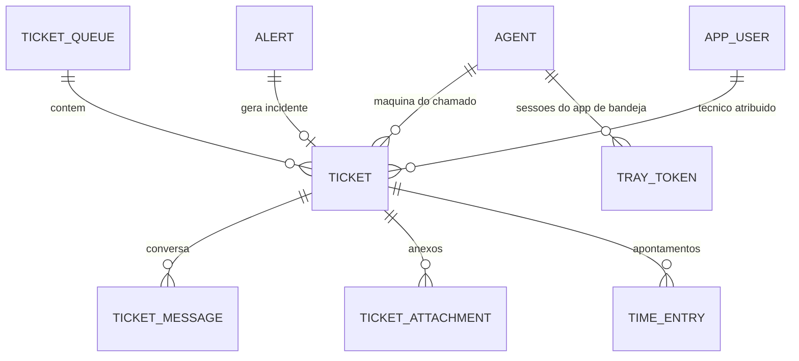
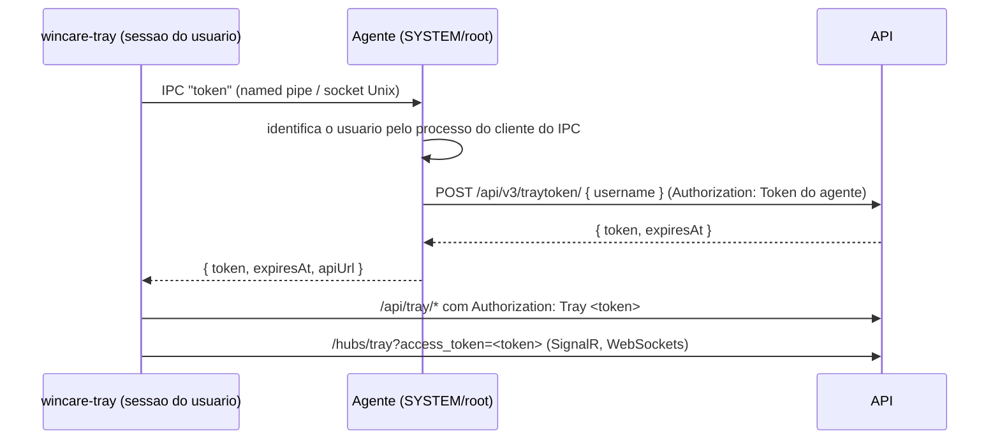

# Contrato de API - Fase 5 (chamados, incidentes e app de bandeja)

Mesmo padrao das fases anteriores (cookie com 2FA, camelCase, ProblemDetails com `code`, auditoria em toda escrita do console).

## 1. Dominio



| Entidade | Campos principais |
|---|---|
| `TicketQueue` | `id, name, description, isDefault` (sempre existe uma fila padrao "Geral") |
| `Ticket` | `id` (numero exibido como #id), `type` (`request` ou `incident`), `title`, `description`, `status`, `priority`, `queueId`, `agentId?`, `clientId?`, `siteId?`, `requesterName`, `requesterUsername?` (usuario do sistema operacional), `requesterEmail?`, `assignedToId?`, `alertId?`, `source` (`console`, `tray`, `alert`), `createdById?`, `createdAt`, `updatedAt`, `firstResponseAt?`, `resolvedAt?`, `closedAt?`, `firstResponseDueAt?`, `resolutionDueAt?` |
| `TicketMessage` | `id, ticketId, authorType` (`technician`, `requester`, `system`), `authorUserId?, authorName, body, internal, createdAt` |
| `TicketAttachment` | `id, ticketId, messageId?, fileName, contentType, size, createdAt, uploadedBy` (conteudo em tabela separada `bytea`, ate 10 MB por arquivo) |
| `TimeEntry` | `id, ticketId, userId, minutes, description, workDate, createdAt` |
| `SlaRule` | `priority, firstResponseMinutes, resolutionMinutes` (uma linha por prioridade) |
| `TrayToken` | `id, agentId, username, tokenHash (SHA-256), expiresAt, createdAt` |

`status`: `new` (novo), `in_progress` (em atendimento), `waiting_user` (aguardando usuario), `resolved` (resolvido), `closed` (fechado).
`priority`: `low`, `medium`, `high`, `critical`.

Regras:
- Ao criar, `clientId` e `siteId` vem do agente quando houver `agentId`.
- Prazos de SLA calculados na criacao e ao mudar a prioridade, a partir de `createdAt` (24x7, sem calendario de expediente nesta fase). Padrao: critica 30 min / 4 h; alta 1 h / 8 h; media 4 h / 24 h; baixa 8 h / 72 h.
- `firstResponseAt` e gravado na primeira mensagem publica de um tecnico.
- Atribuir um tecnico a um chamado `new` muda o status para `in_progress`. Mudar para `resolved` grava `resolvedAt`; para `closed` grava `closedAt`; reabrir (`new`, `in_progress`, `waiting_user`) limpa os dois.
- Mensagem do usuario em chamado `waiting_user` ou `resolved` volta o status para `in_progress`.
- Toda mudanca de status, prioridade ou atribuicao gera mensagem `system` publica.
- `internal: true` so aparece no console (nota interna); o app de bandeja nunca recebe.

## 2. Permissoes novas
| Chave | Uso |
|---|---|
| `tickets.view` | Ver chamados, mensagens, anexos e apontamentos |
| `tickets.manage` | Criar, editar, atribuir, responder, anexar e apontar horas |
| `settings.manage` (existente) | Filas, SLA e regras de incidente |

O papel padrao "Tecnico" recebe as duas em instalacoes novas.

## 3. Chamados no console

`TicketListItem`:
```
{ id, type, title, status, priority, queueId, queueName, agentId, hostname, clientName, siteName,
  requesterName, assignedToId, assignedToName, source, createdAt, updatedAt,
  firstResponseDueAt, resolutionDueAt, slaBreached: boolean, unreadForTechnician: boolean }
```
`slaBreached`: prazo de primeira resposta vencido sem resposta, ou prazo de solucao vencido sem resolucao.
`unreadForTechnician`: a ultima mensagem publica e do usuario.

`TicketDetail` = `TicketListItem` mais `{ description, requesterUsername, requesterEmail, alertId, createdByName, firstResponseAt, resolvedAt, closedAt, totalMinutes, agent: { id, hostname, status, plat, operatingSystem, loggedInUsername, publicIp, meshNodeId } | null }`. O campo `meshNodeId` foi retirado (substituido na fase 12.8, ver ADR-023).

| Metodo | Rota | Permissao | Corpo / resposta |
|---|---|---|---|
| GET | `/api/tickets?status=&priority=&type=&queueId=&assigned=me\|unassigned\|<userId>&agentId=&search=&open=true&page=&pageSize=` | `tickets.view` | `Paged<TicketListItem>`, mais recentes primeiro; `open=true` filtra `new`, `in_progress` e `waiting_user` |
| GET | `/api/tickets/summary` | `tickets.view` | `{ open, unassigned, mine, breached, byStatus: { new, in_progress, waiting_user, resolved, closed } }` |
| GET | `/api/tickets/{id}` | `tickets.view` | `TicketDetail`; 404 |
| POST | `/api/tickets` | `tickets.manage` | `{ title (3 a 200), description (ate 20000), type, priority, queueId?, agentId?, requesterName?, requesterEmail?, assignedToId? }` -> 201 `TicketDetail` |
| PATCH | `/api/tickets/{id}` | `tickets.manage` | `{ title?, description?, type?, priority?, queueId? }` -> `TicketDetail` |
| PUT | `/api/tickets/{id}/status` | `tickets.manage` | `{ status, message? }` -> `TicketDetail` (`message` vira mensagem publica) |
| PUT | `/api/tickets/{id}/assign` | `tickets.manage` | `{ userId: guid \| null }` -> `TicketDetail`; 400 se o usuario nao tiver `tickets.manage` |
| GET | `/api/tickets/assignees` | `tickets.view` | `[{ id, name }]` usuarios ativos com `tickets.manage` |
| GET | `/api/agents/{id}/tickets` | `tickets.view` | `TicketListItem[]` (ultimos 50 da maquina) |

### Mensagens
`MessageDto`: `{ id, ticketId, authorType, authorName, body, internal, createdAt, attachments: [{ id, fileName, contentType, size }] }`

| Metodo | Rota | Permissao | Corpo / resposta |
|---|---|---|---|
| GET | `/api/tickets/{id}/messages` | `tickets.view` | `MessageDto[]` em ordem cronologica |
| POST | `/api/tickets/{id}/messages` | `tickets.manage` | `{ body (1 a 20000), internal }` -> 201 `MessageDto` |

### Anexos
| Metodo | Rota | Permissao | Corpo / resposta |
|---|---|---|---|
| POST | `/api/tickets/{id}/attachments` | `tickets.manage` | `multipart/form-data` com `file`, `messageId?` e `internal?` (com `messageId`, o anexo segue a visibilidade da mensagem) -> 201 `{ id, fileName, contentType, size }`; 413 acima de 10 MB |
| GET | `/api/tickets/{id}/attachments` | `tickets.view` | lista |
| GET | `/api/tickets/{id}/attachments/{attachmentId}` | `tickets.view` | arquivo. O tipo e identificado pela assinatura do arquivo: imagens PNG, JPEG, GIF e WEBP sao servidas com o proprio tipo; qualquer outro arquivo sai como `application/octet-stream` para download |

### Apontamento de tempo
| Metodo | Rota | Permissao | Corpo / resposta |
|---|---|---|---|
| GET | `/api/tickets/{id}/time` | `tickets.view` | `[{ id, userId, userName, minutes, description, workDate, createdAt }]` |
| POST | `/api/tickets/{id}/time` | `tickets.manage` | `{ minutes (1 a 1440), description?, workDate? (data, padrao hoje) }` -> 201 |
| DELETE | `/api/tickets/{id}/time/{entryId}` | `tickets.manage` | 204 (somente o autor ou superusuario; senao 403) |

### Filas e SLA (`settings.manage`, leitura com `tickets.view`)
- `GET /api/ticket-queues` -> `[{ id, name, description, isDefault, openCount }]`; `POST`, `PUT /{id}`, `DELETE /{id}` (409 se houver chamados ou se for a padrao).
- `GET /api/tickets/sla` -> `[{ priority, firstResponseMinutes, resolutionMinutes }]`; `PUT /api/tickets/sla` com a lista completa.
- `GET/PUT /api/tickets/incident-settings` -> `{ enabled, severities: string[], priority, queueId, resolveWithAlert }`. Padrao: ativo, severidade `error`, prioridade `high`, fila padrao, `resolveWithAlert` verdadeiro.

## 4. Incidentes a partir de alertas
- Quando um alerta e criado com severidade em `severities`, nasce um chamado `type: "incident"`, `source: "alert"`, vinculado ao alerta e ao agente, titulo `"[hostname] mensagem do alerta"`.
- No maximo um incidente aberto por alerta; um alerta repetido do mesmo check reaproveita o incidente aberto e recebe mensagem `system`.
- Quando o alerta e resolvido (automaticamente ou no console), o incidente recebe mensagem `system`; com `resolveWithAlert`, passa a `resolved` se ainda nao tiver tecnico atribuido.

## 5. Tempo real no console (hub `/hubs/console`)
| Metodo do hub | Parametros |
|---|---|
| `JoinTicket` | `ticketId` (exige `tickets.view`) |
| `LeaveTicket` | `ticketId` |

Eventos:
- `ticketsChanged` `{ ticketId }` para todos (lista e contadores).
- `ticketMessage` `(ticketId, MessageDto)` para quem entrou no chamado.

## 6. App de bandeja

### 6.1 Identidade
O app roda na sessao do usuario e nao tem acesso ao token do agente. Ele pede ao agente, por IPC local, um token curto:



- `POST /api/v3/traytoken/` (agente) `{ username }` -> `{ token, expires_at }` (chaves no padrao do agente Go). Token de 32 bytes aleatorios (64 hex), guardado como SHA-256, validade de 12 horas, vinculado a agente e usuario. `username` vazio: 400.
- IPC: Windows `\\.\pipe\wincare-tray`; Linux `/run/wincare-tray.sock`; macOS `/var/run/wincare-tray.sock`. O agente identifica o usuario pelo processo do outro lado (Windows: token do processo cliente do pipe; Linux e macOS: UID do par do socket). O app nunca informa o proprio usuario.

### 6.2 Rotas do app (`Authorization: Tray <token>`)
`TrayTicket`: `{ id, title, status, priority, createdAt, updatedAt, assignedToName, chatEnabled, lastMessageAt }`. `chatEnabled` = tem tecnico atribuido e status diferente de `closed`.

| Metodo | Rota | Corpo / resposta |
|---|---|---|
| GET | `/api/tray/me` | `{ hostname, username, clientName, siteName }` |
| GET | `/api/tray/tickets` | `TrayTicket[]` do usuario nesta maquina (ultimos 50) |
| POST | `/api/tray/tickets` | `multipart/form-data`: `title` (3 a 200), `description` (ate 20000), `screenshot?` (imagem ate 10 MB) -> 201 `TrayTicket` (`source: "tray"`, prioridade `medium`, fila padrao) |
| GET | `/api/tray/tickets/{id}` | `TrayTicket` mais `{ description, messages: TrayMessage[], attachments }` (`attachments`: anexos sem mensagem, como a captura de tela da abertura); 404 se nao for do usuario |
| POST | `/api/tray/tickets/{id}/messages` | `{ body }` -> 201 `TrayMessage`; 409 `CHAT_LOCKED` sem tecnico atribuido ou chamado fechado |
| GET | `/api/tray/tickets/{id}/attachments/{attachmentId}` | arquivo (somente anexos de mensagens publicas ou do proprio usuario) |

`TrayMessage`: `{ id, authorType, authorName, body, createdAt, attachments: [{ id, fileName, contentType, size }] }` (nunca inclui notas internas).

### 6.3 Tempo real do app (hub `/hubs/tray`, mesmo token na query `access_token`)
Eventos:
- `ticketMessage` `(ticketId, TrayMessage)` quando o tecnico responde (o app mostra notificacao do sistema).
- `ticketChanged` `(TrayTicket)` quando muda status ou atribuicao.

## 7. Limites desta fase
- O token do app vai na query `access_token` ao abrir o WebSocket do hub `/hubs/tray` (o navegador nao envia cabecalhos no WebSocket); por isso o token e curto (12 h) e restrito as rotas do app.
- Chamados abertos no console nao aparecem no app do usuario (nao tem `requesterUsername`); o app mostra os chamados que o proprio usuario abriu.
- SLA 24x7, sem calendario de expediente e sem pausa em `waiting_user`.
- Sem e-mail para o usuario final; o canal do usuario e o app de bandeja.
- Anexos guardados no PostgreSQL (entram no `pg_dump`); arquivos grandes ficam para armazenamento externo em fase futura.
