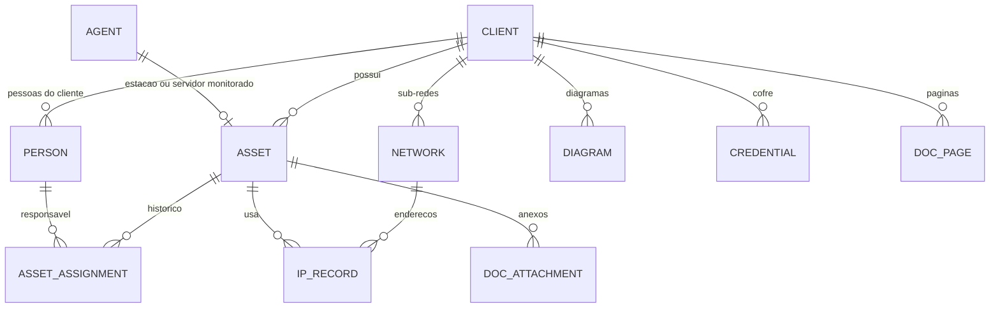

# Contrato de API - Fase 6 (inventario e documentacao de rede)

Mesmo padrao das fases anteriores (cookie com 2FA, camelCase, ProblemDetails com `code`, auditoria em toda escrita).

## 1. Dominio



| Entidade | Campos |
|---|---|
| `Asset` | `id, clientId, siteId?, agentId?` (unico), `type, name, manufacturer?, model?, serialNumber?, assetTag?` (patrimonio), `status, purchaseDate?, warrantyUntil?, location?, ipAddress?, macAddress?, notes?, createdAt, updatedAt` |
| `Person` | `id, clientId, name, email?, phone?, department?, jobTitle?, username?` (login no sistema operacional), `active, createdAt` |
| `AssetAssignment` | `id, assetId, personId, assignedAt, unassignedAt?, assignedBy, notes?` |
| `Network` | `id, clientId, siteId?, name, cidr, vlanId?` (1 a 4094), `vlanName?, gateway?, dnsServers?, dhcpRange?, description?` |
| `IpRecord` | `id, networkId, address, assetId?, hostname?, macAddress?, kind` (`static`, `reserved`, `dhcp`), `description?` |
| `Diagram` | `id, clientId, siteId?, name, data` (JSON do React Flow: `{ nodes, edges, viewport }`, ate 2 MB), `updatedAt, updatedBy` |
| `Credential` | `id, clientId, siteId?, assetId?, name, username?, secret` (cifrado), `url?, notes?, updatedAt, updatedBy` |
| `DocPage` | `id, clientId, siteId?, title, body` (Markdown, ate 200 000), `updatedAt, updatedBy` |
| `DocAttachment` | `id, ownerType` (`asset`, `network`, `page`), `ownerId, fileName, contentType, size, uploadedBy, createdAt` (conteudo em tabela separada, ate 10 MB) |

`type` do ativo: `workstation`, `server`, `laptop`, `printer`, `switch`, `router`, `firewall`, `access_point`, `phone`, `monitor`, `ups`, `other`.
`status` do ativo: `active`, `stock`, `maintenance`, `retired`.

Regras:
- **Ativo de agente**: todo agente tem um ativo (`agentId` preenchido) criado e atualizado pelo servidor: nome = hostname, tipo `server` ou `workstation` conforme o agente, fabricante, modelo e serie lidos do inventario do agente quando existirem. Os campos editados a mao (patrimonio, status, localizacao, compra, garantia, observacoes, tipo `laptop`) nao sao sobrescritos. Ao excluir o agente, o ativo permanece com `agentId` nulo e status `retired`.
- **Responsavel**: no maximo uma atribuicao aberta por ativo. Atribuir outra pessoa fecha a anterior (`unassignedAt`); o historico nunca e apagado.
- **Sugestao de responsavel**: se o ativo de agente nao tem responsavel e o ultimo usuario logado bate com o `username` de uma pessoa ativa do mesmo cliente (sem diferenciar maiusculas e ignorando o dominio `DOMINIO\`), a ficha mostra `suggestedPerson`.
- **IP**: `address` deve pertencer ao `cidr` da rede e ser unico na rede.
- **Credenciais**: o segredo e cifrado com AES-256-GCM usando a chave `Vault:Key` (32 bytes em base64, variavel de ambiente `VAULT_KEY`), que nao fica no banco. Sem a chave configurada, as rotas de credenciais respondem 503 `VAULT_DISABLED`. O segredo so sai na rota de revelar, que gera auditoria.

## 2. Permissoes novas
| Chave | Uso |
|---|---|
| `inventory.view` | Ver ativos, pessoas e fichas |
| `inventory.manage` | Criar, editar e excluir ativos e pessoas, atribuir responsaveis |
| `docs.view` | Ver redes, IPs, diagramas, paginas e anexos; ver a lista de credenciais sem o segredo |
| `docs.manage` | Criar, editar e excluir documentacao de rede |
| `credentials.reveal` | Revelar o segredo de uma credencial |
| `credentials.manage` | Criar, editar e excluir credenciais |

O papel padrao "Tecnico" recebe `inventory.view`, `inventory.manage`, `docs.view`, `docs.manage` e `credentials.reveal` em instalacoes novas.

## 3. Ativos (`inventory.*`)

`AssetListItem`: `{ id, clientId, clientName, siteId, siteName, agentId, type, name, manufacturer, model, serialNumber, assetTag, status, ipAddress, responsible: { id, name } | null, agentStatus, updatedAt }`

| Metodo | Rota | Permissao | Corpo / resposta |
|---|---|---|---|
| GET | `/api/assets?clientId=&siteId=&type=&status=&personId=&search=&page=&pageSize=` | `inventory.view` | `Paged<AssetListItem>`; `search` procura em nome, patrimonio, serie, modelo e IP |
| GET | `/api/assets/{id}` | `inventory.view` | `AssetSheet` (secao 4) |
| POST | `/api/assets` | `inventory.manage` | `SaveAsset` -> 201 `AssetSheet` |
| PUT | `/api/assets/{id}` | `inventory.manage` | `SaveAsset` -> `AssetSheet`; em ativo de agente, `name` e `type` (exceto `laptop`) sao ignorados |
| DELETE | `/api/assets/{id}` | `inventory.manage` | 204; 409 se for ativo de agente ativo |
| PUT | `/api/assets/{id}/responsible` | `inventory.manage` | `{ personId: number \| null, notes? }` -> `AssetSheet` |
| GET | `/api/agents/{id}/asset` | `inventory.view` | `{ assetId }` (cria o ativo se ainda nao existir) |

`SaveAsset`: `{ clientId, siteId?, type, name (1 a 200), manufacturer?, model?, serialNumber?, assetTag?, status, purchaseDate? (data), warrantyUntil? (data), location?, ipAddress?, macAddress?, notes? (ate 5000) }`. `siteId` precisa ser do `clientId`; `ipAddress` precisa ser IP valido; `macAddress` no formato `AA:BB:CC:DD:EE:FF` (aceita `-`, gravado com `:`).

## 4. Ficha do ativo (`AssetSheet`)
```
{
  asset: { ...AssetListItem, purchaseDate, warrantyUntil, location, macAddress, notes, createdAt },
  responsible: { personId, name, email, phone, department, assignedAt, assignedBy } | null,
  suggestedPerson: { id, name } | null,
  history: [{ id, personId, personName, assignedAt, unassignedAt, assignedBy, notes }],
  hardware: { source: "agent" | "manual", makeModel, serialNumber, cpus: string[], gpus: string[], ramGb, disks: string[], localIps: string[],
              operatingSystem, lastLoggedInUser, bootTime } | null,
  software: { count, updatedAt } | null,
  agent: { id, hostname, status, plat, lastSeen } | null,
  network: [{ networkId, networkName, cidr, vlanId, address, kind }],
  credentials: [{ id, name, username, url }],
  attachments: [{ id, fileName, contentType, size, createdAt }],
  tickets: { open, recent: [{ id, title, status, createdAt }] }
}
```
`hardware` vem do inventario enviado pelo agente (Windows: WMI; Linux e macOS: modelo, CPU, GPU, discos e IPs locais; o agente Linux nao envia numero de serie). `network` lista os registros de IP do ativo e as redes cujo `cidr` contem o `ipAddress` do ativo ou um dos `localIps`.

## 5. Pessoas (`inventory.*`)
| Metodo | Rota | Permissao | Corpo / resposta |
|---|---|---|---|
| GET | `/api/people?clientId=&search=&active=&page=&pageSize=` | `inventory.view` | `Paged<{ id, clientId, clientName, name, email, phone, department, jobTitle, username, active, assetCount }>` |
| GET | `/api/people/{id}` | `inventory.view` | pessoa mais `assets` (atuais) e `history` |
| POST, PUT `/{id}` | `/api/people` | `inventory.manage` | `{ clientId, name (2 a 200), email?, phone?, department?, jobTitle?, username?, active }` |
| DELETE | `/api/people/{id}` | `inventory.manage` | 204; 409 se tiver ativos atribuidos (desative em vez de excluir) |

## 6. Redes e IPs (`docs.*`)
| Metodo | Rota | Permissao | Corpo / resposta |
|---|---|---|---|
| GET | `/api/networks?clientId=&siteId=` | `docs.view` | `[{ id, clientId, clientName, siteId, siteName, name, cidr, vlanId, vlanName, gateway, dnsServers, dhcpRange, description, usedCount, totalHosts }]` |
| GET | `/api/networks/{id}` | `docs.view` | rede mais `ips` (`IpRecord` com `assetName`) e `discovered` (ativos e agentes com IP dentro da faixa e sem registro: `{ address, assetId, assetName, source }`) |
| POST, PUT `/{id}`, DELETE `/{id}` | `/api/networks` | `docs.manage` | `{ clientId, siteId?, name, cidr, vlanId?, vlanName?, gateway?, dnsServers?, dhcpRange?, description? }`; `cidr` IPv4 ou IPv6 valido e normalizado (`192.168.1.10/24` vira `192.168.1.0/24`); `gateway` dentro da rede |
| POST | `/api/networks/{id}/ips` | `docs.manage` | `{ address, assetId?, hostname?, macAddress?, kind, description? }` -> 201; 400 fora da faixa; 409 repetido |
| PUT, DELETE | `/api/networks/{id}/ips/{ipId}` | `docs.manage` | |

## 7. Diagramas (`docs.*`)
- `GET /api/diagrams?clientId=` -> `[{ id, clientId, clientName, siteId, name, updatedAt, updatedBy }]`
- `GET /api/diagrams/{id}` -> com `data`.
- `POST`, `PUT /{id}`, `DELETE /{id}` (`docs.manage`): `{ clientId, siteId?, name, data }`. Nos, quando representam um ativo, guardam `data.assetId`; o console usa isso para abrir a ficha.

## 8. Credenciais
| Metodo | Rota | Permissao | Corpo / resposta |
|---|---|---|---|
| GET | `/api/credentials?clientId=&assetId=&search=` | `docs.view` | `[{ id, clientId, clientName, siteId, assetId, assetName, name, username, url, notes, updatedAt, updatedBy }]` (sem segredo) |
| POST | `/api/credentials/{id}/reveal` | `credentials.reveal` | `{ secret }`; gera auditoria `credential.reveal` |
| POST, PUT `/{id}`, DELETE `/{id}` | `/api/credentials` | `credentials.manage` | `{ clientId, siteId?, assetId?, name, username?, secret? (obrigatorio na criacao; ausente no PUT mantem o atual), url?, notes? }` |

## 9. Paginas de documentacao (`docs.*`)
`GET /api/doc-pages?clientId=&search=`, `GET /api/doc-pages/{id}`, `POST`, `PUT /{id}`, `DELETE /{id}` com `{ clientId, siteId?, title (2 a 200), body }`. O console mostra o Markdown sem HTML bruto (texto do usuario nunca e interpretado como HTML).

## 10. Anexos de documentacao
- `POST /api/doc-attachments` (`multipart/form-data`: `ownerType`, `ownerId`, `file`) -> 201 (`inventory.manage` para `asset`, `docs.manage` para os demais).
- `GET /api/doc-attachments?ownerType=&ownerId=` e `GET /api/doc-attachments/{id}` (download, mesmas regras de tipo dos anexos de chamado) com `inventory.view` ou `docs.view` conforme o dono.
- `DELETE /api/doc-attachments/{id}` com a permissao de escrita do dono.

## 11. Limites desta fase
- Impressoras, switches e outros equipamentos sao cadastrados a mao; descoberta e coleta SNMP ficam para a fase 8.
- Sem importacao de planilhas.
- O numero de serie de maquinas Linux depende de evolucao do agente (fase 7).
