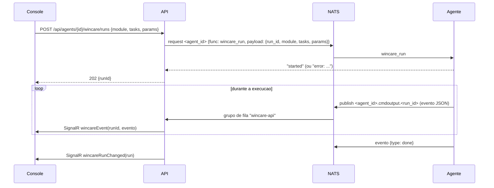

# Contrato - Fase 7 (WinCare no agente, Health Check e autoatendimento)

Mesmo padrao das fases anteriores. O contrato da fase 1 continua valido: o agente novo apenas acrescenta comandos.

## 1. Visao geral



## 2. Catalogo (fonte unica: agente)

O catalogo fica embutido no agente (`agent/wincare/catalog.json`). O console sempre pede o catalogo ao proprio agente, entao cada maquina mostra exatamente o que a versao instalada sabe fazer.

```
{ version, modules: [ {
    key, label, description, platforms: ["windows"|"linux"|"darwin"],
    tasks: [ { key, label, group, description, default: bool, platforms: [...], selfService: bool, reboot: bool, dangerous: bool,
               params: [ { name, label, type: "string"|"bool"|"number"|"select", options?: string[], default?, required: bool } ] } ]
} ] }
```

Modulos (chaves estaveis):
| `key` | Origem no WinCare Pro | Sistemas |
|---|---|---|
| `maintenance` | 01 Manutencao Windows | windows; versao propria para linux e darwin |
| `windows_update` | 02 Windows Update | windows |
| `bug_fixer` | 03 Bug Fixer | windows |
| `office` | 04 Office Suite | windows |
| `registry` | 05 Registro | windows |
| `app_remover` | 06 App Remover | windows |
| `component_test` | 08 Testes de componentes | windows; testes basicos em linux e darwin |
| `winget` | 09 Winget | windows |

O modulo 07 (Health Check) vira o comando `wincare_health`, escrito em Go para os tres sistemas.

## 3. Comandos NATS do agente (msgpack `{func, payload}`; valores de `payload` sao strings)

| `func` | `payload` | Resposta |
|---|---|---|
| `wincare_catalog` | | string JSON do catalogo filtrado pelo sistema da maquina |
| `wincare_run` | `run_id` (`wc-` + 32 hex), `module`, `tasks` (chaves separadas por virgula), `params` (JSON `{nome: valor}`) | `"started"`; `"error: <motivo>"` (modulo ou tarefa desconhecidos, sistema nao suportado, outra execucao em andamento) |
| `wincare_cancel` | `run_id` | `"ok"` ou `"error: <motivo>"` |
| `wincare_health` | | string JSON `HealthReport` |

Uma execucao por vez em cada agente. A execucao roda como SYSTEM/root, com tempo limite por modulo (padrao 2 h; `windows_update` 4 h).

### Eventos publicados em `<agent_id>.cmdoutput.<run_id>` (string JSON em msgpack)
Todos tem `seq` (1, 2, 3...) e `time` (RFC 3339).
- `{ type: "log", level: "INFO"|"WARN"|"ERROR"|"SUCCESS", message }`
- `{ type: "progress", value: 0..100, message? }`
- `{ type: "task", key, status: "running"|"ok"|"warning"|"error"|"skipped", message? }`
- `{ type: "result", data }` (dados estruturados de tarefas que devolvem listas, por exemplo aplicativos instalados ou resultado de testes)
- `{ type: "done", status: "ok"|"warning"|"error"|"cancelled"|"timeout", durationMs, rebootRequired: bool }` (sempre o ultimo)

### `HealthReport`
```
{ score: 0..100, grade: "otimo"|"bom"|"atencao"|"critico", collectedAt, platform,
  items: [ { key, label, category, status: "ok"|"warning"|"critical"|"unknown", value, detail, weight, points } ] }
```
Itens: CPU (carga media), memoria, discos (espaco livre por volume), tempo ligado e reinicio pendente, servicos com falha (servicos automaticos parados no Windows; unidades com falha no systemd), erros recentes de sistema (Event Log System nas ultimas 24 h no Windows; `journalctl -p err` no Linux), antivirus e firewall (Windows: Defender e perfis do firewall), atualizacoes pendentes (Windows Update; `apt`/`dnf` no Linux quando disponivel). Item que nao se aplica ao sistema nao entra na conta. `score` = soma de `points` / soma de `weight` dos itens aplicaveis x 100.

## 4. API do console

Permissao nova: `wincare.run` (executar e cancelar modulos WinCare). Leitura usa `agents.view`.

| Metodo | Rota | Permissao | Corpo / resposta |
|---|---|---|---|
| GET | `/api/agents/{id}/wincare/catalog` | `agents.view` | catalogo do agente; 504 `AGENT_TIMEOUT` |
| POST | `/api/agents/{id}/wincare/runs` | `wincare.run` | `{ module, tasks: string[], params?: {} }` -> 202 `WinCareRunDto`; 409 `AGENT_BUSY` com execucao em andamento; 400 com a mensagem do agente |
| GET | `/api/agents/{id}/wincare/runs?page=&pageSize=` | `agents.view` | `Paged<WinCareRunDto>` |
| GET | `/api/wincare/runs/{runId}` | `agents.view` | `WinCareRunDto` com `events` (ordenados por `seq`) |
| POST | `/api/wincare/runs/{runId}/cancel` | `wincare.run` | 202 |
| GET | `/api/agents/{id}/health` | `agents.view` | ultimo `HealthReport` guardado ou 404 |
| POST | `/api/agents/{id}/health` | `agents.view` | coleta agora, guarda e devolve o `HealthReport` |
| GET/PUT | `/api/wincare/self-service` | `settings.manage` (GET tambem `agents.view`) | `{ enabled, tasks: string[] }` (`"modulo.tarefa"`) |

`WinCareRunDto`: `{ id, runId, agentId, hostname, module, tasks, params, status: "running"|"ok"|"warning"|"error"|"cancelled"|"timeout", progress, startedAt, finishedAt, requestedBy, source: "console"|"tray", rebootRequired, taskStatus: { [key]: status } }`

Tempo real (hub `/hubs/console`): `JoinWinCareRun(runId)` / `LeaveWinCareRun(runId)`; eventos `wincareEvent(runId, evento)` para quem entrou e `wincareRunChanged(WinCareRunDto)` para todos.

Health Check periodico: o servidor coleta a cada 6 horas de cada agente online (distribuido no intervalo) e guarda o ultimo relatorio. A ficha do ativo e o detalhe do agente mostram nota e itens.

## 5. Autoatendimento no app de bandeja

Liberado pelo tecnico em `/api/wincare/self-service`: so tarefas com `selfService: true` no catalogo e presentes na lista `tasks`.

| Metodo | Rota (`Authorization: Tray`) | Resposta |
|---|---|---|
| GET | `/api/tray/self-service` | `{ enabled, tasks: [{ module, key, label, description }] }` |
| POST | `/api/tray/self-service/run` `{ module, key }` | 202 `{ runId }`; 403 se a tarefa nao estiver liberada; 409 `AGENT_BUSY` |
| GET | `/api/tray/self-service/runs/{runId}` | `{ runId, status, progress, label, messages: string[] }` (somente execucoes do proprio usuario) |

Evento no hub `/hubs/tray`: `selfServiceChanged({ runId, status, progress, message })`.
Cada execucao pelo app gera auditoria com o usuario da maquina.

## 6. Agente
- Versao `2.12.0`. A versao distribuida pela API vem de `AGENT_VERSION` no `.env` (padrao 2.11.0); depois de publicar a tag `v2.12.0`, mude para `2.12.0`.
- O agente ja enviava `serialnumber` no inventario (Linux: placa-mae; macOS: `ioreg`), mas o servidor procurava outra chave; o servidor passa a ler `serialnumber` e o agente Linux passa a preferir o numero de serie do produto (`/sys/class/dmi/id/product_serial`).
- Publicacao: workflow de release no repositorio do agente gera, ao criar a tag `v2.12.0`, os arquivos `tacticalagent-v2.12.0-{plat}-{arch}[.exe]` no formato que a API ja usa (`{DownloadBaseUrl}/v{versao}/{arquivo}`), mais o `wincare-tray` para Windows.

## 7. Fora desta fase
Coleta de logs de sistema e coletor SNMP sairam da fase 7 e entram na fase 8 junto com a ingestao no servidor, para que cada um seja entregue e testado de ponta a ponta (agente e console).
