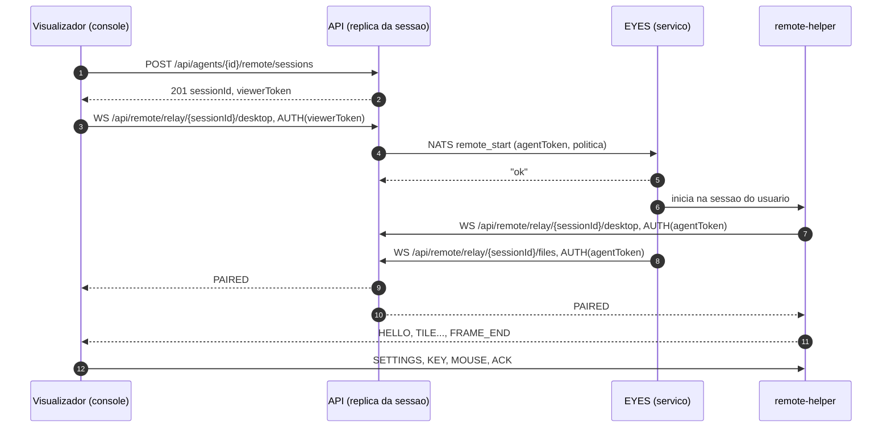
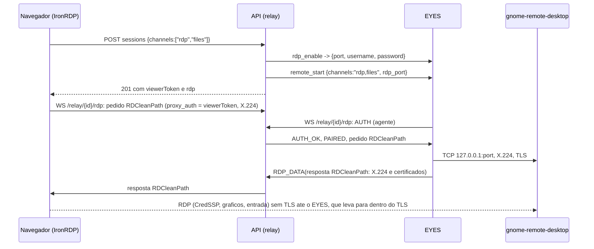

# Contrato de fio do acesso remoto (v1)

Especificacao normativa do acesso remoto proprio do Cybereyes (RFC-001, ADR-023). Vale para as tres pontas: o console (visualizador), a API (sessoes, relay, arquivos, politicas e auditoria) e o EYES (servico e `eyes remote-helper`).

- **Status**: v1, fase 12.0. Itens marcados com **[S1]** a **[S6]** dependem da prova tecnica correspondente (RFC-001, secao 7.1) e podem mudar com o resultado dela.
- **Regra de leitura**: "deve" e obrigatorio; "pode" e opcional. O que nao esta aqui nao faz parte da v1.
- **Caminhos curtos**: os mesmos do contrato do EYES (`Api/`, `Core/`, `Tests/`, `front/`).
- **Relacao com o contrato do EYES** (`docs/agente/contrato-eyes.md`): NATS, msgpack e autenticacao REST do agente seguem as secoes 1 e 4 daquele contrato. Este documento so acrescenta.

## Sumario

1. [Visao geral e identificadores](#1-visao-geral-e-identificadores)
2. [REST do console](#2-rest-do-console)
3. [Comandos NATS](#3-comandos-nats)
4. [Relay: conexao, autenticacao e quadros](#4-relay-conexao-autenticacao-e-quadros)
5. [Canal desktop](#5-canal-desktop)
6. [Area de transferencia](#6-area-de-transferencia)
7. [Canal files e transferencia de arquivos](#7-canal-files-e-transferencia-de-arquivos)
8. [Politicas, consentimento e permissoes](#8-politicas-consentimento-e-permissoes)
9. [Auditoria e dados](#9-auditoria-e-dados)
10. [Limites](#10-limites)
11. [Versoes e compatibilidade](#11-versoes-e-compatibilidade)
12. [Checklist de conformidade](#12-checklist-de-conformidade)

---

## 1. Visao geral e identificadores



| Identificador | Formato | Origem |
|---|---|---|
| `sessionId` | 32 caracteres hexadecimais minusculos (`Guid` no formato `N`), como no terminal | API |
| `viewerToken` | 32 bytes aleatorios em base64url sem `=` (43 caracteres) | API, devolvido so ao visualizador |
| `agentToken` | 32 bytes aleatorios em base64url sem `=` (43 caracteres), diferente do `viewerToken` | API, enviado so pelo NATS |
| `transferId` | inteiro sem sinal de 32 bits, unico dentro da sessao | API |

- Os tokens sao guardados na API so como SHA-256, valem **60 s para conectar** e sao de **uso unico por canal**. Depois de usados, a sessao vale ate o fim, sem novo token.
- Os tokens **nunca** aparecem em URL, log ou banco.

## 2. REST do console

Mesmo padrao das fases anteriores: cookie com 2FA, camelCase, ProblemDetails com `code`, auditoria em toda acao (`docs/api/fase4-mesh.md`).

### 2.1 Rotas

| Metodo | Rota | Permissao | Resposta |
|---|---|---|---|
| POST | `/api/agents/{id}/remote/sessions` | `agents.remote` para `desktop` ou `rdp`; `agents.files` se pedir o canal `files` | 201 `RemoteSessionDto` |
| GET | `/api/remote/sessions/{sessionId}` | dono da sessao ou `settings.manage` | 200 `RemoteSessionDto` (sem tokens) |
| DELETE | `/api/remote/sessions/{sessionId}` | dono da sessao ou `settings.manage` | 204 |
| GET | `/api/remote/sessions?agentId=&ticketId=&userId=&active=&page=` | `agents.view` | 200 lista paginada de `RemoteSessionDto` (sem tokens) |
| GET | `/api/remote/transfers?agentId=&sessionId=&page=` | `agents.view` | 200 lista paginada das transferencias (caminho, tamanho, SHA-256, situacao; sem conteudo) |
| GET | `/api/remote/sessions/{sessionId}/files/list?path=` | `agents.files` | 200 `FileEntryDto[]` |
| GET | `/api/remote/sessions/{sessionId}/files/home` | `agents.files` | 200 `{ desktop, home, downloads, separator }` do usuario conectado |
| POST | `/api/remote/sessions/{sessionId}/files/mkdir` `{ path }` | `agents.files` | 204 |
| POST | `/api/remote/sessions/{sessionId}/files/rename` `{ from, to }` | `agents.files` | 204 |
| POST | `/api/remote/sessions/{sessionId}/files/delete` `{ path, recursive }` | `agents.files` | 204 |
| POST | `/api/remote/sessions/{sessionId}/files/clipboard` `{ transferIds }` | `agents.files` | 204 (arquivos ja enviados vao para a area de transferencia da sessao, so Windows) |
| POST | `/api/remote/sessions/{sessionId}/uploads` `{ path, size, overwrite }` | `agents.files` e politica `files.upload` | 201 `{ transferId, received }` (`received` > 0 retoma um envio interrompido) |
| PUT | `/api/remote/sessions/{sessionId}/uploads/{transferId}` com `Content-Range: bytes a-b/total` | idem | 200 `{ received }` |
| POST | `/api/remote/sessions/{sessionId}/uploads/{transferId}/complete` | idem | 200 `{ sha256, path }` |
| GET | `/api/remote/sessions/{sessionId}/download?path=&zip=` (aceita `Range` quando `zip=false`; `path` repetido baixa varios itens num zip) | `agents.files` e politica `files.download` | 200 ou 206, `Content-Disposition: attachment` |
| GET | `/api/remote/policies` | `settings.manage` | 200 `RemotePolicyDto[]` |
| PUT | `/api/remote/policies/{scope}/{scopeId?}` | `settings.manage` | 200 `RemotePolicyDto` |
| DELETE | `/api/remote/policies/{scope}/{scopeId}` | `settings.manage` | 204 (volta a herdar) |
| POST | `/api/agents/{id}/wake` | `agents.control` | 200 `{ result: "ok", via }` (`via` e a maquina que enviou); 409 sem placa no inventario ou sem vizinho online na mesma rede |

### 2.2 Tipos

`POST /api/agents/{id}/remote/sessions`, corpo:

```json
{ "channels": ["desktop", "files"], "viewOnly": false, "ticketId": 123 }
```

- `channels`: pelo menos um de `desktop`, `rdp` e `files`, com no maximo um canal de tela (`desktop` ou `rdp`). Sessao so com `files` atende a aba "Arquivos" do agente. `rdp` e o RDP do GNOME para Linux com sessao Wayland (secao 5.4) e so vale para agentes Linux.
- `ticketId`: opcional; liga a sessao ao chamado (historico e sugestao de apontamento de tempo).

`RemoteSessionDto`:

```json
{
  "sessionId": "9f0c...32hex",
  "agentId": 12,
  "hostname": "PC-FINANCEIRO-01",
  "user": "tecnico",
  "channels": ["desktop", "files"],
  "viewOnly": false,
  "state": "starting | waiting-consent | active | ended",
  "consent": "none | notify | ask",
  "startedAt": "2026-10-05T12:00:00Z",
  "endedAt": null,
  "endReason": null,
  "relayUrl": "wss://rmm.exemplo.com/api/remote/relay/9f0c...",
  "viewerToken": "so na resposta do POST",
  "expiresAt": "momento limite para conectar",
  "rdp": "so na resposta do POST com o canal rdp (secao 5.4)"
}
```

`rdp` (canal `rdp`): `{ "destination": "<hostname>", "username": "eyes", "password": "<senha temporaria>", "user": "<usuario da sessao>", "clipboard": true }`. A senha e criada pelo EYES a cada sessao; `clipboard` diz se o visualizador liga a area de transferencia do RDP (secao 5.4).

`FileEntryDto`: `{ name, path, kind: "file" | "dir" | "link", size, modifiedAt, hidden }`.

`RemotePolicyDto`: ver secao 8.1.

### 2.3 Erros

| HTTP | `code` | Quando |
|---|---|---|
| 403 | (padrao) | sem a permissao, ou politica desliga o recurso pedido |
| 404 | (padrao) | agente, sessao ou transferencia inexistente, ou sessao de outro tecnico |
| 409 | `AGENT_OFFLINE` | agente desconectado do NATS |
| 409 | `REMOTE_UNSUPPORTED` | versao do EYES abaixo de `Remote:MinimumAgentVersion` (secao 11), sistema sem suporte na v1 ou canal `rdp` fora do Linux |
| 409 | `REMOTE_WAYLAND` | canal `desktop` numa sessao so Wayland; o console abre a mesma maquina pelo canal `rdp` |
| 409 | `SESSION_LIMIT` | limite de sessoes do agente ou do tecnico (secao 10) |
| 409 | `NO_INTERACTIVE_SESSION` | canal `desktop` sem usuario conectado e politica `allowAtLoginScreen = false` |
| 409 | `FILE_EXISTS` | destino ja existe e `overwrite = false` |
| 409 | `SESSION_ENDED` | operacao em sessao encerrada |
| 413 | `FILE_TOO_LARGE` | acima de `files.maxFileMb` |
| 416 | (padrao) | `Content-Range` fora da sequencia esperada; o corpo traz `{ received }` |
| 422 | `INVALID_PATH` | caminho recusado pelas regras da secao 7.3 |
| 502 | `AGENT_ERROR` | o agente respondeu erro; `detail` traz a mensagem |
| 503 | `REMOTE_DISABLED` | `Remote:Enabled = false` na API |
| 504 | `AGENT_TIMEOUT` | sem resposta do agente no prazo |

## 3. Comandos NATS

Mesmas regras da secao 4 do contrato do EYES: mapa msgpack com `func`; `payload` com valores **sempre `str`**; objetos como texto JSON.

| `func` | Modo | Timeout no servidor | `payload` | Resposta |
|---|---|---|---|---|
| `remote_start` | request | 15 s | `session_id`, `relay_url` (base `wss://.../api/remote/relay/<sessao>`), `token` (`agentToken`), `channels` (`"desktop,files"` ou `"rdp,files"`), `view_only` (`"true"`/`"false"`), `policy` (texto JSON, secao 8.2), `technician` (nome exibido ao usuario), `rdp_port` (so com `rdp`: porta local do RDP do GNOME) | `"ok"` ou `"error: <motivo>"` |
| `rdp_enable` | request | 85 s | `view_only` (`"true"`/`"false"`) | `{ port, username, password, user }` ou `"error: <motivo>"` |
| `rdp_disable` | publish | | | |
| `remote_stop` | publish | | `session_id`, `reason` (`"user"`, `"technician"`, `"permission"`, `"timeout"`, `"server"`) | |
| `wol` | request | 15 s | `macs` (texto JSON, lista de `"AA:BB:CC:DD:EE:FF"`), `broadcast` (texto JSON, lista de enderecos IPv4 de broadcast) | `"ok"` ou `"error: <motivo>"` |

- O EYES usa o **caminho** de `relay_url` sobre o endereco da API configurado nele (`https` vira `wss`): so conecta ao servidor que ja conhece, mesmo que o servidor anuncie outro nome.
- `remote_start` responde **antes** do consentimento. O resultado do consentimento chega pelo relay (quadro `CONSENT`).
- Motivos padronizados de erro em `remote_start`: `unsupported`, `wayland` (canal `desktop` numa sessao so Wayland), `busy` (limite local), `no session` (sem usuario e sem tela de login permitida), `policy` (recurso desligado no agente).
- `rdp_enable` (so Linux): liga o RDP do GNOME (`grdctl rdp`) na sessao do usuario conectado, com certificado TLS proprio, usuario `eyes` e senha nova a cada pedido; `view_only` liga o modo so de visualizacao do proprio GNOME. A API chama antes do `remote_start` com o canal `rdp`; o EYES desliga (`rdp_disable`) quando a sessao termina, e a API publica `rdp_disable` se o `remote_start` falhar.
- `wol`: o EYES envia o pacote magico (6 bytes `0xFF` seguidos de 16 repeticoes do MAC) por UDP para cada broadcast, nas portas 7 e 9. A API escolhe o agente que envia: online, mesmo site e com interface na mesma sub-rede do alvo, pelo inventario.

## 4. Relay: conexao, autenticacao e quadros

### 4.1 Conexao

- URL: `wss://<CYBEREYES_HOST>/api/remote/relay/{sessionId}/{canal}`, canal `desktop` ou `files`.
- **Replica dona**: a replica que cria a sessao e a dona. Ela grava no Redis `remote:session:<sessionId>` com o proprio endereco interno e uma chave de encaminhamento aleatoria. Uma replica que receber o relay ou uma rota REST da sessao (a partir de `/api/remote/sessions/{sessionId}`) e nao for a dona confere as credenciais externas (cookie ou `Authorization` do agente) e encaminha a conexao para a dona com o cabecalho `X-Remote-Forward: <chave>`. O Nginx apaga esse cabecalho nas requisicoes de fora. Sem Redis (uma replica so), toda sessao e local. A prova S3 descartou o `hash` do Nginx (`docs/remoto/provas-12.1.md`).
- **Visualizador**: conecta so ao canal `desktop`, com o cookie do console. O canal `files` termina na API: o navegador usa so a REST da secao 2.
- **EYES**: o `remote-helper` conecta ao `desktop`; o servico conecta ao `files`. Os dois enviam `Authorization: Token <token do agente>` (o mesmo da REST `/api/v3`).
- Tudo e WebSocket **binario**. Cada mensagem WebSocket carrega exatamente um quadro.

### 4.2 Quadro

```
+--------+--------------------------------+
| tipo   | corpo                          |
| 1 byte | JSON UTF-8 ou binario por tipo |
+--------+--------------------------------+
```

- Inteiros binarios em **big-endian**.
- Corpo JSON: objeto, sem campos alem dos listados; campos desconhecidos devem ser ignorados por quem recebe.
- Tipo desconhecido: ignorar e seguir (permite evolucao).

| Faixa | Uso |
|---|---|
| `0x01` a `0x0F` | relay (secao 4.3) |
| `0x10` a `0x3F` | canal `desktop` (secoes 5 e 6) |
| `0x40` a `0x6F` | canal `files` (secao 7) |

### 4.3 Autenticacao e emparelhamento

| Tipo | Nome | Sentido | Corpo |
|---|---|---|---|
| `0x01` | `AUTH` | ponta para API | JSON `{ "token": str, "role": "viewer" \| "agent", "proto": 1 }` |
| `0x02` | `AUTH_OK` | API para ponta | JSON `{ "sessionId": str }` |
| `0x03` | `PAIRED` | API para as duas pontas do `desktop` | JSON `{ }` |
| `0x04` | `PEER_GONE` | API para a ponta que ficou | JSON `{ "reason": str }` |

Regras:
- `AUTH` deve ser a primeira mensagem, em ate 10 s; senao a API fecha com `4401`.
- A API confere: token, sessao ativa, papel, canal e, para o agente, que o `Authorization` pertence ao agente da sessao.
- No `desktop`, a API so repassa quadros depois do `PAIRED`. Quadros da faixa `0x10` a `0x3F` sao repassados sem leitura do corpo, com excecao de `CLIPBOARD` e `CONSENT`, que a API le so para contar e auditar (nunca registra o conteudo).
- Sem a outra ponta em 60 s depois do `AUTH_OK`: fecha com `4408`.
- Se uma ponta cair, a API manda `PEER_GONE` a outra e encerra a sessao em 30 s, salvo reconexao com sessao ativa **[S3]**. O visualizador reconecta pedindo uma sessao nova.
- Canal `rdp`: o visualizador nao manda `AUTH`; o token vem no pedido RDCleanPath (secao 5.4). Ele nao recebe `AUTH_OK`, `PAIRED` nem `PEER_GONE`; o agente recebe `AUTH_OK` e `PAIRED` como no `desktop`.

Codigos de fechamento:

| Codigo | Motivo |
|---|---|
| `1000` | fim normal |
| `4401` | autenticacao invalida ou ausente |
| `4403` | sem permissao (inclusive permissao retirada durante a sessao) |
| `4408` | outra ponta nao conectou a tempo |
| `4409` | canal ja conectado por outra ponta do mesmo papel |
| `4410` | sessao encerrada (tecnico, usuario, limite de tempo ou servidor) |
| `4413` | quadro acima do limite (secao 10) |
| `4429` | excesso de quadros por segundo |

## 5. Canal desktop

### 5.1 Quadros do agente para o visualizador

| Tipo | Nome | Corpo |
|---|---|---|
| `0x10` | `HELLO` | JSON `{ "proto": 1, "os": "windows" \| "linux" \| "darwin", "displays": [Display], "active": id, "features": [str], "user": str \| null }` |
| `0x11` | `TILE` | binario: `u32 frame`, `u16 x`, `u16 y`, `u16 w`, `u16 h`, depois JPEG |
| `0x12` | `FRAME_END` | binario: `u32 frame`, `u16 tiles`, `u16 width`, `u16 height` |
| `0x13` | `CURSOR` | JSON `{ "visible": bool, "x": int, "y": int, "id": int, "hotX": int, "hotY": int, "png": str \| null }` |
| `0x14` | `CLIPBOARD` | secao 6 |
| `0x15` | `DISPLAYS` | JSON `{ "displays": [Display], "active": id }` |
| `0x16` | `CONSENT` | JSON `{ "state": "waiting" \| "accepted" \| "denied" \| "timeout" }` |
| `0x17` | `FILES_COPIED` | secao 7.6 |
| `0x18` | `BYE` | JSON `{ "reason": str }` |
| `0x19` | `ERROR` | JSON `{ "code": str, "message": str }` |

`Display`: `{ "id": int, "name": str, "x": int, "y": int, "w": int, "h": int, "scale": number, "primary": bool }`, em pixels fisicos da area de trabalho virtual.

Regras de imagem:
- Coordenadas de `TILE` relativas ao monitor ativo, ja na escala pedida em `SETTINGS`.
- Blocos de ate 256 x 256 px; o agente so envia blocos alterados desde o quadro anterior confirmado.
- `TILE` traz JPEG baseline (o `image/jpeg` do Go gera esse formato) **[S2]**.
- O visualizador desenha os blocos ao receber e so considera o quadro completo no `FRAME_END`.
- Com a tela parada, o agente reenvia em qualidade 90 (em partes de ate 96 blocos de 64 px) os blocos que foram com
  qualidade menor: o texto fica nitido sem pesar durante o movimento. O refinamento usa os mesmos `TILE` e `FRAME_END`.
- Cursor separado (feature `cursor`, pedido com `settings.cursor = true`): o agente para de desenhar o ponteiro na
  imagem e manda `CURSOR` quando a posicao, a visibilidade ou o desenho mudam (verificados a cada 33 ms, entre as
  capturas tambem). `x` e `y` sao o ponto ativo no quadro, ja na escala do `SETTINGS`; `hotX`, `hotY` e o PNG ficam em
  pixels do monitor. `png` vai so na primeira vez de cada `id` (base64); `png = null` reaproveita o desenho com o mesmo
  `id`. Sem o pedido, o agente desenha o ponteiro na imagem, como antes.
- O visualizador mostra o cursor remoto pela forma do ponteiro local (controlando) ou desenhado sobre a tela
  (somente visualizar, mouse fora da tela ou cursor movido do outro lado).
- `features` da v1: `desktop`, `clipboard-text`, `files-copied`, `cad`, `view-only`, `cursor`. A segunda etapa
  acrescenta `clipboard-png`.

### 5.2 Quadros do visualizador para o agente

| Tipo | Nome | Corpo |
|---|---|---|
| `0x20` | `SETTINGS` | JSON `{ "quality": 1-100, "scale": 0.25-1, "maxFps": 1-30, "display": id, "cursor": bool }` (`cursor` opcional, padrao `false`) |
| `0x21` | `KEY` | JSON `{ "code": str, "down": bool }`, `code` igual a `KeyboardEvent.code` |
| `0x22` | `TEXT` | JSON `{ "text": str }`, ate 4 KB por quadro |
| `0x23` | `MOUSE` | JSON `{ "x": int, "y": int, "buttons": int }` |
| `0x24` | `WHEEL` | JSON `{ "dx": int, "dy": int }`, em unidades de 1/120 de clique |
| `0x25` | `REFRESH` | JSON `{ }` (pede quadro completo) |
| `0x26` | `CAD` | JSON `{ }` (Ctrl+Alt+Del) **[S1]** |
| `0x27` | `ACK` | binario: `u32 frame`, `u32 receivedMs` |
| `0x14` | `CLIPBOARD` | secao 6 |

Regras de entrada:
- `MOUSE`: coordenadas do monitor ativo na resolucao **original** (o visualizador desfaz a escala). `buttons` segue `MouseEvent.buttons` (1 esquerdo, 2 direito, 4 meio).
- `KEY`: o agente traduz `code` para a tecla fisica do sistema (scancode no Windows, keycode no X11, keycode virtual no macOS), entao o layout do teclado remoto vale. Teclas presas: no fim da sessao ou em `PEER_GONE`, o agente solta todas as teclas e botoes pressionados.
- `TEXT`: digitacao por Unicode (acentos e IME), sem depender de layout.
- `view-only`: o agente descarta `KEY`, `TEXT`, `MOUSE`, `WHEEL`, `CAD` e `CLIPBOARD` vindos do visualizador.
- O visualizador junta `MOUSE` e `WHEEL` em no maximo um a cada 16 ms (o ultimo movimento; a soma da roda). Botao
  apertado ou solto e tecla saem na hora, depois do movimento pendente.

### 5.3 Controle de fluxo e ritmo

- O visualizador manda `ACK` ao terminar de desenhar cada quadro.
- O agente mede a ida e volta de cada quadro (`FRAME_END` ate o `ACK`) e a taxa de entrega (bytes confirmados por
  tempo), como o BBR: minimo da ida e volta nos ultimos ~40 s e maximo da taxa nos ultimos ~10 s.
- Quadros sem `ACK`: o bastante para cobrir a ida e volta minima no ritmo pedido (`minRTT / (1 / maxFps) + 2`), entre
  **2 e 12**. Bytes sem `ACK`: 2 x taxa x ida e volta minima, entre **128 KiB e 4 MiB** (4 MiB enquanto nao houver
  medida). Com a janela cheia o agente espera; o proximo quadro sai com a tela do momento (quadros intermediarios
  sao descartados, nunca enfileirados).
- Qualidade: comeca na do `SETTINGS` e nunca passa dela; cai 10 quando a fila (ida e volta menos a minima) passa de
  300 ms, cai 5 quando a janela segurou quadros, e sobe 5 por segundo com fila abaixo de 100 ms. Minimo 25.
- Ritmo: no maximo `maxFps` capturas por segundo. Com captura por leitura da tela (GDI, X11), depois de 2 s sem
  mudanca e sem entrada do tecnico a captura cai para 4 por segundo; a entrada do tecnico volta ao ritmo na hora.
  Com o DXGI Desktop Duplication (Windows 8 ou mais novo) o sistema avisa as mudancas e a tela parada nao custa nada.
- O agente rele os monitores a cada 3 s e manda `DISPLAYS` quando mudam (resolucao, monitor ligado ou desligado).
- O `remote-helper` so existe durante a sessao: nasce no `remote_start` e termina no `remote_stop`, no fim do relay ou
  quando perde a ligacao com o servico EYES (entrada padrao fechada, por exemplo numa atualizacao), avisando o
  visualizador com `BYE` `agent`.

### 5.4 Canal rdp (RDP do GNOME em Linux com Wayland)

O remote-helper nao captura sessoes so Wayland (D-06). Nelas, a tela vem do RDP do proprio GNOME (`gnome-remote-desktop`), levado pelo relay; o navegador usa o cliente RDP do IronRDP (`@devolutions/iron-remote-desktop`, licenca MIT ou Apache-2.0), que fala o protocolo RDCleanPath com um proxy. O EYES e esse proxy.



Regras:
- **RDCleanPath** (`crates/ironrdp-rdcleanpath`): DER, `SEQUENCE` com campos de tag de contexto EXPLICIT, versao 3390. O pedido traz `destination`, `proxy_auth` e o X.224 Connection Request; a resposta traz o X.224 Connection Confirm, a cadeia de certificados do servidor e `server_addr`. Erros: geral (codigo 1) com codigo HTTP ou alerta TLS, e negociacao (codigo 2) com o X.224 de falha do servidor.
- **Visualizador para API**: a primeira mensagem e o pedido RDCleanPath. A API le so o `proxy_auth` e confere com o `viewerToken` (uso unico) e com o usuario da sessao; com falha, responde o erro RDCleanPath com HTTP 401 e fecha com `4401` (409 e `4409` para canal ja conectado; 504 e `4408` sem o agente no prazo). O pedido fica guardado e vai ao agente depois do emparelhamento. As mensagens seguintes sao RDP puro, repassadas sem leitura e sem o limite de quadros por segundo (o cliente ja agrupa a entrada nos pacotes do RDP).
- **Agente para API**: `RDP_DATA` (`0x50`) com os bytes do RDP depois do tipo; a API tira o byte de tipo antes de entregar ao navegador. `CONSENT` e `BYE` funcionam como no `desktop` e ficam na API (nao seguem para o navegador).
- **EYES**: depois do `PAIRED`, aplica a politica de aviso e de pedido de acesso (secao 8.3). So entao le o pedido, conecta em `127.0.0.1:<rdp_port>` (nunca no `destination` pedido), manda o X.224, le a resposta (TPKT), faz o TLS com o servidor e responde com a cadeia de certificados. Depois leva os bytes nos dois sentidos. No fim da sessao, desliga o RDP do GNOME.
- O TLS entre o EYES e o `gnome-remote-desktop` fica em `127.0.0.1` e usa o certificado que o proprio EYES gerou no `rdp_enable`, por isso o EYES nao valida a cadeia. O CredSSP do navegador amarra a credencial a chave publica que vai na resposta.
- **Area de transferencia**: e a do proprio RDP (`cliprdr`), que a API nao le. A API manda `rdp.clipboard = clipboardToRemote e clipboardToLocal e nao viewOnly`, e o visualizador liga ou desliga a area de transferencia do cliente RDP com esse valor. A politica por sentido vale so no canal `desktop`.
- **Arquivos**: o canal `files` funciona igual (secao 7) na mesma sessao.
- **Somente visualizar**: o `rdp_enable` liga o modo so de visualizacao do GNOME.
- **Estado no console**: o cliente RDP nao conhece o pedido de acesso nem o motivo do fim; o visualizador consulta `GET /api/remote/sessions/{id}` enquanto a sessao esta aberta.
- **Navegador**: o WASM do cliente RDP vem embutido numa URL `data:`. A CSP do console precisa de `'wasm-unsafe-eval'` em `script-src` e de `data:` em `connect-src`.
- Ciclo de vida (EYES 3.2.4): o RDP do GNOME so existe entre o "Acessar" e o "Encerrar". O `rdp_enable` configura a
  credencial temporaria e so inicia o `gnome-remote-desktop.service` do usuario (sem habilitar no login). No fim da
  sessao (Encerrar, janela fechada, queda do visualizador, tempo limite) o EYES desliga o RDP, apaga a credencial,
  para o servico e desfaz a habilitacao no login deixada por versoes anteriores. Na partida, o EYES faz a mesma
  limpeza onde ja usou o RDP, se nenhuma sessao estiver em uso.

## 6. Area de transferencia

`CLIPBOARD` (`0x14`) vale nos dois sentidos, no canal `desktop`:

```json
{ "kind": "text", "text": "conteudo", "hash": "sha256 hex do texto em UTF-8" }
```

- v1: so `kind = "text"`, ate 1 MiB em UTF-8. Segunda etapa: `kind = "png"`, campo `data` em base64, ate 8 MiB.
- **Agente**: envia a cada mudanca da area de transferencia da sessao (Windows `WM_CLIPBOARDUPDATE`; X11 XFixes; macOS `changeCount` a cada 500 ms) **[S1] [S5] [S6]**. Ao receber, grava na area de transferencia da sessao.
- **Visualizador**:
  - ao receber, grava com `navigator.clipboard.writeText`; se o navegador recusar por falta de gesto, guarda e grava na proxima tecla ou clique dentro da tela;
  - Ctrl+V ou Cmd+V dentro da tela: le o texto do evento `paste`, envia `CLIPBOARD` e **so depois** os `KEY` da combinacao;
  - onde a permissao de leitura existir, le ao receber o foco e envia se mudou **[S4]**.
- **Sem eco**: cada ponta guarda o `hash` do ultimo conteudo recebido e nao reenvia o mesmo `hash`.
- **Politica**: `clipboard.toRemote` e `clipboard.toLocal` (secao 8). O **agente** descarta o que a politica nao permite, nos dois sentidos, e nao anuncia `clipboard-text` se os dois estiverem desligados.
- **Auditoria**: a API conta quadros e bytes por sentido. O conteudo nunca vai para log nem banco.

## 7. Canal files e transferencia de arquivos

O canal `files` liga a API ao servico do EYES (o navegador usa a REST da secao 2). Pedido e resposta carregam `id` (inteiro escolhido pela API).

### 7.1 Quadros

| Tipo | Nome | Sentido | Corpo |
|---|---|---|---|
| `0x40` | `REQUEST` | API para agente | JSON `{ "id": int, "op": str, ... }` |
| `0x41` | `RESPONSE` | agente para API | JSON `{ "id": int, "ok": bool, "result": any, "error": { "code": str, "message": str } }` |
| `0x42` | `CHUNK` | os dois | binario: `u32 transferId`, `u64 offset`, dados (ate 256 KiB) |
| `0x43` | `CREDIT` | quem recebe | JSON `{ "transferId": int, "bytes": int }` |
| `0x44` | `CANCEL` | os dois | JSON `{ "transferId": int }` |

### 7.2 Operacoes (`REQUEST.op`)

| `op` | Campos | `result` |
|---|---|---|
| `home` | | `{ desktop, home, downloads, separator }` do usuario conectado |
| `list` | `path` | `[FileEntry]`, ate 5000 itens, pastas primeiro |
| `stat` | `path` | `FileEntry` |
| `mkdir` | `path` | `null` |
| `rename` | `from`, `to` | `null` |
| `delete` | `path`, `recursive` | `null` |
| `upload-begin` | `transferId`, `path`, `size`, `overwrite`, `restart` | `{ received }` (tamanho do `.partial` existente; `restart = true` apaga o `.partial` e devolve 0) |
| `upload-end` | `transferId`, `sha256` | `{ sha256, path }` |
| `download-begin` | `transferId`, `path` ou `paths`, `offset`, `zip` | `{ size, sha256 }` do que foi enviado; a resposta so sai depois do ultimo `CHUNK` |
| `clipboard-files` | `transferIds` | `null`: coloca os arquivos recebidos na area de transferencia da sessao (Windows `CF_HDROP`) |

Codigos de erro do agente: `not-found`, `exists`, `denied`, `invalid-path`, `too-large`, `no-space`, `hash-mismatch`, `busy`, `unsupported`, `io`.

### 7.3 Caminhos

- Absolutos e no formato do sistema remoto. O agente normaliza e recusa (`invalid-path`):
  - qualquer segmento `..`;
  - caractere nulo;
  - no Windows: prefixos `\\.\` e `\\?\`, nomes reservados (`CON`, `NUL`, `COM1`...), e `:` fora da letra da unidade (fluxos alternativos do NTFS);
  - links simbolicos que levem para fora da pasta pedida em `delete` recursivo.
- O destino padrao do arrastar e soltar e a `desktop` devolvida por `home` (D-05, padrao provisorio).

### 7.4 Envio (navegador para estacao)

1. `POST /uploads` cria a transferencia; a API manda `upload-begin` e devolve `received`.
2. O navegador envia blocos de **1 MiB** por `PUT` com `Content-Range` a partir de `received`.
3. A API repassa cada bloco em `CHUNK`s de ate 256 KiB, respeitando o `CREDIT` dado pelo agente (o agente concede ate 4 MiB por vez).
4. O agente grava em `<destino>.partial`. A API calcula o SHA-256 enquanto repassa.
5. `POST /complete`: a API manda `upload-end` com o seu SHA-256; o agente confere com o calculado no disco, renomeia o `.partial` para o destino e responde. Se os hashes diferirem, o agente apaga o `.partial` e responde `hash-mismatch`.
6. Queda no meio: um novo `POST /uploads` com o mesmo `path` e `size` na mesma sessao devolve a mesma transferencia e o `received`, e o envio continua dai. A API guarda o SHA-256 parcial na memoria da replica dona; transferencia nova (outra sessao) sempre comeca do zero (`restart = true`), porque a API nao tem o hash do inicio.

### 7.5 Download (estacao para navegador)

1. `GET /download` faz a API mandar `stat` (arquivo comum: tamanho e tipo; pasta vira zip), depois `download-begin`, e conceder `CREDIT` (4 MiB no inicio e o que escrever na resposta HTTP). Credito que chega antes do agente registrar a transferencia fica guardado.
2. O agente le e envia `CHUNK`s; a API repassa ao navegador em streaming, sem gravar em disco.
3. A API e o agente calculam o SHA-256; o agente envia o seu na `RESPONSE` do `download-begin`, depois do ultimo bloco; se diferir, a API aborta a resposta HTTP (o navegador marca o download como falho). Erro antes do primeiro bloco vira resposta de erro normal (secao 2.3).
4. `zip = true` (pastas): o agente gera o zip durante o envio; sem `Range`.
5. `Range` (arquivo comum): vira `offset` no `download-begin`.

### 7.6 Arquivos copiados e colados

- **Copiados na estacao**: quando a area de transferencia da sessao passa a ter lista de arquivos (Windows `CF_HDROP`), o `remote-helper` envia `FILES_COPIED` (`0x17`) JSON `{ "paths": [str], "totalBytes": int }`, ate 1000 caminhos. O visualizador mostra "Baixar" e usa `GET /download` (uma pasta ou varios arquivos vao como zip).
- **Colados no visualizador**: arquivos que o navegador entregar no evento `paste` sao enviados (7.4) para a pasta Downloads do usuario e, ao fim, o visualizador chama `POST /files/clipboard` e a API manda `clipboard-files`; o usuario cola com Ctrl+V no Explorer. So Windows na v1.

## 8. Politicas, consentimento e permissoes

### 8.1 `RemotePolicyDto`

Escopos: `global`, `client`, `site`. O efetivo e o mais especifico; campo nulo herda do escopo acima.

| Campo | Tipo | Padrao global | Significado |
|---|---|---|---|
| `consent` | `none` \| `notify` \| `ask` | `none` (D-04) | aviso ao usuario |
| `consentTimeoutSeconds` | int | 60 | sem resposta no `ask`, recusa |
| `allowAtLoginScreen` | bool | `true` | permite tela sem usuario conectado |
| `clipboardToRemote` | bool | `true` | tecnico para estacao |
| `clipboardToLocal` | bool | `true` | estacao para tecnico |
| `filesUpload` | bool | `true` | envio para a estacao |
| `filesDownload` | bool | `true` | download da estacao |
| `maxFileMb` | int | 2048 (D-05, provisorio) | limite por arquivo |
| `idleMinutes` | int | 30 | sem entrada do visualizador |
| `maxHours` | int | 8 | duracao maxima |

### 8.2 `policy` no `remote_start`

Texto JSON com o efetivo para aquele agente, nos mesmos nomes: `{ "consent", "consentTimeoutSeconds", "allowAtLoginScreen", "clipboardToRemote", "clipboardToLocal", "filesUpload", "filesDownload", "maxFileMb", "idleMinutes", "maxHours" }`. O agente aplica o que recebeu; a API tambem aplica do seu lado.

### 8.3 Consentimento no EYES

- `none`: conecta direto, sem nada na tela do usuario.
- `notify`: o EYES pede ao `eyes-tray` o aviso "`<technician>` esta acessando este computador", com botao Encerrar, durante toda a sessao.
- `ask`: o EYES manda `CONSENT { waiting }`, pede a decisao ao `eyes-tray` e manda `accepted`, `denied` ou `timeout`. So depois de `accepted` o `remote-helper` envia imagem.
- Sem `eyes-tray` disponivel: no Linux e no macOS o EYES usa a caixa de dialogo e a notificacao do sistema (`zenity` ou `kdialog` e `notify-send`; `osascript`), sem o botao Encerrar; sem elas (e no Windows sem `eyes-tray`), `notify` vira `none` com registro no log do agente e `ask` recusa com `denied`.
- Encerrar pelo usuario: o EYES encerra localmente, manda `BYE { "reason": "user" }` e fecha os canais.
- Canal local com o `eyes-tray` (estende `agent/internal/tray`): nova conexao de eventos, uma linha JSON por mensagem.
  - app para agente, ao abrir: `{"cmd":"subscribe"}`;
  - agente para app: `{"event":"remote-notify","session":"<id>","technician":"<nome>"}`, `{"event":"remote-ask","session":"<id>","technician":"<nome>","timeout":60}`, `{"event":"remote-ended","session":"<id>"}`;
  - app para agente: `{"cmd":"remote-answer","session":"<id>","accept":true}` e `{"cmd":"remote-end","session":"<id>"}`.
  - O agente so aceita resposta de conexao cujo usuario (identificado pelo processo do outro lado, como no token do app) e o da sessao acessada.
- Servico e remote-helper: o servico inicia o remote-helper logo no `remote_start` e aplica a politica em paralelo. Os parametros e, depois deles, as linhas de controle vao pela entrada padrao do remote-helper, uma linha JSON por mensagem: `{"consent":"accepted"|"denied"|"timeout"}` e `{"end":"user"}`. Com `ask`, o remote-helper manda `CONSENT { waiting }` assim que o visualizador emparelha e espera a linha de consentimento; sem aceite manda `CONSENT` com o resultado, `BYE` com `consent-denied` ou `consent-timeout` e fecha. Com `{"end":"user"}` manda `BYE { "reason": "user" }` e fecha.

### 8.4 Permissoes

| Chave | Uso |
|---|---|
| `agents.remote` | sessao com canal `desktop` ou `rdp` (tela e area de transferencia) |
| `agents.files` (nova) | canal `files`, aba "Arquivos" e transferencias |
| `agents.control` | Wake-on-LAN (como hoje) |
| `settings.manage` | politicas; encerrar sessao de outro tecnico |

Retirar a permissao ou desativar o usuario encerra as sessoes dele com `4403`.

## 9. Auditoria e dados

| Evento de auditoria | Quando | Detalhe |
|---|---|---|
| `remote.session-start` | `POST` aceito | maquina, canais, `viewOnly`, chamado |
| `remote.session-end` | fim | duracao, motivo, bytes, contagens de area de transferencia |
| `remote.consent` | resposta do usuario | `accepted`, `denied` ou `timeout` |
| `remote.file-upload` | fim de envio | caminho, tamanho, SHA-256, resultado |
| `remote.file-download` | fim de download | caminho, tamanho, SHA-256, resultado |
| `remote.file-op` | `mkdir`, `rename`, `delete` | caminhos |
| `remote.policy-change` | `PUT` ou `DELETE` de politica | escopo e valores |

Tabelas `remote_sessions`, `remote_transfers` e `remote_policies`: RFC-001, secao 4.12. Retencao da auditoria: pendente (D-04, LGPD).

## 10. Limites

| Limite | Valor v1 |
|---|---|
| Sessoes ativas por agente | 4, com varias de tela (`desktop`) ao mesmo tempo; o canal `rdp` (RDP do GNOME) e exclusivo (EYES 3.2.5) |
| Sessoes ativas por tecnico | 5 |
| Criacao de sessao por tecnico | 10 por minuto |
| Quadro do relay | 2 MiB (`TILE`); 64 KiB (demais JSON); 256 KiB (`CHUNK`); 1 MiB (canal `rdp`) |
| Quadros do visualizador | 200 por segundo (sem limite no canal `rdp`) |
| Texto na area de transferencia | 1 MiB |
| Transferencias simultaneas por sessao | 4 |
| Buffer do relay por ponta | 1 MiB; acima disso a API para de ler a outra ponta (contrapressao) |
| Registro da sessao entre replicas | 1 minuto, renovado a cada 15 s pela replica dona; sessao de replica que caiu fecha em ate ~3 min |
| Tempo para conectar | 60 s (token; mais 85 s com o canal `rdp`, pelo `rdp_enable`); 10 s para o `AUTH` |

## 11. Versoes e compatibilidade

- `proto = 1` no `AUTH` e no `HELLO`. Ponta com `proto` maior que o suportado deve falar a menor versao comum; sem versao comum, fechar com `4401`.
- A API so cria sessao para agentes com versao igual ou maior que `Remote:MinimumAgentVersion` (comparada com `System.Version`, como o resto do servidor); abaixo disso, 409 `REMOTE_UNSUPPORTED`.
- `Remote:Enabled` (padrao `true` a partir da fase 12.2) liga ou desliga o modulo inteiro.
- Novos tipos de quadro e novos `features` sao aditivos; tipos desconhecidos sao ignorados (4.2).

## 12. Checklist de conformidade

Cada item vira teste automatizado na fase indicada.

- [ ] Sessao: `POST` com e sem permissao, limites e erros da secao 2.3 (`Tests/RemoteTests.cs`, 12.2).
- [ ] Tokens: uso unico, vencimento em 60 s, ausencia em URL e logs (`Tests/RemoteTests.cs`, 12.2).
- [ ] Relay: `AUTH` fora de ordem, papel trocado, segundo visualizador (`4409`), ponta ausente (`4408`), permissao retirada (`4403`) (12.2).
- [ ] Emparelhamento com 2 replicas atras do Nginx (S3, 12.2).
- [ ] `remote_start` e `remote_stop` no EYES, com motivos padronizados (`agent/internal/remote`, 12.2).
- [ ] Primeiro quadro, `ACK` e controle de fluxo com o EYES real sob Xvfb (E2E, 12.2).
- [ ] Teclado por `code` e por `TEXT`, mouse em monitor com escala, teclas soltas no fim (12.3).
- [ ] Consentimento `none`, `notify`, `ask` e encerramento pelo usuario (12.3).
- [ ] Area de transferencia nos dois sentidos, sem eco, politica aplicada no agente (12.4).
- [ ] Envio com retomada, download com `Range`, zip de pasta, hash divergente, caminhos invalidos (12.5).
- [ ] `FILES_COPIED` e `clipboard-files` no Windows (12.5).
- [ ] `wol` com escolha do agente vizinho (12.7).
- [x] Canal `rdp`: RDCleanPath com os vetores do IronRDP, token no `proxy_auth`, repasse sem o byte de tipo, `REMOTE_WAYLAND` e desligamento do RDP do GNOME (`agent/internal/remote/rdp_test.go`, `agent/internal/remote/rdcleanpath`, `Tests/RemoteTests.cs`, `front/features/remote/RdpViewer.test.tsx`).
