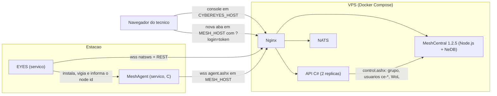
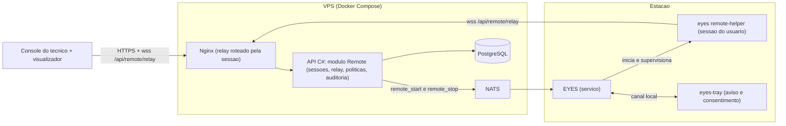
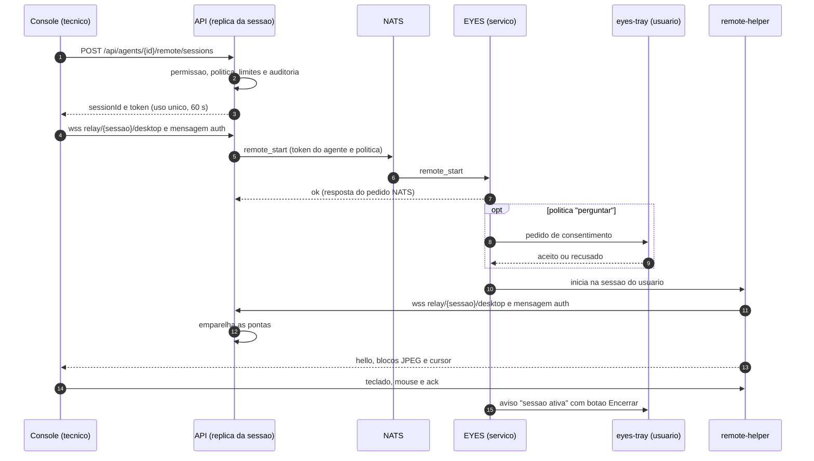
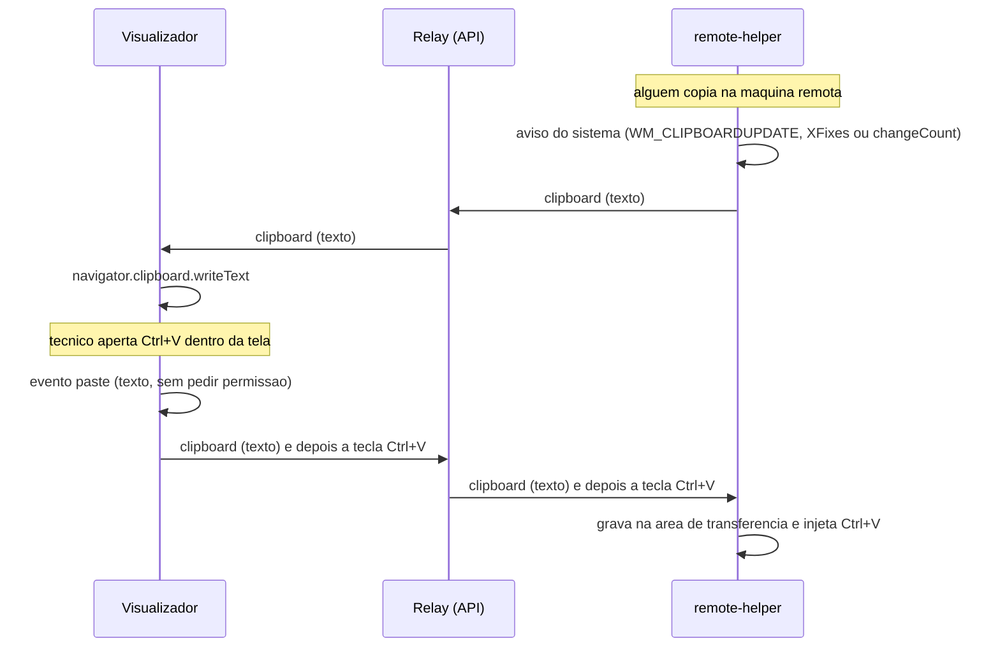
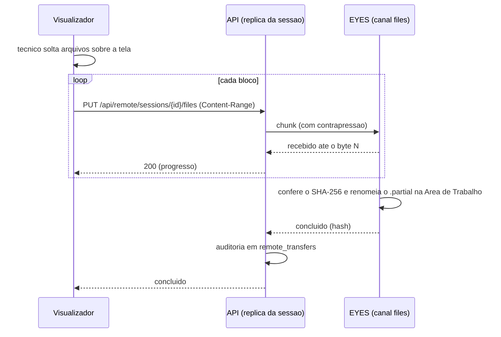

# RFC-001: Acesso remoto proprio (substituir o MeshCentral)

## Status: Aprovado

- **Aprovacao**: 2026-10-05, com as decisoes da secao 13 (registradas no ADR-022).

- **Data**: 2026-10-05
- **Pedido**: refatorar o MeshCentral e trazer o acesso remoto para dentro deste repositorio, como foi feito com o agente do Tactical (ADR-020), para melhorar o codigo e deixar a integracao completa. Requisitos acrescentados no pedido: **area de transferencia automatica** e **transferencia de arquivos facilitada**.
- **Decisao registrada**: ADR-022 (acesso remoto proprio), que substitui o ADR-013 e a parte do ADR-004 que mantem o MeshCentral. O requisito do ADR-004 continua: acesso remoto pelo navegador, sem instalar nada no computador do tecnico.
- **Relacionados**: ADR-004, ADR-013, ADR-018, ADR-019, ADR-020, `docs/api/fase4-mesh.md`, `docs/agente/contrato-eyes.md`, `docs/runbooks/migracao-400-estacoes.md`.
- **Caminhos curtos** (mesma convencao do contrato do EYES): `Api/` = `backend/src/Cybereyes.Api/`, `Core/` = `backend/src/Cybereyes.Core/`, `Tests/` = `backend/tests/Cybereyes.Api.Tests/`, `front/` = `frontend/src/`. Referencias ao MeshCentral apontam para o pacote npm `meshcentral@1.2.5` (a versao em uso); ao MeshAgent, para o repositorio `Ylianst/MeshAgent` no commit `709f373` (2026-09-23).

## Resumo

- **Recomendacao**: nao fazer fork do MeshCentral. Construir o acesso remoto como modulo proprio, dividido entre as tres pecas que ja sao nossas: o EYES (captura de tela, entrada, area de transferencia e arquivos), a API C# (sessoes, relay, politicas e auditoria) e o console React (visualizador). E o mesmo caminho do ADR-020: especificacao primeiro, codigo proprio no monorepo e so dependencias permissivas.
- **Por que nao fork**: o MeshCentral 1.2.5 tem 60.995 linhas de JavaScript nos modulos do servidor e mais 46.249 nas duas telas principais; o MeshAgent tem cerca de 202 mil linhas de C (metade delas o motor JavaScript Duktape), alem de OpenSSL e libjpeg-turbo embutidos. Seriam duas linguagens e cadeias de compilacao a mais, e continuariam existindo dois agentes em cada maquina.
- **O que muda para quem usa**: um agente so (EYES), um endereco so (`CYBEREYES_HOST`), sem segundo login e sem segunda base de usuarios. O acesso remoto abre dentro do console, com as mesmas permissoes e a mesma auditoria. A area de transferencia sincroniza sozinha e os arquivos vao para a maquina remota arrastando para cima da tela.
- **Como chegar la (servidor limpo, D-08)**: provas tecnicas com criterio de seguir ou parar, piloto em homologacao e remocao do MeshCentral do repositorio e da VPS antes da migracao das 400 estacoes. Nenhuma estacao recebe o MeshAgent e nao ha periodo de convivencia em producao.
- **Enquanto o MeshCentral existir no servidor (Etapa 0)**: o servidor deixa de oferecer o MeshAgent. As tres falhas de seguranca da integracao atual (token de login reutilizavel por 60 minutos, `allowFraming` ligado sem necessidade e token gravado no log do Nginx) so precisam de correcao se alguma maquina for usar o MeshCentral antes da remocao.

---

## 1. Contexto

### 1.1 Como funciona hoje

- A API fala com o MeshCentral pelo websocket interno `control.ashx`, com um token cifrado em nome de um administrador interno (`Api/Rmm/Mesh/MeshCentral.cs:115-152`).
- Na partida, a cada 4 minutos e depois de mudancas em usuarios e papeis, a API cria no MeshCentral um usuario `ce-<usuario>` para cada tecnico com `agents.remote` e remove os demais (`Api/Rmm/Mesh/MeshServices.cs:36-98`).
- O botao "Acesso remoto" pede links a API e abre o MeshCentral em outra aba, em outro dominio, com `?login=<token>&gotonode=...&viewmode=11|12|13&hide=31` (`Api/Rmm/Mesh/MeshServices.cs:202-206`, `front/features/agents/actions/RemoteAccessMenu.tsx`).
- Em cada estacao rodam dois agentes. O EYES baixa e instala o MeshAgent, descobre o node id executando `meshagent -nodeid`, informa o servidor a cada 15 a 20 minutos e reinstala o MeshAgent se ele sumir, no maximo a cada 30 minutos (`agent/internal/install/install.go:202`, `agent/internal/mesh/mesh.go:127-143`, `agent/internal/core/core.go:66-96`).

### 1.2 Problemas da integracao atual (debitos tecnicos)

| ID | Problema | Evidencia | Impacto | Esforco |
|---|---|---|---|---|
| DT-01 | O token de login vale 60 minutos e pode ser usado mais de uma vez: o payload `{ a: 3, u }` nao tem `once` nem `expire`, e o MeshCentral aceita o `?login=` por 60 minutos | `Api/Rmm/Mesh/MeshCentral.cs:112-113`; MeshCentral `webserver.js:3085`; `meshcentral.js:3895` (tratamento de `once`) | Alto | Baixo |
| DT-02 | O token vai na URL: fica no historico do navegador e no log de acesso do Nginx, porque o servidor do `MESH_HOST` usa o log padrao da imagem, que grava a linha da requisicao com a query string | `infra/docker/nginx/templates/default.conf.template:119-143` | Alto (somado ao DT-01) | Baixo |
| DT-03 | `"allowFraming": true` faz o MeshCentral deixar de mandar `X-Frame-Options`, mas o console nunca coloca o MeshCentral em iframe (ADR-018). A interface fica exposta a clickjacking sem necessidade | `infra/docker/meshcentral/entrypoint.sh:20`; MeshCentral `webserver.js:7235-7236` | Medio | Baixo |
| DT-04 | Dois agentes por estacao e duas identidades (id do agente e node id), ligadas por sincronizacao periodica e reinstalacao automatica | `agent/internal/core/core.go:66-96`, `agent/internal/install/install.go:202` | Alto (operacao, suporte e superficie de ataque) | Alto (e o objetivo desta RFC) |
| DT-05 | Segunda base de usuarios no MeshCentral, mantida por sincronizacao (na partida, a cada 4 minutos e logo apos mudancas em usuarios e papeis): se a sincronizacao falhar, a permissao retirada continua valendo no MeshCentral ate uma sincronizacao bem-sucedida; o Cybereyes so registra a abertura do acesso, e o resto da sessao fica no log do MeshCentral | `Api/Rmm/Mesh/MeshServices.cs:36-98`, `:205` | Medio | Alto |
| DT-06 | Cliente do `control.ashx` fragil: protocolo interno nao documentado, websocket novo a cada chamada, tempo limite fixo de 20 s, sem nova tentativa, respostas casadas pelo nome da acao | `Api/Rmm/Mesh/MeshCentral.cs:115-152` | Medio (pode quebrar a cada versao do MeshCentral) | Medio |
| DT-07 | Estado da integracao em memoria por replica: com 2 replicas, cada uma sincroniza sozinha e `/api/mesh/status` mostra o estado de quem respondeu | `Api/Rmm/Mesh/MeshServices.cs:16-22`, `Api/Program.cs:73-76` | Baixo | Baixo |
| DT-08 | Segundo dominio, segundo certificado e a tela de login completa do MeshCentral publicada na internet | `infra/docker/docker-compose.yml:218-235`, `infra/docker/certbot/run.sh:15` | Medio | Alto (some com a remocao) |
| DT-09 | Conteiner do MeshCentral sem healthcheck; imagem marcada so com a versao do MeshCentral, entao uma mudanca no entrypoint publica conteudo diferente com a mesma tag | `infra/docker/docker-compose.yml:218-235`; ADR-019, limites conhecidos | Baixo | Baixo |
| DT-10 | O controle remoto de uma maquina real nunca foi testado de ponta a ponta e nao ha teste automatizado contra um MeshCentral real | ADR-013, limites conhecidos; `Tests/MeshTests.cs` | Medio | Medio |
| DT-11 | Na tela do MeshCentral, a area de transferencia automatica e opcional (caixa "Automatic Clipboard"), so de texto, por consulta a cada 1 segundo, e nao envia do navegador para a maquina no Firefox. Soltar um arquivo sobre a tela nao transfere o arquivo: so abre a execucao de `.bat`, `.ps1` e `.sh` ou digita o conteudo de `.txt`. A transferencia fica em outra aba | MeshCentral `views/default.handlebars:1530`, `:10008-10030`, `:10308-10323` | Alto (e o pedido do produto) | Resolvido por esta RFC |

### 1.3 O que foi feito com o agente do Tactical, e o que muda aqui

- **ADR-020**: o agente foi reescrito do zero, em sala limpa, porque o `rmmagent` estava sob a Tactical RMM License. A especificacao ficou em `docs/agente/contrato-eyes.md`, as dependencias sao so permissivas, os binarios sao compilados na imagem da API e a atualizacao e automatica.
- **Licenca do MeshCentral e do MeshAgent**: Apache 2.0, verificada no `package.json` e no `LICENSE` do pacote `meshcentral@1.2.5` e no `readme.md` e nos cabecalhos dos fontes do MeshAgent. A licenca permite usar e adaptar o codigo, com condicoes: incluir a licenca, manter os avisos de copyright e marcar os arquivos alterados. Nao ha exigencia de sala limpa, e a validacao juridica pendente do ADR-005 nao se aplica aqui.
- **Na pratica**: o codigo deles esta em JavaScript (servidor e visualizador) e C (agente); o nosso esta em C#, Go e TypeScript. A proposta e escrever o nosso usando o MeshCentral e o MeshAgent como referencia tecnica (protocolo de blocos JPEG, troca de desktop no Windows, tabelas de teclado, logica do visualizador). Trecho adaptado diretamente leva o aviso de copyright original e entra em `THIRD_PARTY_NOTICES.md`.
- O nome "MeshCentral" nao aparece no produto novo: a licenca Apache 2.0 nao concede uso de marca.

### 1.4 Tamanho do que entraria no repositorio num fork

| Peca | Linguagem | Tamanho medido |
|---|---|---|
| Servidor MeshCentral 1.2.5 | Node.js | 60.995 linhas nos modulos `.js` da raiz (`webserver.js` 10.926, `meshuser.js` 8.711, `meshcentral.js` 4.497, `db.js` 4.277); 46.249 linhas em `views/default.handlebars` e `views/default3.handlebars`; pacote com 2.675 arquivos e 481 MB descompactado, dos quais 207 MB na pasta `agents` (binarios prontos do MeshAgent e de ferramentas como MeshCmd e MeshCentral Router) |
| MeshAgent | C | cerca de 202 mil linhas de `.c` (99.928 delas no `duktape.c`) e 16,8 mil de `.h`, sem contar OpenSSL e libjpeg-turbo, que vem junto; 43,6 mil linhas de modulos JavaScript executados pelo Duktape |
| Controle remoto (KVM) do MeshAgent | C | 16.057 linhas em `meshcore/KVM`: Windows 3.059, Linux 10.399 (X11, DRM e Wayland), macOS 2.599 |
| Integracao atual no Cybereyes | C#, Go, TypeScript, shell | 1.216 linhas nos arquivos dedicados (API 545, agente 320, infra 68, console 283), mais trechos em instalacao, scripts, chamados, inventario e documentacao |

---

## 2. Objetivos e requisitos

### 2.1 O que "integracao 100% efetiva" quer dizer neste plano

1. **Um agente por maquina** (EYES): uma instalacao, um servico, uma atualizacao, uma identidade.
2. **Um endereco** (`CYBEREYES_HOST`), um certificado, um login (o do console, com 2FA), uma base de usuarios e permissoes.
3. **Acesso remoto dentro do console**: mesma aparencia, mesmas permissoes, mesma auditoria e o mesmo tempo real.
4. **Ligado ao resto do produto**: chamados, app de bandeja, inventario, relatorios e auditoria (secao 4.10).
5. **Area de transferencia automatica e transferencia de arquivos facilitada** como recursos de primeira classe, alem do que o MeshCentral entrega hoje (DT-11).
6. **Testes automatizados de ponta a ponta no CI**, com o agente real, o que hoje nao existe para o acesso remoto (DT-10).

### 2.2 Requisitos funcionais da v1

| ID | Requisito |
|---|---|
| RF-01 Tela | Ver e controlar a sessao do usuario (teclado, mouse, roda e toque), escolher o monitor, ajustar qualidade e escala, enviar Ctrl+Alt+Del, operar a tela de UAC e a tela bloqueada no Windows, modo somente visualizacao |
| RF-02 Area de transferencia automatica | Texto nos dois sentidos, sem clique, ligada por padrao (salvo politica). Imagem na segunda etapa. Arquivos pelo RF-03 |
| RF-03 Transferencia de arquivos facilitada | Arrastar arquivos e pastas para cima da tela envia para a Area de Trabalho do usuario conectado (ou para a pasta escolhida); painel de arquivos ao lado da tela; download de arquivos e pastas (pasta vira zip); arquivos copiados na maquina remota aparecem como "Baixar"; arquivos colados no visualizador ficam prontos para Ctrl+V no Explorer remoto (Windows); progresso, cancelamento e retomada |
| RF-04 Arquivos sem abrir a tela | Aba "Arquivos" na pagina do agente (substitui o `viewmode=13`) |
| RF-05 Consentimento e aviso | Padrao: sem aviso (D-04). Em Configuracoes, por cliente ou site, da para ligar "avisar" (aviso visivel durante a sessao, com botao para o usuario encerrar) ou "perguntar" |
| RF-06 Auditoria | Inicio, fim, duracao, tecnico, maquina, recursos usados e bytes de cada sessao; nome, tamanho, SHA-256 e sentido de cada arquivo; da area de transferencia, so contagem e tamanho, nunca o conteudo |
| RF-07 Wake-on-LAN | Sem MeshCentral: o EYES de outra maquina online no mesmo site envia o pacote magico |
| RF-08 Pontos de entrada | Pagina do agente, barra lateral do chamado e ficha do ativo, os mesmos lugares onde o `RemoteAccessMenu` aparece hoje (`front/features/agents/AgentDetailPage.tsx`, `front/features/tickets/TicketSidebar.tsx`, `front/features/inventory/AssetSheetPage.tsx`) |

### 2.3 Requisitos nao funcionais (metas propostas, sem medicao; as provas tecnicas confirmam ou ajustam)

| Item | Meta proposta |
|---|---|
| Tempo ate o primeiro quadro (P95, sem pedido de consentimento) | ate 3 s |
| Quadros por segundo em uso de escritorio, 1080p | 10 ou mais |
| Area de transferencia: copiar de um lado ate estar disponivel do outro | ate 1 s |
| CPU do agente em uso de escritorio | ate 15% de um nucleo |
| Banda | qualidade adaptativa; meta de uso medio definida na prova S2 |
| Arquivos | retomada sem recomecar; SHA-256 conferido |
| Disponibilidade | a mesma do console (99,5% ao mes, `.team-context.md`) |

### 2.4 Fora da v1 (backlog)

- Gravacao de sessao, audio, varios tecnicos na mesma sessao, chat dentro da sessao (o chat do chamado no app de bandeja ja existe), bloquear teclado e mouse do usuario, escurecer a tela local, escolher a sessao em servidores com varias sessoes (RDS), tunel de portas (o equivalente ao MeshCentral Router), conexao direta P2P (WebRTC com `pion/webrtc`, MIT) e Intel AMT.
- **Sobre "RDP"**: o produto e um aplicativo de area de trabalho remota, mas nao usa o protocolo RDP da Microsoft. O servidor de RDP nao existe nas edicoes Home do Windows e, numa estacao, a conexao RDP desconecta quem esta na frente da maquina. No suporte, o tecnico precisa ver e controlar a mesma tela que o usuario ve.

---

## 3. Alternativas consideradas

| | A. Manter o MeshCentral e melhorar a integracao | B. Fork do MeshCentral e do MeshAgent no monorepo | C. Modulo proprio (recomendada) |
|---|---|---|---|
| O que e | Corrigir DT-01 a DT-10 e, no maximo, abrir o visualizador do MeshCentral dentro do console | Copiar os dois projetos para o repositorio e refatorar | EYES + API + console com protocolo proprio, usando MeshCentral e MeshAgent como referencia |
| Agentes por maquina | 2 | 2 (o MeshAgent em C nao vira parte do EYES em Go) | 1 |
| Linguagens novas no time | nenhuma | Node.js e C (MSVC, Xcode e compiladores cruzados) | nenhuma |
| Area de transferencia e arquivos como pedido | limitado ao que o MeshCentral faz (DT-11) | possivel, mexendo no codigo deles | desenhado para isso |
| Login e usuarios | segunda base e sincronizacao continuam | seria preciso reescrever a autenticacao deles | uma so |
| Manutencao e seguranca | depende das versoes do MeshCentral | correcoes do MeshCentral, do MeshAgent, do OpenSSL e do Duktape passam a ser nossas | so o nosso codigo e as dependencias Go, C# e npm |
| Esforco | baixo | muito alto, e continuo | alto, concentrado em captura e entrada por sistema |
| Risco principal | integracao continua parcial | divida tecnica grande em linguagens fora do time | captura e entrada no Windows, Linux Wayland e macOS |

**Decisao (D-01)**: C.

---

## 4. Proposta

### 4.1 Visao geral

### 4.2 Onde cada parte fica no repositorio

| Parte | Caminho proposto | Reaproveita |
|---|---|---|
| Especificacao de fio | `docs/remoto/contrato-remoto.md` | formato de `docs/agente/contrato-eyes.md` |
| Sessoes no servico do EYES | `agent/internal/remote/` | limites e ciclo de vida de `agent/internal/terminal` |
| Processo auxiliar na sessao do usuario | subcomando `eyes remote-helper` (o mesmo binario, sem instalador novo) | inicio de processos em sessoes de usuario de `agent/internal/tray/supervise_windows.go` |
| Captura, codificacao, entrada e area de transferencia | `agent/internal/remote/{capture,encode,input,clipboard}`, com arquivos `_windows.go`, `_linux.go` e `_darwin.go` | `golang.org/x/sys`, ja usado |
| Arquivos | `agent/internal/files/` | |
| Consentimento e aviso | `agent/internal/tray` e `agent/tray` | canal local existente |
| API | `Api/Rmm/Remote/` | padrao de `Api/Rmm/Actions/TerminalSessions.cs`, `IAgentRpc`, `IAuditService`, `ConsoleHub` |
| Console | `front/features/remote/` | pontos de entrada do `RemoteAccessMenu` |
| Testes | `agent/smoke`, `Tests/RemoteTests.cs`, E2E com Playwright | `Tests/EyesE2ETests.cs`, `Tests/EyesHarness.cs` |

### 4.3 Transporte

- **Sinalizacao por NATS**, como o terminal: a API manda `remote_start` e `remote_stop` ao agente pelo assunto do agente. As permissoes do NATS nao mudam (`Api/Rmm/Nats/NatsAuthWriter.cs`).
- **Midia por relay WebSocket na API**: para cada sessao e canal (`desktop` e `files`), o navegador e o processo auxiliar abrem um WebSocket em `wss://CYBEREYES_HOST/api/remote/relay/{sessao}/{canal}`. A API so emparelha as pontas e repassa bytes com buffers pequenos, entao a contrapressao do TCP vale de ponta a ponta. E o desenho do `meshrelay` do MeshCentral.
- **Por que a tela nao vai pelo NATS**: o agente tem uma unica conexao NATS (`wss://CYBEREYES_HOST/natsws`) para tudo. Alguns MB/s de tela atrasariam check-ins, respostas de comandos e o terminal, e o NATS basico nao tem controle de fluxo.
- **Duas replicas da API**: as duas pontas de uma sessao precisam chegar a mesma replica. A prova S3 mostrou que o `hash` do Nginx 1.28 nao funciona junto com o `resolve` do upstream (`docs/remoto/provas-12.1.md`). Decisao: a replica que cria a sessao e a dona dela e registra o proprio endereco interno no Redis; a replica que receber uma ponta ou uma rota da sessao encaminha a conexao para a dona pela rede interna.
- **Token nunca na URL**: o token curto vai na primeira mensagem do WebSocket (navegador) ou em cabecalho (agente), para nao repetir o DT-02.
- **Portas**: tudo continua em 443, no mesmo host.

### 4.4 Abertura de sessao

Regras:

- Token de sessao de uso unico, valido por 60 s para conectar e ligado a sessao, ao agente, ao tecnico e ao canal.
- Limites iguais aos do terminal (`agent/internal/terminal/terminal.go:26-36`): ociosidade de 30 minutos e duracao maxima de 8 horas. Maximo de sessoes por agente e por tecnico definido no contrato.
- Permissao retirada ou usuario desativado durante a sessao: a API derruba as sessoes dele.
- O usuario da maquina pode encerrar pelo aviso do app de bandeja. O EYES encerra localmente, mesmo sem falar com a API.

### 4.5 Tela: captura, codificacao e entrada

- **Blocos JPEG**: a tela e dividida em blocos e so os alterados sao enviados, como JPEG da biblioteca padrao do Go (`image/jpeg`). Qualidade, escala e quadros por segundo se ajustam a banda medida pelo retorno do visualizador (`ack`). E o modelo do KVM do MeshCentral, funciona em qualquer navegador e cabe no EYES sem CGO (o `agent/build.sh` compila tudo com `CGO_ENABLED=0`).
- **Cursor a parte** (forma e posicao), para o ponteiro nao depender da taxa de quadros.
- **Processo auxiliar**: a captura roda num processo na sessao do usuario, porque o servico roda na sessao 0 (Windows) ou fora da sessao grafica (Linux e macOS).

| Sistema | Onde roda a captura | Captura | Entrada | Area de transferencia | Observacoes |
|---|---|---|---|---|---|
| Windows 10 e 11 (e Server) | `eyes remote-helper` iniciado pelo servico como SYSTEM na sessao ativa | GDI na v1; DXGI Desktop Duplication como otimizacao (S1 e S2 decidem) | `SendInput` (teclas fisicas e Unicode); Ctrl+Alt+Del por `SendSAS`, que depende da politica `SoftwareSASGeneration` | aviso de mudanca por `AddClipboardFormatListener`; texto, imagem e lista de arquivos (`CF_HDROP`) | acompanhar a troca de desktop (Default e Winlogon) para UAC e tela bloqueada, e a troca de sessao; Go puro com `x/sys/windows` |
| Linux com X11 | auxiliar como root com `DISPLAY` e `XAUTHORITY` da sessao ativa | X11 (MIT-SHM ou GetImage) com `jezek/xgb` (BSD) | extensao XTEST | selecoes CLIPBOARD e PRIMARY com aviso pela extensao XFixes | Go puro; testavel no CI com Xvfb |
| Linux com Wayland | a decidir (S5) | portal ScreenCast com PipeWire, ou DRM (o MeshAgent tem codigo para os dois) | portal RemoteDesktop ou `uinput` | portal ou protocolo de dados do Wayland | fora da v1, salvo decisao contraria (D-06) |
| macOS | auxiliar na sessao grafica do usuario do console (`launchctl asuser`) | CoreGraphics (`CGDisplayCreateImage`) por `ebitengine/purego` (Apache 2.0), sem CGO; ScreenCaptureKit se o piloto exigir (fase 12.6) | `CGEventPost` | `NSPasteboard` (`changeCount`) | exige as permissoes de Gravacao de Tela e Acessibilidade (usuario ou MDM), associadas a identidade do binario; o efeito da falta de assinatura nas atualizacoes e confirmado na S6 (D-07) |

- **Visualizador**: canvas com decodificacao por `createImageBitmap` (num Web Worker, se a prova mostrar ganho); teclado por `KeyboardEvent.code` (posicao fisica) e texto por Unicode; mouse, roda e toque. No Chrome e no Edge em tela cheia, a API Keyboard Lock permite capturar atalhos do sistema como Alt+Tab (a confirmar na S4); nos demais navegadores esses atalhos ficam em botoes na barra. O visualizador abre numa janela propria do console (rota `/remote/:agentId`, mesma origem), entao a CSP continua com `frame-src 'none'`.

### 4.6 Area de transferencia automatica

1. **Ligada por padrao** em toda sessao de tela, salvo politica (prevencao de vazamento de dados) que desligue um ou os dois sentidos. A politica e aplicada no agente, nao so na tela.
2. **Da maquina remota para o tecnico**: o sistema avisa o processo auxiliar quando a area de transferencia muda (Windows: `WM_CLIPBOARDUPDATE`; X11: XFixes; macOS: `changeCount` consultado a cada 500 ms). O conteudo vai pelo canal da sessao e o visualizador grava com `navigator.clipboard.writeText`. Se o navegador exigir um gesto do usuario, a gravacao aproveita a proxima tecla ou clique do tecnico dentro da tela.
3. **Do tecnico para a maquina remota**: Ctrl+V (ou Cmd+V) dentro da tela dispara o evento `paste`, que entrega o texto sem pedir permissao. O visualizador envia o texto e so depois a combinacao Ctrl+V, em ordem, pelo mesmo canal. Onde a leitura e permitida com permissao concedida uma vez (Chrome e Edge), o visualizador tambem le a area de transferencia ao receber o foco, para o texto ja estar la antes da tecla.
4. **Sem eco**: cada lado guarda o hash do ultimo conteudo recebido e nao devolve o mesmo conteudo.
5. **Tipos**: texto Unicode na v1 (limite proposto de 1 MB); imagem PNG na segunda etapa; arquivos pela secao 4.7.
6. **Auditoria**: contagem, sentido e tamanho por sessao. O conteudo nunca vai para log nem para o banco.

Limites conhecidos, a confirmar na prova S4: a API de area de transferencia do navegador exige HTTPS e aba em foco, e o comportamento muda entre navegadores. O proprio MeshCentral desliga a leitura automatica no Firefox porque ela abre um aviso de colar a cada leitura (`views/default.handlebars:10010`). Por isso, no Firefox e no Safari, o caminho principal e o Ctrl+V dentro da tela.

### 4.7 Transferencia de arquivos facilitada

1. **Arrastar e soltar sobre a tela**: arquivos e pastas soltos sobre a tela remota vao para a Area de Trabalho do usuario conectado (destino padrao configuravel, D-05). Um aviso mostra o progresso; ao terminar, o arquivo aparece na Area de Trabalho.
2. **Painel de arquivos** ao lado da tela e aba "Arquivos" no agente (RF-04): navegar, enviar, baixar, renomear, excluir e criar pasta. Pastas sao baixadas como zip gerado durante a transferencia.
3. **Copiar e colar entre as pontas**:
   - arquivos copiados no Explorer remoto viram o aviso "N arquivos copiados na maquina remota: Baixar" no visualizador (Windows: `CF_HDROP`);
   - arquivos colados no visualizador, quando o navegador entrega arquivos no evento `paste`, sao enviados para uma pasta temporaria e colocados na area de transferencia remota (`CF_HDROP`), prontos para Ctrl+V no Explorer.
   - Limite do navegador: uma pagina web nao coloca arquivos na area de transferencia do computador do tecnico, entao "copiar na maquina remota e colar na minha area de trabalho" vira download. Se esse fluxo identico ao do RDP for indispensavel, ver a decisao D-03 (visualizador nativo).
4. **Transferencia robusta**: blocos (proposta: 1 MB por requisicao), retomada a partir do ultimo bloco confirmado, arquivo gravado como `.partial` e renomeado so no fim, fila com varios arquivos e cancelamento.
5. **Integridade**: SHA-256 calculado pela API durante o repasse e pelo agente na gravacao (ou na leitura, no download); os dois precisam bater, senao o arquivo e descartado.
6. **Caminho dos dados**: envio por `PUT` em blocos com `Content-Range` e download por `GET` com streaming, os dois pela API e roteados para a replica da sessao (mesmo `hash` do relay). A API repassa pelo canal `files` sem guardar o arquivo em disco. O download por `GET` usa a barra de downloads do proprio navegador.
7. **Seguranca**: caminhos normalizados (sem `..`, sem dispositivos e sem fluxos alternativos do NTFS), limites de tamanho por politica, envio e download liberados separadamente e auditoria de cada arquivo.
8. **Dono do arquivo**: o EYES grava como SYSTEM ou root. No Windows, o arquivo herda as permissoes da pasta do usuario; no Linux e no macOS, recebe o usuario como dono.

### 4.8 Consentimento, aviso e privacidade

| Modo (politica por cliente ou site) | Comportamento | Uso sugerido |
|---|---|---|
| Sem aviso (padrao, D-04) | conecta direto | padrao de todas as maquinas |
| Avisar (ligado em Configuracoes) | conecta e mostra "Fulano esta acessando este computador" com botao Encerrar | clientes ou sites que pedirem |
| Perguntar (ligado em Configuracoes) | o usuario aceita ou recusa; sem resposta em 60 s, recusa | clientes que exigirem |

- Sem usuario logado, a politica decide se o tecnico pode conectar na tela de login.
- O aviso e o pedido usam o app de bandeja (`eyes-tray`). Hoje o canal local so tem pedidos do app para o agente, uma linha JSON por conexao (`agent/internal/tray/tray.go:1-8`). Ele passa a ter tambem uma conexao de eventos do agente para o app. O agente identifica o usuario pelo processo do outro lado do canal, como ja faz para emitir o token do app, e so aceita a resposta vinda da sessao que esta sendo acessada.
- Linux e macOS ainda nao recebem o app de bandeja automaticamente (ADR-020). Ate isso mudar, o aviso usa um recurso nativo do sistema (a validar), e o modo "perguntar" so vale onde houver interface.
- LGPD: o texto do aviso, a retencao da auditoria e a base legal ficam com o responsavel pelo produto e o juridico (D-04).

### 4.9 O que mais o MeshCentral faz hoje, e como fica

| Funcao atual | Como fica |
|---|---|
| Tela (`viewmode=11`) | RF-01 |
| Terminal (`viewmode=12`) | o terminal do EYES no console (fase 2) ja cobre; o menu de acesso remoto passa a abrir o terminal do EYES |
| Arquivos (`viewmode=13`) | RF-03 e RF-04 |
| Wake-on-LAN (`wakedevices`) | RF-07. O inventario precisa coletar o MAC no Linux e no macOS: hoje so o Windows coleta (`agent/internal/inventory/hardware_windows.go:64`) |
| Recuperar MeshAgent | deixa de existir |
| Sincronizacao de usuarios e status do MeshCentral | deixa de existir; em Configuracoes, a secao do MeshCentral (`front/features/settings/MeshSection.tsx`) da lugar as politicas do acesso remoto |
| Rotas do MeshAgent (`/api/v3/meshexe/`, `meshreinstall`, `syncmesh`) | respondem sem efeito ate todos os agentes atualizarem; depois saem |

### 4.10 Integracao com o resto do Cybereyes

- **Permissoes**: `agents.remote` passa a valer para tela e area de transferencia; nova `agents.files` para arquivos; politicas com `settings.manage`. O papel "Tecnico" recebe as duas em instalacoes novas (`Api/Infrastructure/DatabaseSeeder.cs:33`).
- **Chamados**: o acesso aberto a partir do chamado fica no historico do chamado e, ao fim, sugere um apontamento de tempo (`TimeEntry`, `Core/Tickets`) com a duracao da sessao.
- **App de bandeja**: aviso, pedido de consentimento e botao de encerrar.
- **Inventario**: MAC das interfaces para o Wake-on-LAN.
- **Relatorios**: relatorio de sessoes remotas (quem, onde, quando, quanto tempo, quais arquivos).
- **Tempo real**: a pagina do agente mostra quando ha sessao ativa e de quem (SignalR, `ConsoleHub`).
- **Auditoria**: `remote.session-start`, `remote.session-end`, `remote.file-upload` e `remote.file-download`, no mesmo servico de auditoria do resto do produto.

### 4.11 Contratos (rascunho; a versao final fica em `docs/remoto/contrato-remoto.md`)

> A versao normativa esta em `docs/remoto/contrato-remoto.md` (fase 12.0). Diferenca principal em relacao ao rascunho abaixo: o canal `files` liga a API ao EYES, e o navegador usa so REST para arquivos.

REST do console:

| Metodo | Rota | Permissao | Resposta |
|---|---|---|---|
| POST | `/api/agents/{id}/remote/sessions` `{ channels: ["desktop","files"], viewOnly?, ticketId? }` | `agents.remote` (e `agents.files` para o canal `files`) | 201 `{ sessionId, relayUrl, token, expiresAt, policy }`; 403; 409 `AGENT_OFFLINE`, `REMOTE_UNSUPPORTED` ou `SESSION_LIMIT`; 503 `REMOTE_DISABLED` |
| DELETE | `/api/remote/sessions/{sessionId}` | dono da sessao ou `settings.manage` | 204 |
| GET | `/api/remote/sessions?agentId=&active=` | `agents.view` | sessoes ativas e historico |
| PUT | `/api/remote/sessions/{sessionId}/files?path=` (bloco com `Content-Range`) | `agents.files` | 200 `{ received }`; 409 se o nome ja existir; 413 acima do limite |
| GET | `/api/remote/sessions/{sessionId}/files?path=` | `agents.files` | arquivo em streaming, com `Range`; pasta como zip |
| GET e PUT | `/api/remote/policies` | `settings.manage` | politicas por escopo |
| POST | `/api/agents/{id}/wake` (mesma rota de hoje) | `agents.control` | `{ result: "ok", via: "<hostname>" }` |

NATS, da API para o agente (pedido e resposta, mesmas regras da secao 4 do contrato do EYES):

| `func` | Payload | Resposta |
|---|---|---|
| `remote_start` | `{ session_id, relay_url, token, channels, view_only, policy: { consent, clipboard, files, max_file_bytes }, technician }` | `"ok"` ou `"error: <motivo>"`; o resultado do consentimento chega depois, pelo relay |
| `remote_stop` | `{ session_id, reason }` | `"ok"` |
| `wol` | `{ macs: [str], broadcast: [str] }` | `"ok"` ou `"error: <motivo>"` |

Relay (WebSocket binario; formato exato e versoes no contrato):

- `desktop`, do agente para a tela: `hello` (versao, monitores, recursos), `tile`, `cursor`, `clipboard`, `display-changed`, `consent` (aguardando, aceito, recusado), `bye`.
- `desktop`, da tela para o agente: `auth` (primeira mensagem), `settings` (qualidade, escala, quadros, monitor), `key`, `text`, `mouse`, `wheel`, `refresh`, `clipboard`, `cad`, `ack` (controle de fluxo e medida de atraso).
- `files`: `list`, `stat`, `mkdir`, `rename`, `delete`, `upload-begin`, `chunk`, `upload-end`, `download-begin`, `download-end`, `progress`, `cancel`, `error`.

Com o servidor limpo (D-08), nao ha convivencia: o EYES nao precisa de chave para instalar ou remover o MeshAgent. A rotina de instalacao do MeshAgent sai do EYES na fase 12.8.

### 4.12 Modelo de dados

| Tabela | Campos principais | Indices |
|---|---|---|
| `remote_sessions` | `id` (uuid), `agent_id`, `user_id`, `ticket_id` (opcional), `channels`, `view_only`, `consent_mode`, `consent_result`, `started_at`, `first_frame_at`, `ended_at`, `end_reason`, `viewer_ip`, `bytes_to_viewer`, `bytes_to_agent`, `clipboard_to_remote`, `clipboard_to_local` | (`agent_id`, `started_at` desc), (`user_id`, `started_at` desc) |
| `remote_transfers` | `id` (uuid), `session_id`, `agent_id`, `user_id`, `direction`, `remote_path`, `size_bytes`, `sha256`, `started_at`, `finished_at`, `status`, `error` | (`session_id`), (`agent_id`, `started_at` desc) |
| `remote_policies` | escopo (global, cliente ou site), `consent_mode`, `clipboard_to_remote`, `clipboard_to_local`, `files_upload`, `files_download`, `max_file_mb`, `idle_minutes`, `max_hours`, `allow_at_login_screen` | escopo unico |

- Migrations so aditivas ate a fase 12.8. A coluna `MeshNodeId` da tabela `agents` sai so na fase 12.8.

### 4.13 Seguranca (modelo de ameacas resumido)

- **Ativos**: a tela, a area de transferencia (pode ter senhas), os arquivos da estacao, a entrada de teclado e mouse executada como SYSTEM, os tokens de sessao e a trilha de auditoria.
- **Fronteiras de confianca**: navegador do tecnico, Nginx, API, NATS, servico do EYES (SYSTEM ou root), processo auxiliar (SYSTEM na sessao do usuario) e app de bandeja (usuario).

| Ameaca (STRIDE) | Vetor | Mitigacao |
|---|---|---|
| Falsificacao | alguem se passar pelo tecnico ou pelo agente no relay | navegador: cookie do console com 2FA e token de sessao de uso unico; agente: credencial do agente mais o token de sessao, que so chega pelo NATS (so a API publica no assunto do agente); emparelhamento so com sessao, agente e canal iguais |
| Adulteracao | alterar quadros, teclas ou arquivos no caminho | TLS em todo trafego externo; SHA-256 nos arquivos; validacao de cada mensagem no agente |
| Repudio | negar que acessou ou transferiu | auditoria de sessao e de cada arquivo, com tecnico, IP, horario e hash |
| Divulgacao | ver tela, senha copiada ou arquivo sem direito; token vazado em URL ou log | permissoes separadas para tela e arquivos; politicas aplicadas no agente; consentimento; conteudo da area de transferencia nunca registrado; token nunca na URL |
| Negacao de servico | muitas sessoes ou arquivos enormes derrubando a API | limite de sessoes por agente e por tecnico, limite de tamanho, buffers pequenos no relay, limite de taxa na criacao de sessoes |
| Elevacao de privilegio | abusar do processo auxiliar que roda como SYSTEM na sessao do usuario | o auxiliar nao abre porta local, fala so com o servico por canal herdado e com o relay autenticado; o usuario local nao consegue comanda-lo; decodificadores com testes de fuzz |

- **Pipeline**: o DoD pede `golangci-lint`, mas o workflow do agente roda so `gofmt` e `go vet` (`.github/workflows/agent.yml`). Incluir o `golangci-lint` com o `gosec` e testes de fuzz do Go nos decodificadores de mensagens.
- **Assinatura de codigo**: captura de tela e injecao de entrada sao comportamentos que antivirus e EDR observam, e os binarios do EYES ainda nao sao assinados (ADR-020). Decisao D-07: comecar sem assinatura; o piloto mede alertas de antivirus e EDR, e a assinatura volta a ser avaliada se eles aparecerem.

---

## 5. Trade-offs

**Ganhamos**
- Um agente, um dominio, um login e uma base de usuarios; um conteiner a menos; sem sincronizacao periodica.
- Area de transferencia e arquivos do jeito pedido (DT-11), com politica e auditoria do proprio Cybereyes.
- Testes de ponta a ponta no CI e controle total sobre versoes, correcoes e protocolo.
- O acesso remoto segue o mesmo ciclo de entrega e atualizacao automatica do EYES.

**Perdemos ou assumimos**
- Maturidade: o KVM do MeshAgent tem anos de casos especiais (placas de video, Wayland, DRM, telas giradas). Os nossos aparecem no piloto.
- Linux com Wayland pode ficar sem acesso remoto na v1 (hoje o MeshAgent tem codigo para isso). Com o servidor limpo (D-08), essas maquinas ficam sem tela remota ate a decisao D-06.
- O macOS depende de assinatura de codigo e de permissoes concedidas pelo usuario ou por MDM, como ja acontece com o MeshAgent.
- JPEG em Go puro gasta mais CPU que o libjpeg-turbo do MeshAgent; a prova S2 mede.
- O trafego de tela passa a atravessar as replicas da API, que passam a precisar de roteamento por sessao no Nginx.

---

## 6. Impacto

| Area | Impacto |
|---|---|
| Agente (EYES) | novos pacotes `remote` e `files`, subcomando `remote-helper`, eventos no canal local da bandeja, MAC no inventario Linux e macOS, rotina de instalacao do MeshAgent removida; a versao nova chega pela atualizacao automatica (`agentupdate`) |
| App de bandeja | aviso, pedido de consentimento e botao de encerrar |
| API | modulo `Rmm/Remote` (sessoes, relay, arquivos, politicas, auditoria); `Rmm/Mesh` sai no fim |
| Console | visualizador, painel e aba de arquivos, politicas em Configuracoes; `RemoteAccessMenu`, `MeshSection`, `api/mesh.ts` e o item "Recuperar MeshAgent" saem ou mudam |
| Banco | tabelas novas (aditivas); `agents.MeshNodeId` removida no fim |
| Infra | rota do relay com `hash` no Nginx; no fim saem o servico `meshcentral`, `MESH_HOST`, o segundo certificado e os volumes `mesh_*` do backup |
| Desempenho | banda de tela passa pela API; medir na S3 (vazao por replica) e acompanhar o `mem_limit` de 1 GB da API |
| Seguranca | secao 4.13; superficie publica menor sem o MeshCentral |
| Documentacao | contrato novo, ADR-022, fase 12 no plano, runbooks de instalacao, atualizacao, incidentes, segredos, backup e migracao |

---

## 7. Plano de implementacao

Tamanho relativo: **P** (pequeno), **M** (medio) e **G** (grande), comparados entre si. Prazos em semanas so depois de medir a velocidade real nas fases 12.0 e 12.1. As fases 12.3, 12.4 e 12.5 podem andar em paralelo depois da 12.2.

| Fase | Entregas | Criterio de aceite | Tamanho | Depende de |
|---|---|---|---|---|
| **Etapa 0**: servidor sem oferecer o MeshAgent | o servidor deixa de oferecer o MeshAgent nas instalacoes (os comandos saem com `--nomesh`), para nenhuma estacao instalar o MeshAgent antes da remocao. As correcoes de seguranca da integracao atual (token de login com `once` e `expire` curto, sem `allowFraming`, log do Nginx sem a query string) so entram se alguma maquina for usar o MeshCentral antes da remocao | instalacao nova de teste registra o EYES sem MeshAgent | P | nenhuma |
| **12.0** Especificacao e decisoes | `docs/remoto/contrato-remoto.md` (fio, limites, erros, versoes e checklist de conformidade); respostas as decisoes D-01 a D-09; distribuicao de sistemas operacionais das 400 estacoes; texto do aviso e retencao (LGPD); ADR-022 | contrato revisado e ADR aprovado | P | aprovacao desta RFC |
| **12.1** Provas tecnicas | S1 a S6 (secao 7.1), com relatorio e medidas | cada prova com resultado "segue" ou "para"; se S1 ou S3 pararem, esta RFC volta para discussao | M | 12.0 |
| **12.2** Fundacao ponta a ponta | API: sessoes, tokens, relay, emparelhamento, limites, auditoria e `remote_sessions`. Nginx: rota do relay. EYES: `remote_start` e `remote_stop`, gerente de sessoes, auxiliar minimo. Console: janela `/remote/:agentId`, canvas e reconexao. CI: Playwright montado e E2E com o EYES real sob Xvfb | primeiro quadro e clique funcionando no CI (Xvfb) e numa maquina Windows de teste; inicio e fim da sessao na auditoria | M | 12.1 (S1 e S3) |
| **12.3** Tela completa no Windows | qualidade adaptativa, cursor, varios monitores, escala de DPI, teclado (layouts, Unicode, Keyboard Lock), Ctrl+Alt+Del, UAC e tela bloqueada, somente visualizacao; aviso e consentimento no `eyes-tray`; botoes do console (agente, chamado e ativo) usando o novo visualizador; historico de sessoes no agente e no chamado | checklist de tela aprovado em Windows 10 e 11 reais: 1 e 2 monitores, escala de 100% e 150%, UAC, tela bloqueada, troca rapida de usuario, maquina virtual | G | 12.2 |
| **12.4** Area de transferencia automatica | texto nos dois sentidos por eventos; Ctrl+V interceptado; sem eco; politica aplicada no agente; auditoria por contagem; depois, imagem PNG | copiar no Windows remoto e colar no computador do tecnico em ate 1 s, sem clique (Chrome e Edge); Ctrl+V dentro da tela cola o texto local (Chrome, Edge e Firefox); politica desligada bloqueia os dois sentidos | M | 12.2 |
| **12.5** Transferencia de arquivos facilitada | arrastar e soltar na tela; painel de arquivos e aba "Arquivos"; pasta baixada como zip; copiar e colar arquivos entre as pontas (Windows); blocos, retomada, SHA-256, limites, `remote_transfers` e permissao `agents.files` | 10 arquivos soltos de uma vez chegam a Area de Trabalho do usuario; arquivo no limite definido em D-05 enviado e baixado com hash conferido; queda de rede no meio retoma sem recomecar; arquivo copiado no Explorer remoto vira "Baixar" no visualizador | G | 12.2 |
| **12.6** Linux e macOS | Linux X11 com tela, area de transferencia e arquivos; Wayland e macOS conforme D-06 e D-07; aviso nesses sistemas | checklist por sistema aprovado em maquinas reais | G | 12.3, D-06 e D-07 |
| **12.7** O resto do MeshCentral | Wake-on-LAN pelo EYES e MAC no Linux e no macOS; menu de terminal apontando para o terminal do EYES; politicas em Configuracoes; relatorio de sessoes remotas | WoL acorda uma maquina desligada a partir de outra do mesmo site; nenhuma tela do console depende do MeshCentral | P | 12.2 |
| **12.8** Piloto e remocao | piloto em homologacao com estacoes reais; remocao do MeshCentral do repositorio e da VPS (secao 14); ADR-004 e ADR-013 marcados como substituidos; so entao a migracao das 400 estacoes comeca | checklists de paridade aprovados; `docker compose` sem `meshcentral`; CI verde; runbooks atualizados | M | todas as anteriores |

### 7.1 Provas tecnicas (fase 12.1)

| Prova | Pergunta | Criterio para seguir |
|---|---|---|
| S1 Windows | O servico consegue iniciar o auxiliar como SYSTEM na sessao do usuario e, em Go puro (`CGO_ENABLED=0`), capturar a tela, injetar entrada e ler a area de transferencia, inclusive na tela de UAC, na tela bloqueada e depois de troca de sessao? Como tratar a politica `SoftwareSASGeneration` do Ctrl+Alt+Del? | funciona em Windows 10 e 11 reais |
| S2 Codificacao | Blocos JPEG com a biblioteca padrao do Go atendem as metas de CPU, quadros por segundo e banda da secao 2.3? | metas atingidas em uso de escritorio; video em tela cheia degrada de forma controlada |
| S3 Relay | O `hash` por sessao no Nginx, com upstream `resolve` e 2 replicas, emparelha as pontas? Qual a vazao por replica e o atraso extra? O que acontece quando uma replica reinicia? | emparelhamento estavel e atraso extra dentro da meta que o contrato fixar |
| S4 Navegadores | Matriz real de area de transferencia (leitura, escrita, evento `paste`, gesto exigido) e de Keyboard Lock no Chrome, Edge, Firefox e Safari | tabela no contrato e estrategia definida por navegador |
| S5 Linux | X11 com `jezek/xgb`: captura, XTEST e selecoes no Xvfb do CI. Wayland: portal ScreenCast e RemoteDesktop com PipeWire, ou DRM; o que exige CGO? | X11 funcionando no CI e decisao D-06 tomada |
| S6 macOS | ScreenCaptureKit e `CGEventPost` com `ebitengine/purego` sem CGO; permissoes de Gravacao de Tela e Acessibilidade; o que acontece com as permissoes a cada atualizacao de um binario sem assinatura | caminho viavel e decisao D-07 tomada |

### 7.2 Andamento

| Fase | Situacao | Onde ver |
|---|---|---|
| Etapa 0 | concluida: o servidor nao distribui mais o MeshAgent | `docs/api/fase4-mesh.md` |
| 12.0 | concluida | `docs/remoto/contrato-remoto.md`, `docs/remoto/fase12-0.md` |
| 12.1 | concluida (S2, S3, S4 e S5 medidos; S1 e S6 dependem de maquinas reais) | `docs/remoto/provas-12.1.md` |
| 12.2 | concluida no CI: sessao, tokens, relay com encaminhamento entre replicas, politicas, auditoria, EYES 3.1.0 com `remote_start`, `remote_stop` e remote-helper X11, visualizador no console. O teste `RemoteE2ETests` sobe o EYES real sob Xvfb e confere HELLO, blocos JPEG, ACK, movimento do ponteiro (xdotool) e o fim da sessao. Pendentes desta fase: a prova numa maquina Windows de teste (vai junto com a 12.3) e o Playwright do console (o visualizador esta coberto por testes do vitest com WebSocket simulado) | `docs/remoto/fase12-2.md` |
| 12.3 | codigo concluido e verificado fora do Windows: captura GDI com cursor, `SendInput`, troca para a area de trabalho Winlogon (UAC e tela bloqueada), varios monitores com DPI, Ctrl+Alt+Del por `SendSAS`, remote-helper como SYSTEM na sessao do usuario, aviso e pedido de acesso pelo eyes-tray, historico de sessoes no agente e no chamado. Pendente: a execucao em Windows 10 e 11 reais (roteiro do piloto, secoes 1 e 2), que este ambiente nao tem | `docs/remoto/fase12-3.md`, `docs/remoto/roteiro-piloto.md` |
| 12.4 | concluida para texto: XFixes no X11 e `WM_CLIPBOARDUPDATE` no Windows, sem eco, politica no agente, Ctrl+V com o texto antes das teclas, gravacao pendente ate o gesto, contagem na auditoria; E2E com o EYES real no Xvfb nos dois sentidos. Pendentes: imagem PNG (segunda etapa) e a conferencia em Windows real, Firefox e Safari no piloto | `docs/remoto/fase12-4.md` |
| 12.5 | concluida: canal files no EYES e na API (navegar, criar, renomear, apagar, envio em blocos com retomada e SHA-256, download com Range e zip, `remote_transfers` e auditoria), arrastar e soltar na tela, painel e aba "Arquivos", arquivos copiados e colados no Windows; E2E com o EYES real. Pendentes: CF_HDROP e pastas redirecionadas em Windows real (piloto, secao 5) | `docs/remoto/fase12-5.md` |
| 12.6 | codigo concluido: cursor no Linux pelo XFixes; macOS sem CGO (purego) com captura por `CGDisplayCreateImage`, `CGEventPost`, `NSPasteboard` e remote-helper como o usuario do console; aviso e pedido de acesso pela caixa do sistema no Linux e no macOS quando nao ha eyes-tray. Mudanca: ScreenCaptureKit trocado por `CGDisplayCreateImage` na v1. Pendentes: macOS real (S6, D-07) e Linux real com GNOME e KDE (piloto, secao 6) | `docs/remoto/fase12-6.md` |
| 12.7 | concluida: Wake-on-LAN pelo EYES (comando `wol`, MAC das placas no Linux e no macOS, vizinho online da mesma rede escolhido pela API), Terminal e Arquivos no menu de acesso remoto, politicas em Configuracoes, aba "Acessos remotos" em Relatorios com sessoes e transferencias. Pendente: WoL em rede real (piloto, secao 7) | `docs/remoto/fase12-7.md` |
| 12.8 | remocao concluida no repositorio (API, banco, agente, console, infra, CI e documentacao, checklist da secao 14). Pendentes fora do repositorio: o piloto em homologacao (`docs/remoto/roteiro-piloto.md`) e a limpeza da VPS (DNS, certificado e volumes do MeshCentral) | `docs/remoto/fase12-8.md` |

---

## 8. Estrategia de testes

| Nivel | O que cobre | Onde |
|---|---|---|
| Unidade (Go) | diferenca de blocos, codificacao, protocolo, mapa de teclado, area de transferencia sem eco, normalizacao de caminhos, retomada, politica | `agent/internal/remote`, `agent/internal/files` |
| Fuzz (Go) | decodificadores de mensagens do relay e do canal de arquivos | `go test -fuzz` |
| Unidade e integracao (C#) | tokens, emparelhamento, limites, politicas, permissoes, auditoria, repasse de arquivos com hash | `Tests/` (xUnit e Testcontainers, como hoje) |
| Ponta a ponta no CI | EYES real sob Xvfb + API + console com Playwright: primeiro quadro, clique, digitacao, area de transferencia nos dois sentidos, envio e download com hash | job novo; o DoD preve Playwright, mas o console hoje so tem `vitest` |
| Fumaca | o auxiliar sobe e responde nos runners Windows, macOS e Linux | `agent/smoke` (workflow `agent.yml`) |
| Manual em maquinas reais | checklists por sistema: UAC, tela bloqueada, monitores, escala, layouts de teclado, maquinas virtuais | piloto |
| Carga | sessoes simultaneas e vazao do relay por replica | prova S3 e antes da migracao das 400 estacoes |
| Seguranca | token reutilizado ou vencido, sessao de outro agente, permissao retirada no meio, consentimento recusado, caminho com `..`, arquivo acima do limite, politica desligada | `Tests/` e `agent/internal/remote` |

---

## 9. Migracao e corte (servidor limpo, D-08)

1. **Agora (Etapa 0)**: o servidor para de oferecer o MeshAgent. Nenhuma estacao instala o MeshAgent daqui em diante.
2. **Fases 12.0 a 12.7**: tudo desenvolvido e testado em homologacao, com o EYES real e estacoes de teste.
3. **Fase 12.8**: piloto em homologacao; checklists de paridade aprovados; o MeshCentral sai do repositorio e da VPS (secao 14).
4. **Depois**: a migracao das 400 estacoes (`docs/runbooks/migracao-400-estacoes.md`) roda num servidor ja sem MeshCentral. O runbook passa a citar o acesso remoto novo nos criterios de cada onda.

Consequencia aceita: ate o fim da fase 12.8, as estacoes que entrarem no Cybereyes ficam sem acesso remoto pela tela (o terminal do EYES continua disponivel). Por isso a migracao das 400 estacoes espera o acesso novo.

---

## 10. Plano de rollback

- **Ate a fase 12.8**: nada muda em producao alem da Etapa 0, que se desfaz voltando a oferecer o MeshAgent.
- **Depois da remocao do MeshCentral**: reverter os commits da remocao e subir de novo o servico `meshcentral` com um `mesh_data` novo; nao ha dados a preservar, porque nenhuma estacao de producao usou o MeshAgent.
- **Banco**: a coluna `MeshNodeId` sai na fase 12.8, numa migration reversivel.

---

## 11. Metricas de sucesso

| Metrica | Como medir | Meta |
|---|---|---|
| MeshAgent na frota | agentes com `MeshNodeId` preenchido | 0 (nenhum instalado) |
| Infra | `docker compose ps` e DNS | 1 conteiner e 1 dominio a menos |
| Sucesso de abertura | sessoes com primeiro quadro dividido pelas sessoes pedidas, sem contar recusa do usuario | 98% ou mais (proposta) |
| Tempo ate o primeiro quadro | `first_frame_at` menos `started_at` | P95 ate 3 s (proposta) |
| Area de transferencia | atraso medido no E2E | ate 1 s |
| Arquivos | transferencias concluidas com hash conferido divididas pelas iniciadas | 99% ou mais (proposta) |
| Auditoria | sessoes e arquivos com registro | 100% |
| Uso dos recursos novos | contagens de area de transferencia e de arquivos por sessao | acompanhar depois do piloto |

---

## 12. Riscos

| ID | Risco | Probabilidade | Impacto | Mitigacao |
|---|---|---|---|---|
| R-01 | Captura e entrada no Windows em Go puro nao chegarem ao nivel do MeshAgent (UAC, tela bloqueada, troca de sessao) | Media | Alto | prova S1 com criterio de parar antes de remover o MeshCentral |
| R-02 | JPEG em Go puro caro demais em CPU | Media | Medio | diferenca de blocos, escala e quadros adaptativos; prova S2; codificacao por hardware depois |
| R-03 | Linux com Wayland sem suporte na v1 | Alta | Medio | X11 primeiro; decisao D-06 apos a prova S5 |
| R-04 | macOS: assinatura e permissoes de Gravacao de Tela e Acessibilidade | Alta | Medio | prova S6; decisao D-07; perfil de MDM onde houver |
| R-05 | Restricoes de area de transferencia variando por navegador | Alta | Medio | Ctrl+V interceptado; Chrome e Edge como alvo principal; prova S4 |
| R-06 | Emparelhamento do relay com 2 replicas | Baixa | Alto | prova S3; alternativa de encaminhamento interno entre replicas |
| R-07 | Antivirus ou EDR bloqueando captura e injecao de entrada de um binario sem assinatura | Media | Alto | risco aceito em D-07: o piloto mede os alertas; orientacao de liberacao no EDR; assinatura reavaliada se houver bloqueio |
| R-08 | Escopo crescendo (gravacao, chat, varios tecnicos, audio) | Media | Medio | secao 2.4 fora da v1; entra no backlog por decisao |
| R-09 | Privacidade e LGPD (tela, area de transferencia e arquivos) | Media | Alto | consentimento, aviso, auditoria sem conteudo, retencao definida (D-04) |
| R-10 | Migracao das 400 estacoes atrasada pelo acesso novo | Alta | Medio | decisao D-08 (servidor limpo); o terminal do EYES cobre o suporte basico ate la (secao 9) |
| R-11 | Processo auxiliar como SYSTEM virar porta de entrada | Baixa | Critico | secao 4.13: sem porta local, canal herdado, fuzz e revisao de seguranca antes do piloto |

---

## 13. Decisoes

| ID | Decisao | Resultado |
|---|---|---|
| D-01 | Abordagem: modulo proprio (C), fork (B) ou manter o MeshCentral (A) | **Decidido**: modulo proprio |
| D-02 | Ordem dos sistemas | Pendente. Recomendacao: Windows, depois Linux X11, depois macOS; confirmar com a distribuicao real das 400 estacoes |
| D-03 | Visualizador so no navegador ou tambem um app nativo para o tecnico | **Decidido**: comecar pelo navegador; app nativo fica como fase futura opcional |
| D-04 | Consentimento padrao | **Decidido**: sem aviso por padrao; "avisar" e "perguntar" podem ser ligados em Configuracoes, por cliente ou site. Texto do aviso e retencao da auditoria ainda a definir (LGPD) |
| D-05 | Destino padrao do arrastar e soltar e limite de tamanho de arquivo | Pendente. Recomendacao: Area de Trabalho do usuario conectado; limite configuravel por politica |
| D-06 | Linux com Wayland na v1 ou depois | **Decidido na 12.1** (recomendacao adotada): fora da v1; a sessao Wayland responde `REMOTE_UNSUPPORTED` e o terminal e os arquivos continuam funcionando |
| D-07 | Assinatura de codigo (Windows e macOS) | **Decidido**: comecar sem assinatura (risco R-07 aceito) |
| D-08 | A migracao das 400 estacoes espera o acesso novo? | **Decidido**: servidor limpo; a migracao comeca so depois da remocao do MeshCentral (secao 9) |
| D-09 | Gravacao de sessao | Pendente. Recomendacao: fora da v1 |

---

## 14. Checklist de remocao do MeshCentral (fase 12.8)

| Area | O que sai ou muda |
|---|---|
| API | `Api/Rmm/Mesh/` inteiro; registros em `Api/Program.cs:71-76` e `:189`; `meshexe`, `meshreinstall` e `syncmesh` em `Api/Rmm/AgentProtocolEndpoints.cs`; `MeshUrl` em `Api/Rmm/InstallerEndpoints.cs`; `--nomesh` em `Api/Rmm/InstallScripts.cs`; `RequestsMeshSync()` em `Api/Endpoints/UserEndpoints.cs` e `Api/Endpoints/RoleEndpoints.cs`; `MeshNodeId` no DTO de `Api/Tickets/TicketEndpoints.cs` e de `Api/Rmm/AgentEndpoints.cs`; descricao de `agents.remote` em `Core/Security/Permissions.cs:69` |
| Banco | migration que remove `agents.MeshNodeId` (`Core/Rmm/Agent.cs:43`) |
| Testes | `Tests/MeshTests.cs` substituido por `Tests/RemoteTests.cs` |
| Agente | `agent/internal/mesh/`; laco `syncmesh` e `recover` com `mode: mesh` em `agent/internal/core/core.go`; etapa do MeshAgent em `agent/internal/install/install.go` (fica so a rotina de remocao); `NoMesh` em `agent/internal/config/config.go` (a opcao `--nomesh` continua aceita, sem efeito) |
| Console | `front/api/mesh.ts`, `front/features/settings/MeshSection.tsx`, o `RemoteAccessMenu` atual e o item "Recuperar MeshAgent" de `front/features/agents/actions/AgentActionsMenu.tsx`; tipos e fixtures em `front/api/types.ts` e `front/test/fixtures.ts` |
| Infra | servico `meshcentral`, volumes `mesh_data`, `mesh_files` e `mesh_shared` e variaveis `Mesh__*` em `infra/docker/docker-compose.yml`; `infra/docker/meshcentral/`; servidor do `MESH_HOST` e upstream `cybereyes_mesh` no template do Nginx; filtro do envsubst no `nginx/Dockerfile`; `MESH_HOST` no `certbot/run.sh`; volumes do MeshCentral em `backup/backup.sh` e `backup/restore.sh`; `MESH_*` e `MESHCENTRAL_VERSION` no `.env.example` |
| CI | build e publicacao da imagem `cybereyes-meshcentral` em `.github/workflows/ci.yml` |
| Documentacao | `README.md`, `.team-context.md`, `docs/PLANO.md`, ADR-004 e ADR-013 (substituidos), `docs/api/fase4-mesh.md` (substituido pelo contrato novo), runbooks de instalacao, atualizacao, incidentes, segredos, backup e migracao, e as secoes do MeshAgent em `docs/agente/contrato-eyes.md` |
| VPS | registro DNS e certificado do `MESH_HOST`; volumes antigos `mesh_*` (sem dados a preservar, secao 10) |

---

## 15. Proximos passos

1. Executar o piloto em homologacao com o roteiro `docs/remoto/roteiro-piloto.md` (Windows 10 e 11, macOS, Linux com GNOME e KDE, navegadores do tecnico e Wake-on-LAN) e registrar os resultados.
2. Corrigir o que o piloto apontar (por exemplo: ScreenCaptureKit no macOS, mapeamento de Cmd para Ctrl, prazo da politica `SoftwareSASGeneration`).
3. Atualizar a VPS (runbook de atualizacao) e remover DNS, certificado e volumes do MeshCentral.
4. Com o piloto aprovado, iniciar a migracao das 400 estacoes (`docs/runbooks/migracao-400-estacoes.md`).
